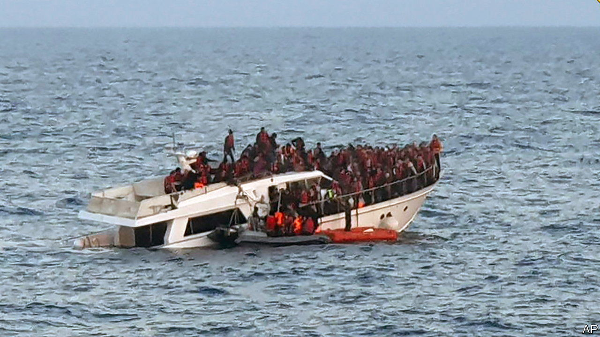
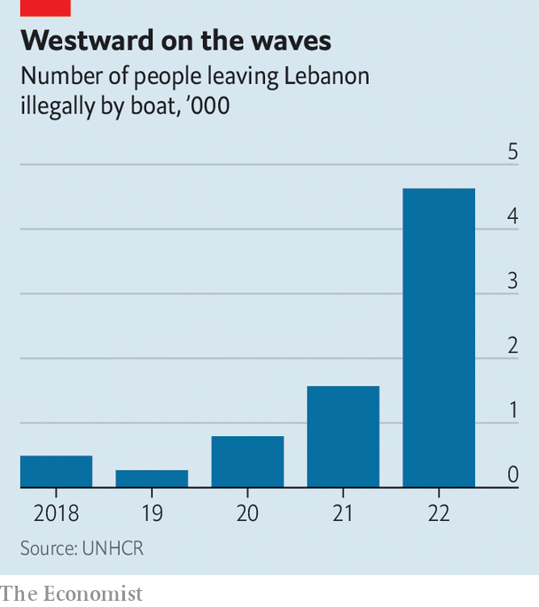

###### Betting on boats

# Why wretched Lebanese are fleeing across the sea 

##### Most people in Lebanon say they want to live abroad 

 

> Jun 15th 2023 

Last August 31-year-old Nader Yusuf embarked with 410 other people on an eight-day sea crossing from Lebanon to Italy. His salary as a delivery driver, priced in Lebanese pounds, had plummeted in two years to barely 5% of its original value against the dollar, leaving him unable to afford his $100-a-month rent. He was promptly evicted, along with his pregnant wife and five children, two of whom were seriously ill.

Depressed and desperate, Mr Yusuf sold his truck for $4,000, borrowed another $2,000 to pay a smuggler to take him to Europe and called his wife from the boat to say what he had done. “Please forgive me, I had no other choice.”

 


Most of the boat people leaving the shores of Lebanon illegally are  in Europe. The overall number illicitly plying the seas has leapt tenfold in four years, according to the Lebanese army, which is supposed to stop them. 

But the proportion of those coming from Lebanon doubled from 12% in 2021 to 24% a year later. Triple-digit inflation, an  and a breakdown in public services are driving more Lebanese people away. According to a recent poll, 61% of them say they would like to live or work abroad.

“People come here every day looking for somebody to take them across,” says Zakaria Abd el-Rahman, a 60-year-old boat captain in Tripoli, Lebanon’s second port. Seven years ago he used to charge $1,000-2,000 a head to take Syrian asylum-seekers on the 14-hour crossing to Cyprus. Not any more. In 2020 Cyprus and Lebanon agreed that irregular arrivals would be swiftly sent back. 

So most boats leaving Lebanon illegally now head for Italy, ten times farther. In 2019 the number who died trying to reach nearby Cyprus was six; last year at least 157 perished heading farther west. A migration expert fears that this year fatalities could reach 400.

 The risk of boats being caught has also increased, prompting some captains to stay in Europe themselves. And desperate people still want to brave the passage. Mr Yusuf is now in Germany.■

