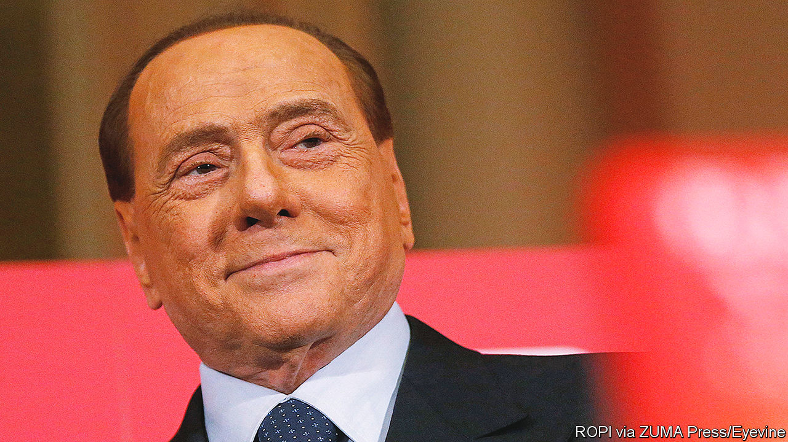

###### The great seducer

# Silvio Berlusconi duped Italians for years 

##### The republic’s longest-serving prime minister, perpetually dogged by scandal, died on June 12th, aged 86 

 

> Jun 12th 2023 

But for the genitalia of the women of the Caucasus, the whole improbable adventure might never have happened. Becoming one of the ; creating a political party from nothing in less than a year; and going on to become the Italian Republic’s .

It all went back to his conversation on the train with the hostile vice-president of a pension fund. He desperately needed this man to invest in his first big construction project. His original ploy—getting relatives to pretend they were clamouring for the apartments he had built near an industrial complex outside Milan—had gone embarrassingly wrong. The pension-fund boss had realised he was being duped. But then the 27-year-old Silvio Berlusconi deployed his irresistible charm, seduced the vice-president’s secretary, persuaded her to tell him when her boss was next travelling to Milan and booked the seat opposite.

By the time they reached Milan they were both at the bar, half-drunk, with the pension-fund manager telling him how extraordinary were the private parts of the women of Caucasia. The venture was rescued, enabling the young entrepreneur to embark on an even more grandiose development, Milano Due. The cable-tv station at Milano Due in turn provided the foundations for a vast media group that smoothed his entry into Italian politics and helped sustain him as a force in parliament for nearly 30 years.

But all that, he assumed, was more or less bound to happen. He was not only a self-made man but also ; even if his first enterprise had bombed, he would eventually have earned the success that was his due. He had enormous energy, a master salesman’s talent for persuasion, a wave of the hand for laws that stood in his way and limitless self-belief. As he told his American biographer, he knew how to create and how to lead. And, he added, “I know how to make people love me.” 

So he did. A poll of young Italians conducted in 1993, the year before he first became prime minister, found they loved him more than Jesus. Though he never succeeded in getting a majority of the electorate to vote for him, those who backed him did so with a fervour rare in democratic societies. At the height of his personality cult, before the general election of 2008, his campaign song was entitled “Thank goodness for Silvio”:

 Say it like this,

 with a strength that belongs only

 to those who are pure of mind:

 “Prime minister, we are with you. Thank goodness for Silvio.”

He took care to ensure the devotion of his collaborators, remembering birthdays and buying flowers for female assistants. As one (straight) male deputy from his Forza Italia party put it, they didn’t just come to like Silvio. They came to love him. 

All this seemed perfectly understandable to the object of their adulation. It was incomprehensible, therefore, that so many others failed to see things the same way. There were the journalists (though fewer perhaps than might be expected) who asked how the son of a Milanese bank manager could become so fabulously wealthy in just a few years. Some even hinted, insultingly, that he might have received his seed capital from organised crime. They noted that his father’s bank was said to be a laundry for Cosa Nostra money; that he hired a Mafia boss to work in his home, and that the man who set up Forza Italia for him, Marcello Dell’Utri, was convicted of aiding and abetting Cosa Nostra and given a seven-year prison sentence. 

Then there were the prosecutors who wanted to know, among many other impertinent things, whether his success as a media tycoon was entirely due to his business acumen, or whether it had more to do with the bribing of judges and the illegal funding of the party that let him own a three-channel national tv network. Case after case was brought against him. Yet he always managed to wriggle free, often thanks to laws that guillotined Italy’s lengthy judicial processes. During his longest spell in office, from 2001 to 2006, he changed the law to ensure the blade fell earlier on the kind of trials he was most likely to face. It was among nearly 20 measures he introduced that favoured either him or his businesses, which grew like topsy while he was in power.

None of this, however, shook his belief in his own altruism. On the stump he would reproach voters for their lack of appreciation of his selflessness, reminding them that he owned more than 20 houses around the world but, instead of enjoying them, slaved night and day for the good of his ungrateful compatriots. 

Perhaps most hurtful of all, some people insinuated that he was a misogynist. But he loved women. At least, those who were young and beautiful. Not like Angela Merkel, whom he allegedly described as an unbeddable lard-arse and publicly humiliated at a Nato summit. He nevertheless adored his mother, Rosa, and, whether coincidentally or not, it was after she died in 2008, just before his third spell as prime minister, that he became involved in the first of many s involving young—sometimes very young—women. His second wife, Veronica Lario, a former actress, separated from him, after declaring she could not share her life with a man who consorted with under-age girls.

His supporters, or at least the men, might have overlooked the scandals, had it not been for the  that erupted at the same time. The resulting emergency was particularly unsuited to his personality. He had always taught his salespeople that they should “carry the sun in their pocket”, and he himself always radiated positivity and optimism. But what the Great Recession revealed was that he was almost physically incapable of communicating bad news. On the contrary, he told Italians the crisis would not affect them. And as their economy crumbled the next year, even many of his most devoted followers realised—like that pension-fund chief at the start of it all—that they too had been duped by the great seducer.■

