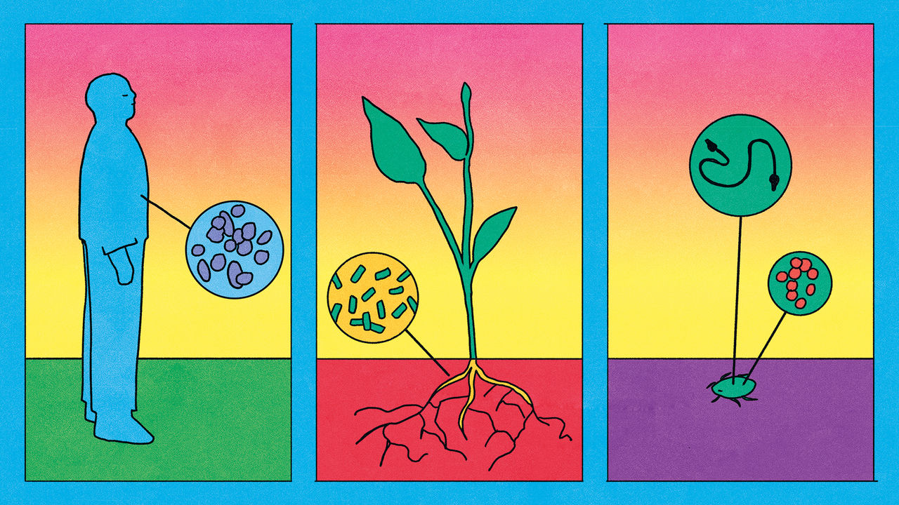
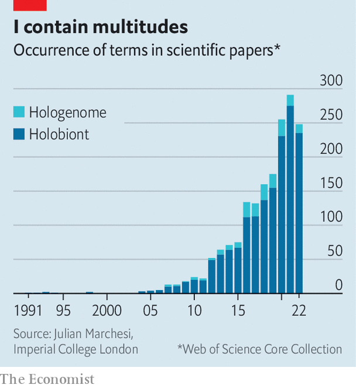

###### You are legion

# The idea of “holobionts” represents a paradigm shift in biology 

##### These meta-organisms are made up of animals, plants, and the microbiota that live on and inside them 

 

> Jun 14th 2023 

“How many cells are there in a human being?” It sounds like a question from a nerdy pub quiz. It is also a profound philosophical inquiry. One answer is around 37trn. This is the number, in a typical adult weighing 70kg, that trace their descent from the fertilised egg which brought that human into existence. 

Look at it another way, though, and you arrive at a figure roughly twice as large. That adds in the archaean, bacterial, fungal and protist cells which occupy the mouth, gut, skin, lungs and almost every other surface, nook and cranny of the human body. These cells contribute only about 0.3% to a person’s body weight. But being, on the whole, much smaller than “proper” human cells, they are almost equally numerous. 

That human beings have this accompanying microbiome is not news. Nor is it news that, while some of those extra cells are mere passengers, others are actively beneficial. The idea of symbiosis, in which different species live together intimately and collaboratively, goes back to the 19th century. Yet what started as a finite list of unusual cases has gradually grown to the point where it is clear that almost every multicellular organism—and even some single-celled ones—have symbionts.

This suggests to some biologists that the time is ripe for a “paradigm shift”—a new way for scientists to look at the world. Out, they say, with the old idea of plants and animals “having a microbiome”, and in with the idea that both are merely parts of a united meta-organism whose components evolve in concert with each other. And in, too, with a name for these communal critters: holobionts.

Holistic thinking

One believer in this way of thinking is Thomas Bell, head of the Leverhulme Centre for the Holobiont at Imperial College, London, which opened in January. Paradigm shifts have many causes. But one that has helped tip the balance in this case is a technology called metagenomics. Dr Bell and his colleagues plan to apply it to a wide range of known and potential holobionts.

Metagenomics analyses simultaneously the genomes of everything in a sample—be it of soil, water, leaf litter or a mashed-up part of a plant or animal. Before its invention, trying to work out which microbes were present in such samples was tricky. Few bugs are amenable to being cultured in a laboratory, so many were, in effect, invisible to science. These days you can run a relevant extract of any organism you care to mention through the metagenomics mill—and if you do so, it is likely to show up as a holobiont.

Dr Bell and his colleagues are looking, in particular, at insects, amphibians and plants. Besides being eukaryotes—meaning their cells have proper nuclei and contain complex structures called organelles—these have little enough in common, evolutionarily speaking. Each group was picked for study because viewing its members as holobionts rather than individual creatures is illuminating. 

Among insects, the centre is starting with bark beetles and honeybees. Bark beetles’ holobiont nature is emphasised by the fact that some have evolved special structures called mycangia, which carry fungal spores. The spores grow thin tendrils called hyphae that allow them to digest wood. That releases nutrients which the beetles can metabolise. But if these fungi (one of the best known of which causes Dutch elm disease) get out of hand, they can devastate entire forests. 

Honeybees, meanwhile, are important pollinators, a behaviour that may result in hives exchanging microbiomes via flowers their members visit. Some bee populations also show signs of being under stress, possibly from insecticide use. Several of Dr Bell’s colleagues suspect the explanation for this lies not in the animal part of the holobiont, but rather in its microbial part.

Amphibians are on the list because many are threatened with extinction by skin fungi called chytrids, which have been spread from their Asian homeland by humans. Along with researchers at London Zoo, the centre’s scientists are studying the diversity of amphibian skin microbiomes, and whether this can give the meta-organism immunity to chytrid infection.

Plants find themselves in the centre’s crosshairs because most are accompanied by a “rhizosphere” of bacteria and fungi attached to, or even penetrating their roots. The rhizosphere’s biochemical pathways increase the range of nutrients available to the holobiont as a whole. The rhizosphere is sustained in turn by carbohydrates and other nutrients synthesised by the holobiont’s plant component.

A beneficial alliance

Work like Dr Bell’s means the idea of holobionts as a meaningful category is catching on (see chart). But for it to be accepted fully, it needs to be disentangled and defined. As Scott Gilbert, a developmental biologist at Swarthmore College, puts it, “This notion [of holobionts] challenges and seeks to replace the concept of a monogenomic individual whose essential identity arises during development, is maintained by the immune system, and which is selected through evolution.” That is a big claim.

 


One possible stumbling block is individual continuity. For organisms as conventionally classified, the link between parent and offspring is clear. For putative holobionts, it can be less so. Rather than growing from a single fertilised egg, holobionts have to be assembled. Sometimes the components are passed between parents and offspring. Humans, for example, are born with some microbes already in their guts. They pick up others during the messy process of birth, and more from their mother’s milk. In these circumstances it is easy to see how the various components of a holobiont could co-evolve into a single, functioning unit. 

Plants tend to make their associations horizontally—forming alliances with microbes already living in the soil in which they germinated. That might be thought to weaken the case for the resulting alliances behaving as single evolutionary units. In fact, calculations by Joan Roughgarden, an evolutionary biologist at Stanford University, show that horizontal transmission also supports co-evolution, and thus the emergence of true holobionts. 

One piece of evidence to suggest she is right comes from a study of switchgrass by Thomas Juenger, a biologist at the University Texas, Austin. If plants and their rhizospheres are evolutionary units, they might be expected to collect a “core” microbiome that is encouraged into existence by specific genes in the plant. Switchgrass has three genetically distinct populations in North America. By comparing these and their associated rhizospheres, Dr Juenger showed a relationship between a plant’s genes, particularly those associated with its immune system, and which bacteria thrived in the resulting rhizosphere.

Sometimes, as with bark beetles and their mycangia, the evolutionary integration of primary host and microbiome is obvious even without a genetic analysis. , an Australian termite, relies on gut microbes to break the tough wood it eats into molecules which the holobiont’s animal part can metabolise. , one of those fibre-digesting components, is itself a composite of a protist (a single-celled eukaryote) and four types of bacteria. Lynn Margulis, the American biologist who coined the term holobiont in 1991, called this critter “the beast with five genomes”.

Aphids are equally intriguing. All members of this group carry bacteria of the genus , a variety unknown anywhere else. In a relationship reckoned to date back around 200m years,  live inside specialised aphid cells called bacteriocytes. The bacteria are so cossetted that they have shed most of the genes they started with, relying on their animal partners to fill the biochemical gaps. In exchange, they synthesise amino acids the insects are unable to make for themselves. 

Nor does the story end there. Many aphids host a second bug, , in their bacteriocytes. These critters, which also rely on  for their supply of amino acids, kill the larvae of parasitic wasps that would otherwise consume an aphid alive. But that, in turn, happens only in the presence of a virus called APSE—an even smaller metaphorical flea in the holobiont hierarchy. 

All that is reminiscent of the most extreme case of holobiontry: that of organelles called mitochondria and chloroplasts. Mitochondria generate energy by metabolising glucose, and are found in all eukaryotes. Chloroplasts engage in photosynthesis, and are restricted to algae and plants. Both are the distant descendants of formerly free-living bacteria that began their relationship with the cells they now call home over a billion years ago. (It was these two cases which led Margulis to coin the term holobiont.) 

The holobionic man

The varying degrees of intimacy on display—from surface passenger to vital cellular component—do raise the question of where, exactly, the borders of the term “holobiont” lie. But biology is full of concepts that are at once fuzzy and useful (“species” is one). Perhaps the most important job of the concept is to act as a reminder to biologists never to neglect a possible role for the microbiome in any phenomenon they are trying to understand. For example, the study of the evolution of pesticide resistance in insects usually involves the genome of the insect itself. But resistance by pests called bean bugs to fenitrothion, an insecticide, is conferred by bacteria of the genus  which live in their guts—important knowledge, if you want to counter that resistance.

And there are even stranger powers brought to holobionts by their microbial parts. For example, certain bacteria are sensitive to magnetic fields. Researchers suspect some may have formed alliances with creatures such as turtles and birds, enabling these animal-based collectives to use Earth’s field to navigate. More familiarly, it is the holobiont nature of dogs (and also hyenas and other carnivores with anal glands) that enables them to communicate via scent marks. The odours they deposit this way are created by bacterial degradation of secretions into these glands. 

The best studied animal holobiont of all is . Topologically, a human being is a torus—a three-dimensional object with a hole through the middle. The hole in question is the alimentary canal. Nearly the whole surface of this torus is home to microbes, though different parts have different inhabitants. By far the largest numbers of them live in the lower gut.

These gut microbes extend the digestive capabilities of the human holobiont in the same way (though not to the same degree) as happens in termites, by breaking up fibrous plant polymers into smaller molecules that the other 37trn cells can metabolise. But they produce lots of other molecules, too, some of which send signals to the holobiont’s animal cells. Those cells, moreover, often signal back.

This signalling seems particularly influential over parts of the nervous system. Among the molecules secreted by gut bacteria are serotonin, GABA and catecholamines. All are neurotransmitters, chemicals which carry impulses between nerve cells. The microbiome is thus an integral part of the gut-brain axis, the constant neural chatter between the largest group of nerve cells in the body (the central nervous system) and the second-largest (the enteric nervous system).

The third big interaction between host and microbiome involves the immune system. This brokers the deal that keeps the whole show on the road by preventing any particular part of the microbiome running riot—a task at least as important as fending off infectious diseases. In return, a well-balanced microbiome assists the immune system by preventing pathogenic bugs from multiplying in the intestines.

The gut microbiome is thus deeply integrated with the mammalian part of the human holobiont—as can be seen when that integration goes wrong. Dysbiosis, as this is known, is at least associated with, and in many cases probably helps cause, obesity, diabetes, high blood pressure, atherosclerosis, asthma, inflammatory bowel disease, some liver diseases, various cancers, autism, Parkinson’s disease and depression. And this is not an exhaustive list. 

Looking beyond the 37trn mammalian cells in this way can be medically fruitful. A largely plant-based diet, for example, encourages fibrolytic bugs, while a meat-rich one favours those that thrive on fat and proteins. As a consequence, plant-based diets yield molecules such as butyric and propionic acids which are known to regulate inflammation and other immune-system functions. Meat-based ones result in branched-chain fatty acids, and phenols and indoles, which have a range of bad effects, including being risk factors for bad cardiovascular health. 

Fixing things with holobionics

Crop breeders, too, are starting to take the holobiont concept seriously. Field agents for Indigo Ag, in Boston, Massachusetts, identify rare survivors in farmers’ fields of events like droughts and infestations, and send these plants in for study. The assumption is that there is something special about such survivors. Indigo’s foundational guess was that this special something is often in the rhizosphere.

 


Pursuing that thought, the firm has found—and now markets—rhizospheric bugs which confer drought-tolerance on cotton, maize, soyabeans and wheat; improve resistance to fungi in maize, soyabeans and wheat; guard against nematode attack; liberate phosphorus and potassium from the soil; and “fix” atmospheric nitrogen by turning it into molecules such as nitrates, which plants can use to make amino acids, the building blocks of proteins.

Another firm, Pivot Bio of Berkeley, California, is concentrating on nitrogen fixation. Pivot’s researchers have edited the genes of two types of nitrogen-fixing bacteria so that they continue to work even when there is already plenty in the soil, and also turn out more fixed nitrogen than they usually would. When planted alongside a crop such as maize, a cocktail of these bugs provides an instant, nitrogen-fixing rhizosphere for each seedling. That can reduce fertiliser use by a fifth.

Jean-Michel Ané of the University of Wisconsin-Madison, who is, inter alia, a scientific adviser to Pivot, has two other nitrogen-fixing ideas up his sleeve. One, observing that legumes grow special root nodules to house nitrogen-fixing bacteria, is to reshape the roots of cereals (rice is the main target) so that they grow similar nodules. He and his colleagues have identified two leguminous genes that, when transplanted to poplars (a common experimental plant) cause them to grow nodules too.

Dr Ané’s other idea is based on unusual strains of maize and sorghum that grow aerial roots which secrete a gel in which nitrogen-fixing bacteria like to live. This gel then drips to the ground, where the fixed nitrogen is absorbed by the plant’s roots. In the case of maize, he and his colleagues have managed to cross-breed plants carrying this trait with commercial cultivars, and are now into the fifth generation of plants bearing it.

Cattle and other livestock are also coming under scrutiny. Their termite-like digestive systems generate more than 100m tonnes of methane a year, about 6% of the greenhouse-gas emissions for which humans are responsible. The bugs in question can be curbed by adding either of two substances to cattle feed—a chemical called 3-nitrooxypropanol or a seaweed called  . Indeed, adding  not only curbs methane output, but also increases the conversion rate of feed into milk or meat.

Conservationists see promise in thinking of organisms as holobionts, too. That is the motive for Dr Bell’s work on amphibians. Others, though, are looking to help entire ecosystems. Both forests and coral reefs are temperature-sensitive and thus threatened by global warming. Viewing their members as holobionts may allow ecologists to help them adjust.

Like Indigo’s researchers, Cassandra Allsup, Isabelle George and Richard Lankau, of the University of Wisconsin–Madison, have been looking at soil microbes. They have sampled forests in their home state and in Illinois to the south. Testing seedlings of various species grown near the north and south of this span, which are 5.8 degrees of latitude apart, they found that those grown in soil inoculated with bacteria from sites with similar climates grew faster than those in soil given bugs from different ones. Though inoculating entire forests is not practical, they hope that treating nursery-grown saplings intended for local reforestation projects might help those trees’ survival.

Like humans, corals are a particularly well-studied meta-organisms. Their tourist-attracting colours come from photosynthetic protists called zooxanthellae that live inside special cells in the sessile animals responsible for secreting the limestone of which coral heads are made—and it is these which provide the holobiont with most of its nutrition. 

A weakness of this arrangement is that if zooxanthellae get too hot, their photosynthetic mechanisms go haywire, generating toxic oxygen-rich molecules called free radicals. The coral animals then expel them, a phenomenon called bleaching. If conditions return to normal in time, recolonisation may occur. But corals that remain bleached for too long will die.

Some people are trying to inculcate resistance to rising temperatures by tinkering with the genes of the animal part of the system. But Madeleine van Oppen of Melbourne University, in Australia, and Raquel Peixoto of King Abdullah University, in Saudi Arabia, are looking, in separate projects, to tweak either the zooxanthellae, or some of the many bacteria which are also part of the holobiont. 

Such ecosystem engineering represents holobionic thinking on a grand scale. Whether it will lead somewhere fruitful remains to be seen. But the very fact that it is happening at all is, surely, testament to an idea whose hour has come. ■


