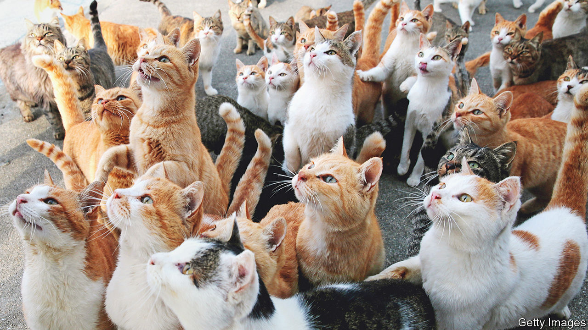

###### Don’t have kittens

# There’s more than one way to spay a cat 

##### A new vaccine could be a cheap, simple solution to a big problem 

 

> Jun 14th 2023 

Running a city can be an expensive business. There are potholes to fix, policemen and firefighters to fund, and mountains of refuse to collect. In many cases, the kitty is empty.

Other sorts of kitties cause problems, too. Some 480m of the world’s 600m domesticated cats are thought to be free-roaming. Strays can be unsightly and can spread diseases, either to each other or to people. Many endure short and uncomfortable lives. Even those that land on their feet can cause suffering elsewhere—more than 60 species of animals, ranging from mice to birds, have been hunted to extinction by predatory cats.

Fixing the problem, as well as the cats, is not cheap. Tel Aviv, which has tens of thousands of the animals, has spent over $100,000 a year on neutering programmes alone. Now, though, a paper in  suggests a single jab could offer a cheap, safe and long-lasting way to sterilise a cat.

The technology involved is gene therapy, in which a gene is carried into an organism’s body, usually by a modified virus, in order to fulfil some additional function. This has been gaining momentum in humans, with seven different gene therapies approved by America’s Food and Drug Administration as of this February. Most are designed to target rare genetic diseases, including haemophilia B, where mutation causes problems with blood clotting.

David Pépin, a molecular biologist at Harvard University, came to realise the same techniques could also be used to induce contraception. His laboratory was investigating a lesser-known reproductive hormone called AMH (anti-müllerian hormone), which is produced by the follicles that house immature egg cells in mammals. These follicles grow inside the ovaries until they burst, releasing their cargo into the fallopian tubes and towards potential fertilisation. More mature follicles produce AMH in order to slow down the growth of those eggs remaining in the ovaries. The hormone acts as a red traffic light, as it were, to ensure the flow of maturing eggs is not too rapid.

Dr Pépin concluded that persuading a mammal to produce higher-than-usual amounts of AMH—by inserting the right type of gene—might strengthen this braking signal and halt follicle production altogether. After initial successes in rodents, he joined forces with Bill Swanson at the Cincinnati Zoo and Botanical Gardens to test the idea on cats.

In 2019 the researchers injected six cats with a harmless virus that contained a synthetic copy of a feline AMH gene, and three control cats with the virus alone. The virus they chose was able to deliver its payload direct to the cats’ muscle cells. These cells are ideal for two reasons. First, muscle cells are perfectly placed to pump hormones such as AMH into the bloodstream and thence into organs across the body, including the ovaries. 

Second, muscle cells neither die off nor split in two during an animal’s lifetime. That ensures the new genes they had been armed with would not disappear over time—essential for permanent sterilisation. This is particularly important for the delivery mechanism employed by Dr Pépin. While most of an animal’s genes are contained in strands of DNA inside the nuclei of cells, the AMH gene floats around in the cellular cytoplasm. Despite its unorthodox location, it is still capable of instructing the cell to produce hormones.

All nine cats—which were named after the wives of American presidents—then had their faeces monitored over the course of two years so that the levels of their reproductive hormones could be checked. In order to ensure the right cats were being matched to the right scat, each was fed food with a different coloured dye or, for a few fabulous individuals, glitter. After eight months, and then again after 20 months, male cats were introduced into the living quarters so that the females’ breeding patterns could be assessed.

Though the three control cats (Michelle, Nancy and Rosalyn) ovulated and got pregnant, the six injected with the gene-carrying virus (Betty, Dolly, Jacqueline, Abigail, Barbara and Mary) did not. Each had levels of AMH up to a thousand times higher than before they were treated. Four refused to even try to breed, and the two that were still receptive to the idea had no pregnancies. “These cats are not able to reproduce,” concludes Dr Swanson.

While the precise mechanisms in cats and rodents are not identical, high levels of AMH seem to have a contraceptive effect in both species. Dr Pépin hopes AMH could become a useful target in human contraception too—though as a pill with temporary effects rather than a permanent injection. Presently, the most common kind of hormonal contraception is the combined pill, which contains oestrogen and progesterone. These limit the release of hormones which cause follicles to ripen, and thicken the mucus at the entrance of the womb, preventing the passage of sperm.

But there are oestrogen and progesterone receptors all over the body, not just in the reproductive system. Synthetic hormones affect those as well. That is one reason for the pill’s many side-effects, including mood swings, nausea and headaches. AMH receptors in humans are much more specific, being found mostly in the reproductive system. The hope is that a contraceptive that targets amh may therefore be one with many fewer side-effects. ■


