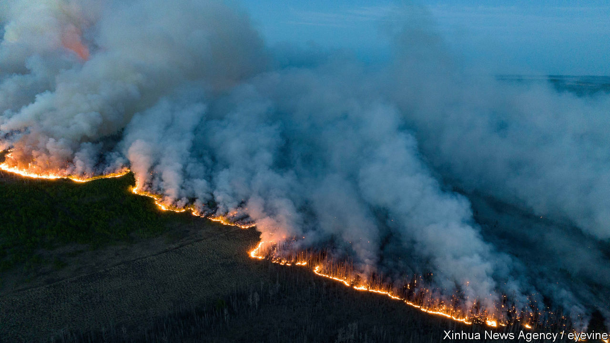
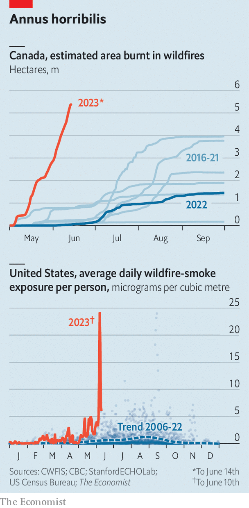

###### Burning bright

# Canada’s wildfires have burnt an area 16 times larger than normal 

##### American air quality may have improved, but the fires are still going 

 

> Jun 15th 2023 

“Blame Canada”, read the front page of the , when smoke from wildfires in Quebec blanketed the east coast of the United States last week. The average air quality of the country was its worst in a decade. New York was for a time the most polluted major city in the world. What had previously been a problem in Canada—of enormous wildfires—quickly became one in the United States, when abnormal winds pushed plumes south of the border. Since then, the winds have changed, sparing the populous east coast from smoke. But the blazes in Canada are still raging. 

 


Canadian wildfires started earlier than usual this year and have burned ferociously ever since. On one day alone the area burnt in Canada was around 200,000 hectares (or 0.5m acres). That is greater than the total area burnt by wildfires in California last year, according to David Wallace-Wells, a writer on climate change. As of June 14th, the Canadian Interagency Forest Fire Centre, a not-for-profit, estimated that a total area of 5.4m hectares had been set alight—roughly the size of Costa Rica. This makes 2023 so far the worst year for wildfire damage since 1995, when it was 7.5m hectares. 

The weather is partly to blame. May was the hottest since 1940. It was also seventh-driest. Such conditions desiccate vegetation and help fires start and spread. Although the absolute number of fires has been only slightly higher than normal, each fire has grown far larger than it usually would. The area ablaze in Quebec is 217 times greater, for example. 

With the exception of the health hazard posed by the haze, the direct impact on humans has been minimal. Around 26,000 people were ordered to evacuate parts of Canada. But as we went to press, no deaths had been reported. President Joe Biden has said that 600 firefighters would be sent from the United States to help. It would only take a change in the wind to make it America’s problem once again. ■

