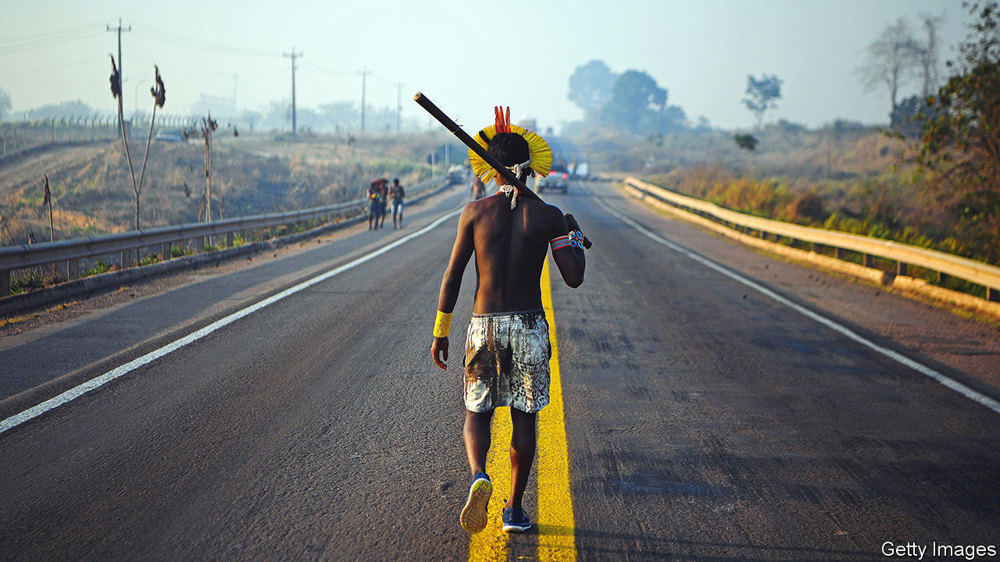
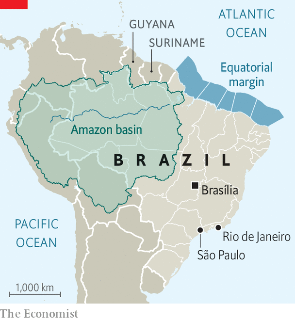
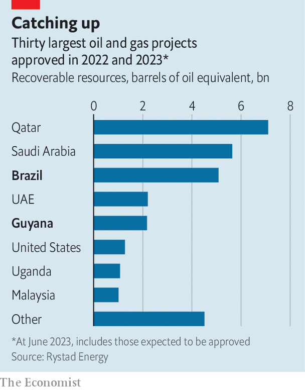

###### Unsustainable

# Lula’s ambitious plans to save the Amazon clash with reality 

##### The Brazilian president faces resistance from Congress, the state oil company and agribusiness 

 

> Jun 13th 2023 

When Luiz Inácio Lula da Silva won Brazil’s election last year, climate activists the world over breathed a sigh of relief. His right-wing predecessor, Jair Bolsonaro, had gutted the environmental agency, turned a blind eye to illegal gold-mining and undermined indigenous rights. Lula, by contrast, promised to end illegal deforestation in the Amazon and lead international efforts to halt climate change. On June 5th the left-winger outlined an ambitious plan to stop illegal deforestation in the Amazon by the end of the decade. “There should be no contradiction between economic growth and environmental protection,” he said. Yet Lula’s green agenda is suffering setbacks.

In theory, Brazil is well placed to lead efforts against climate change. In 2019 fully 82% of its electricity was generated from renewable sources, compared with a global average of 29%. Its carbon emissions mainly come from deforestation and agriculture, rather than energy. 

Curbing deforestation promises rich rewards. The World Bank estimates that the value of the Amazon rainforest, mainly as a carbon store, is $317bn a year, nearly all the benefits of which accrue to the rest of the world. This is three to seven times more than the estimated value which could be made from farming, mining or logging in the area. A Senate committee is working on creating a carbon market, which would allow Brazil to make money by selling carbon credits. And in April the EU, with which Brazil may soon sign a trade agreement, passed a law that will ban imports of products that contribute to deforestation. All this provides incentives to prevent more tree-felling. 

Several problems are getting in Lula’s way. For a start, he is far less popular than under his first two terms, between 2003 and 2010. Back then, he could sway Congress more easily. But he only won last year’s election by a slim margin. 

What’s more, Congress has veered to the right. Lula leads a rowdy coalition that has frequently failed to vote with him. He has had to resort to pork-barrel tactics, but that has not entirely worked. On June 1st Congress passed a law that removed the rural-land registry and management of waste and water from the environment ministry. It also took away the power of the newly created indigenous ministry to demarcate territories. The day before, the lower house passed a bill which, if approved by the Senate, would not recognise claims to land by indigenous groups arising after 1988.

Both bills were coups for the agri-business lobby, which is the second problem for the president. Agriculture is increasingly important in the country. First-quarter GDP figures released this month show the agricultural sector is 18% larger than the same period last year, a performance strong enough to prompt analysts to raise their full-year forecasts for the whole economy. This was partly because of a spell of good weather compared with last year, and because the price of agricultural commodities has risen. By contrast industrial output declined and the service sector grew slightly. According to the World Bank, the value added of agriculture, forestry and fishing as a share of GDP has risen from 4% in 2010 to 7% in 2021. 

The agri-business lobby now commands 347 out of 594 seats across both houses of Congress, up from 280 in 2018. “There is no Brazil without agri-business,” says Pedro Lupion, the leader of the lobby. 

Part of the agriculture sector’s expansion happened under Lula’s first two administrations, when trade with China accelerated. Yet Lula has struggled to win back the support of the lobby, which has rallied behind Mr Bolsonaro. In April Lula’s agriculture minister had his invitation to the country’s biggest agricultural fair rescinded, after Mr Bolsonaro announced that he would attend. Later, Lula called the organisers of the event “fascists”. Mr Lupion complains that the left has made the green agenda an “ideological” issue.

A third problem for Lula is the importance of the state oil firm, Petrobras. In his first two administrations, Lula celebrated Petrobras as a national champion after the company made one of the largest offshore oil discoveries ever in 2006, in what are known as the pre-salt fields off the south-eastern coast. The discovery allowed Brazil to become the world’s eighth-biggest oil-producer. Much more of that potential oil will be developed this decade, which the government hopes could make Brazil the fourth-biggest oil-producer. Adtiya Ravi, an analyst at Rystad Energy, a consultancy, estimates that oil from the pre-salt fields alone could account for nearly 4% of global supply by the end of the decade. Petrobras expects to increase output from 3m barrels per day today to over 5m by 2030. 

 


Along with developing existing projects, Petrobras is trying to win a licence to drill for offshore oil near the Amazon basin, in an area known as the equatorial margin (see map). This area could hold as much as 30bn barrels of oil and its equivalents, of which a quarter are thought to be extractable. Recent discoveries of oil in Guyana and Suriname are encouraging Petrobras, which is ready to invest roughly half of its $6bn exploration budget over the next five years in the area. On May 18th Brazil’s regulator denied the company an exploration licence, though Petrobras has appealed the decision. Alexandre Silveira, the energy and mining minister, described oil exploration in the region as a “passport to the future”, and called the regulator’s demands “incoherent and absurd”. Lula said he finds it “difficult” to believe that oil exploration would cause environmental damage in the region.

Meanwhile, Petrobras’s five-year business strategy barely mentions investments in renewable energies. It says $4.4bn, or 6% of its capital expenditure over the period, will go towards “strengthening [the company’s] low-carbon position” and most of that will be directed towards decarbonising oil production, rather than fostering renewable energy. By comparison, BP invested $5bn in renewable energy, hydrogen, biofuels and electric-vehicle charging stations in 2022, or 30% of its capital expenditure that year. Maurício Tolmasquim, recently appointed the chief energy-transition officer at Petrobas, admits that the company “is lagging behind” other major energy companies in its plans to go green. In March its new CEO, Jean Paul Prates, boasted that Brazil could be “the last oil producer in the world”.

 


According to Rystad Energy, Brazil has approved or is set to approve the highest number of oil and gas projects in 2022 and 2023 after Saudi Arabia and Qatar (see chart). Whereas oil production in Europe, Africa and Asia is set to decline over the next decade, South America’s share of global output is expected to rise from 7.2% today to nearly 10% by 2030, mostly thanks to Brazil, Guyana and Suriname. 

To fulfil his green pledges, Lula needs to drop “his loyalty to oil nationalism”, says Natalie Unterstell, the head of Talanoa Institute, a think-tank in Rio de Janeiro. But the government can smell the money. Even without the development of the equatorial margin, Petrobras expects to provide over $200bn of revenue to state coffers over the next five years, or about 5% of total government revenues. 

The final obstacle is a desire to develop the Amazon and the states near the equatorial margin. Brazil’s northern and northeastern states contain three-quarters of the country’s poor (as defined by estimates from the statistical agency), though they contain just over a third of its population. Northern governors want more investment. Last June, before being elected, Lula said he was in favour of a highway being built through the Amazon that would connect the soya-growing interior to ports on the coast. Lula’s transport minister has also listed a huge railway that would link the interior to the coast among his priorities. Yet one study from 2021 reckoned that if the railway were constructed, 230,000 hectares of trees on indigenous lands would be chopped down by 2035. 

Already, Lula’s desire to boost the economy has clashed with his environmental agenda. Days before announcing the plan to end deforestation, his administration lowered taxes on cars and lorries to stimulate consumption. To go green, Lula will need to adapt many of his plans for enriching Brazil. ■

