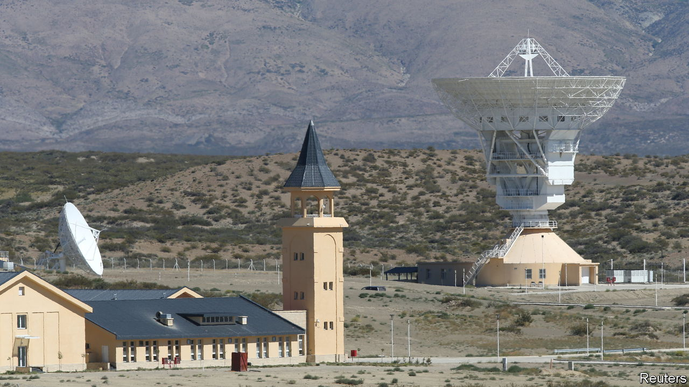

###### Comrades across continents

# What does China want from Latin America and the Caribbean? 

##### Along with trading with the region, it is increasingly important in geopolitical terms 

 

> Jun 15th 2023 

China’s engagement with Latin America has tended to be purely transactional. It went from hardly trading with the region at the turn of the century to overtaking the United States to become the top trading partner for South America, and the second almost everywhere else in Latin America. Annual goods trade between China and Latin America rose to $445bn in 2021, up from $12bn in 2000. But its relationship with the region appears to be evolving. Latin America is increasingly useful to China in geopolitical terms, too.

On June 8th the  reported that the Communist government of Cuba had secretly agreed to allow China to set up an  in the country. At first American and Cuban officials denied the story. Two days later the White House admitted that a base has existed for some time. This is not the first time that China has been reported to have military or security footholds in the region. China has long been thought to have a small military presence in Cuba and access to listening stations. It has several satellite ground-stations in Latin America, which are believed to also have spying purposes. A space observatory in Argentina is run by the Chinese army and its activities are opaque. The latest move is “a small step”, says Evan Ellis of the United States Army War College, “but over a big threshold”.

Deepening geopolitical ties follow closer economic ones. China is a big source of cash for the region. Between 2005 and 2021 Chinese state-owned banks loaned $139bn to Latin American governments. It has invested billions of dollars in the region, mainly in energy and mining. Some 21 countries in Latin America and the Caribbean have signed up to China’s Belt and Road Initiative, a massive global infrastructure-building spree. 

Latin American countries are also turning to the yuan for trade and to include in their central-bank reserves. On June 2nd Argentina doubled its currency-swap line with China, meaning that around a third of its central-bank reserves, which stand at $32bn, will effectively be in yuan. Last year, the yuan surpassed the euro to become the second-most important foreign currency in Brazil’s central-bank vaults.

Many commercial projects have caused concern. In some cases, they are in sensitive industries such as telecoms or energy. In April a Chinese state-owned power company reached an agreement to purchase two power suppliers in Peru that would give China a near-monopoly over the country’s energy grid. Some fret over Chinese construction of ports in the region, such as the Chancay megaport near Lima in Peru, fearing that they could be repurposed to military ends. 

China’s most recent strategy paper on Latin America, published in 2016, says it will “actively carry out military exchanges and co-operation”. Although the United States remains the primary military partner in the region, China has boosted engagement with law-enforcement agencies. It has trained police forces from countries including Argentina and Brazil, donated cars and investigative equipment to Nicaragua and Costa Rica, and sold surveillance equipment to Ecuador. 

So far, China seems to be winning the geopolitical popularity contest—and not just with the usual suspects, such as Venezuela’s autocratic regime or Cuba’s socialists. Since 2017 five countries in the region have ditched ties with Taiwan in favour of China. In March, Honduras was the latest to do so. Xiomara Castro, the president of Honduras, wrapped up a six-day visit to China on June 14th. Argentina, Honduras and Uruguay are all in the process of joining the Shanghai-based New Development Bank, founded by the BRICS countries. 

Not all are impressed. Argentina’s centre-right opposition is challenging an agreement between the governor of Tierra del Fuego, at the southernmost tip of the continent, and a Chinese petrochemicals group to build a port, power station and chemical plant there costing $1.2bn. 

But mostly Latin America’s leaders shrug off concerns about Chinese meddling. The chance to avoid what they perceive as hypocritical lectures from the United States appeals not only to left-wingers, but also to populists who have little time for human rights, such as El Salvador’s president, Nayib Bukele, and to moderates in Ecuador, Panama and Costa Rica. Even under Jair Bolsonaro, Brazil’s right-wing president from 2018 to 2022, who made critical comments about the country, China continued to trade and invest in Brazil. 

Whether China’s deeper engagement is a risk depends on “the eye of the beholder”, says a Mexican official. China has tended to avoid provoking the United States, keeping its engagement primarily in South America rather than Central America and the Caribbean (with the exception of Cuba). But China’s growing ambitions and Latin America‘s supplies of many of the minerals needed for the green transition, such as lithium and copper, mean ties are likely to deepen. ■

