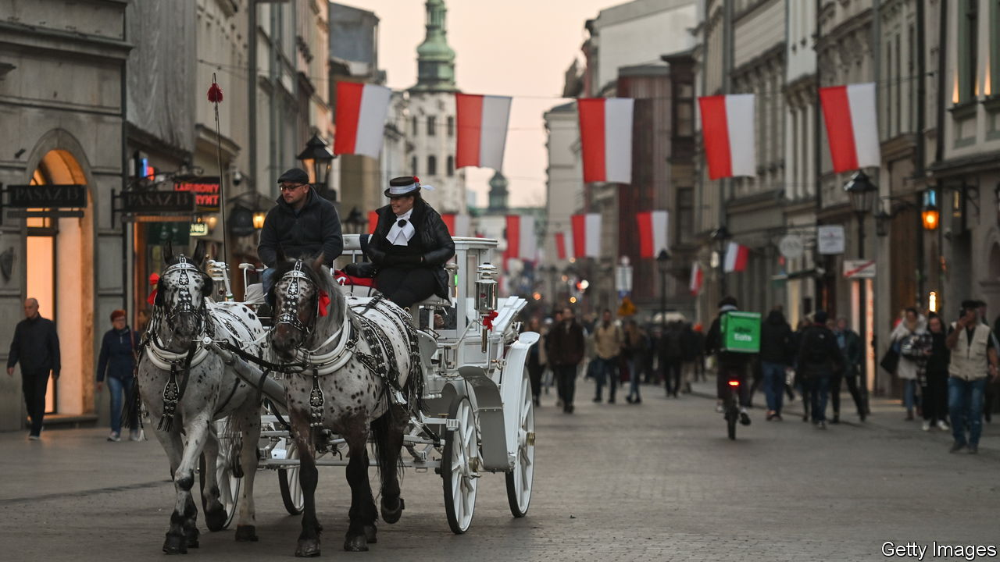

###### From partition to pierogi

# What to read to understand modern Poland 

##### Six books about the country that sees itself as the heart of Europe 

 

> Jun 15th 2023 

WHERE THERE are two Poles, there are three opinions, goes a Polish saying. Poland’s tumultuous history and polarised politics give its writers a lot to reflect on and disagree about. For more than a century from the late 1700s the country was partitioned by its neighbours, including Russia, Prussia and Austria. After the second world war it was subjugated by the Soviet Union. Many writers sought literary escape from the grimness of communism, through science fiction and reportage from far-off lands. Their tales were often coded satires of the Soviet-imposed system, which managed to escape censorship. Contemporary Poland sees itself as a Western country, anchored in NATO and the European Union, but its government does not always abide by the democratic norms of its allies. Here are six books about a country that is at once at the heart of Europe and on its edge.

By Norman Davies. 

To understand modern Poland, start with a tour of its past. In the 17th century, as the Polish-Lithuanian Commonwealth, it covered more territory than any other European state west of Russia (and was more than triple its current size). By the end of the 18th it had ceased to be an independent entity. Poland became a battle zone in the two world wars and was then forced by the Soviet Union to become a socialist dictatorship. Norman Davies, the leading chronicler of Poland in English, squeezes 1,000 years of history into two volumes (and further compressed all that into a separate single-volume work, “Heart of Europe”). His book weds a British historian’s detachment to the passion of a naturalised Pole, and weaves through its account of Poland’s identity the heritage and influence of Jews, Germans, Ukrainians and Lithuanians. Mr Davies enriches his chronicle of events with anecdotes, poetry and retellings of the myths that have shaped Poland’s character. 

. By Anne Applebaum. 

Anne Applebaum starts her tale at the point where Mr Davies ends: with the new millennium. On New Year’s Eve the American-born journalist and her husband, Radoslaw Sikorski, who later became Poland’s defence minister and foreign minister, gathered friends at their manor house. The air was crisp with optimism. After decades behind the Iron Curtain Poland had joined NATO and was in the EU’s waiting room. But during the following 20 years the camaraderie crumbled. United by their rejoicing in the collapse of communism, the guests split into liberal and populist-conservative camps. The latter, represented by the Law and Justice party (PiS), is now in power. Over the past eight years it has weakened Poland’s hard-won democracy by packing courts and public media with party loyalists. Other post-communist countries, notably Hungary, experienced similar developments.

In “Twilight of Democracy”, which was published soon after the re-election of the PiS government in 2019, Ms Applebaum, a former correspondent for , traces how intellectuals—frustrated, self-pitying and opportunistic, in her description—became agents of populism. She names and shames old friends who became leading supporters of the PiS government. Some may play prominent roles in the parliamentary election due in late 2023.

Other liberals have criticised Ms Applebaum’s pro-Western assumptions. In “The Light That Failed”, Ivan Kratsev, a Bulgarian academic, and Stephen Holmes, an American one, argue that eastern Europeans resent being cast as imitators of the progressive West. Populists have seized on their disillusionment. Pro-Western liberals like Ms Applebaum, Mr Krastev says, have tragically failed to respond with a compelling narrative of their own.

By Olga Tokarczuk. Translated by Antonia Lloyd-Jones.  ; £8.99

A series of mysterious murders shakes a village in Klodzko valley in south-western Poland (where the author has a house). The victims are members of a hunting club; one harvests fox furs. An eccentric pensioner tries to persuade the villagers that animals, including deer, beetles and birds, committed the murders as revenge. Her accusations anger the hunters and the powerful Catholic church. 

Olga Tokarczuk, born in 1962, is one of the  of her generation. She has won the  for literature and the . “Drive Your Plow” is more readable than the gargantuan , perhaps her most famous work. Yet this relatively short eco-thriller has Ms Tokarczuk’s characteristic depth. It is layered with allegory, weaving in astrology and the poetry of William Blake, both passions of the book’s protagonist. Agnieszka Holland, a Polish director, made it into a movie, (roughly, “hunting trophy”), which was released in 2017.

 By Stanislaw Lem. Translated by Bill Johnston.

If much of Polish literature provides escape from grim realities, Stanislaw Lem casts his readers farthest. “Solaris”, published in 1961, travels to the fictional planet of the same name, which has a mind of its own. A crew of scientists in a cramped space station in orbit above a sentient undulating organism slowly lose their grip on reality. What takes its place are painful memories. Lem thought that much of British and American science fiction was intellectually shallow. Their protagonists tend to explore alien worlds that become comprehensible; Lem imagined worlds that remain fundamentally mysterious. His novels send readers on psychological and philosophical journeys. And, as was common practice for independent-minded writers during the years of Soviet domination, Lem found ways to dodge censorship. Popular behind the iron curtain, many of his books were competently translated into English only decades after their publication.

Andrzej Sapkowski is the contemporary Lem. His best-selling “The Witcher” series of novels follows a gruff monster-slayer for hire. A video game based on the books helped put Poland’s gaming industry on the international map. Its makers, CD Projekt, became the largest company in Poland by market capitalisation in 2020.  of “The Witcher” appeared in 2019.

 By Artur Domoslawski. Translated by Antonia Lloyd-Jones.

If you have marvelled at the shimmering prose of Ryszard Kapuscinski, Poland’s best- known journalist, consider diving below the surface. A  of the celebrated war reporter, published in 2012, attests to his courage and talent but also exposes darker truths. He was a sloppy chronicler, an embellisher of facts, a poor father and husband and a collaborator with Poland’s communist regime. Even so, a  of more scrupulous journalists learned from what was best about Kapuscinski’s work. 

By Zuza Zak. 

Zuza Zak’s writing seeks to prove that Polish food is more than “just dumplings”. Her recent book shows that even dumplings are not just dumplings. “Pierogi” has more than 50 recipes, divided into historical and modern categories. Some are regional. Large potato  (zeppelins) are stuffed with smoked fish from the Baltic sea. Baked parcels, prepared all across Poland, enwrap wild mushrooms (for which Poles forage avidly). Other recipes are specialities of Poland’s ethnic minorities. , leathery dumplings which can be stuffed with a sweet curd cheese and covered with raspberry sauce, are made by Tatars, who have lived in eastern Poland from the 14th century.

“Pierogi” captures some truths about how Poles eat these days. Most families eat home-cooked food (ready-meals are rare and restaurants are for celebrations). Seasonality is important. Winter brings an appetite for starchy potato-cheese topped with lardons; summer is incomplete without bilberry dumplings and a dollop of sour cream. Ms Zak’s “modern” chapters also show how the country’s eating habits are changing. Warsaw, Poland’s capital, is one of the most vegan-friendly cities in the world.


We published a companion piece on  from Poland, which includes reportage about Albania, Bulgaria, the Czech Republic and Russia. Read our obituary of .  looks at eastern Europe more widely. As the election draws closer, follow our . Here we write about how Poland is (again)  to matter in Europe. We also look at how  are making the country , why its politicians , and why the . ■

