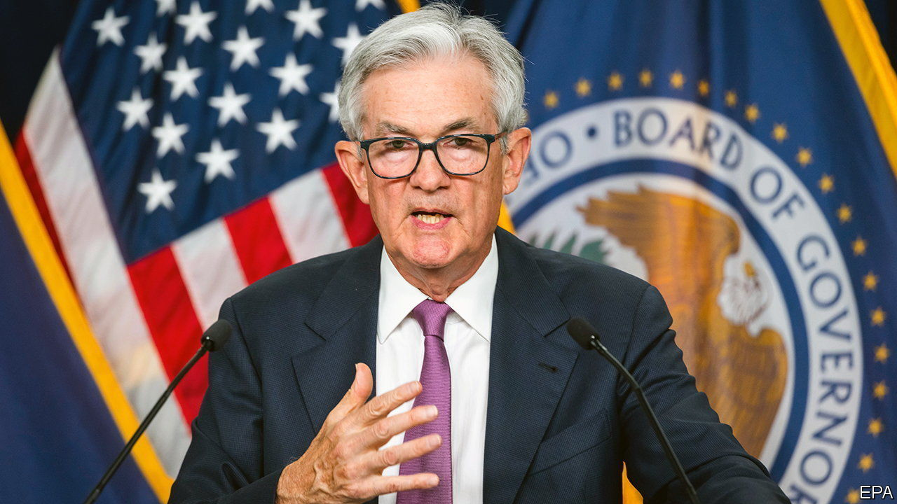
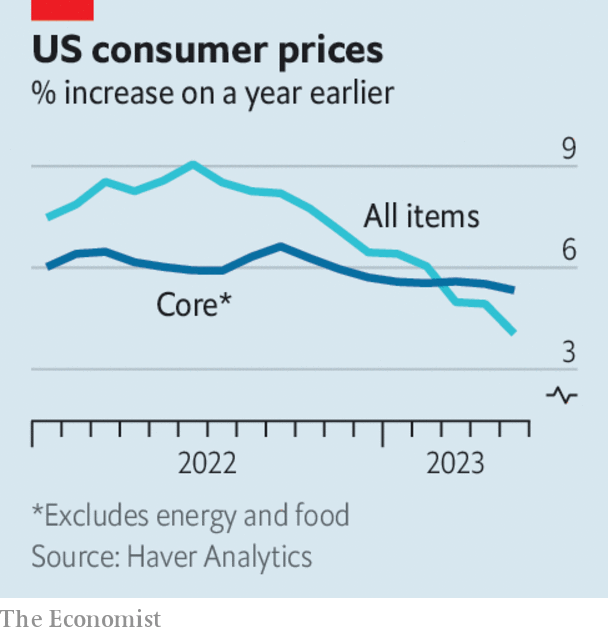

###### The world this week

# Business 

#####  

 

> Jun 15th 2023 

The Federal Reserve decided to leave its key  unchanged at a range of 5% to 5.25%. It was the first time that America’s central bank left the rate on hold following ten consecutive increases, which started in March 2022. However, it indicated that it would probably lift the rate twice again this year. 

 


The easing of inflationary pressures was a big factor behind the Fed’s decision. America’s overall annual  rate fell to 4% in May, the lowest it’s been since March 2021. Core inflation, which strips out energy and food prices, was 5.3%: it has hardly budged since the start of the year, in part because housing-related costs are rising. Despite higher mortgage rates, house prices are steadily increasing again. 

With inflation remaining elevated in the euro zone, the  lifted interest rates again by a quarter of a percentage point. That takes it deposit facility to 3.5%, the highest it’s been since 2001. 

The French finance minister, Bruno Le Maire, secured a promise from 75 food producers to cut their prices. Food prices in  rose by 14.1% in the 12 months to May. 

 central bank took a big shift towards easing monetary policy by trimming interest rates. The economy has been losing steam since a strong rebound immediately after the lifting of covid restrictions. Retail sales and industrial production grew more slowly than economists had expected in the year to May. Unlike the rest of the world, inflation is negligible and the property market is in the doldrums. 

New figures showing that wages are soaring in  probably mean that more interest-rate rises from the Bank of England are on the cards. The data caused the yields on short-term government bonds to jump to their highest levels since August 2008, higher even than the spike after the ill-fated mini-budget of Liz Truss’s government last September. 

A new beginning

 completed its takeover of , bringing an end to the latter’s 167 years of independence; for now it will operate as a subsidiary. The emergency takeover was proposed by the Swiss government in March following the collapse of market confidence in Credit Suisse after years of scandals and losses. The combined company will oversee $5trn in assets. 

America’s stock exchange agreed to buy , a provider of risk-management and regulatory software, for $10.5bn. Nasdaq is best known for the tech firms that list their shares on the exchange. It reckons the deal will boost its financial-compliance services. 

In Japan the  stockmarket index closed above the 33,000 mark for the first time since 1990. It was boosted this week in part by a surge in the share price of SoftBank, amid rumours that it might team up with the firm behind ChatGPT. The Nikkei has gained 30% this year and the Topix 20%, helped by a weaker yen that has attracted foreign investors. 

 faced down two proxy votes at its annual general meeting. In an unusual challenge to the management of a Japanese company, activist investors in America and Europe recommended voting against Toyoda Akio, the grandson of the carmaker’s founder, as chairman. They say he has been slow in rolling out electric vehicles. Another proposal urged full disclosure on Toyota’s climate policy. Both proposals were defeated. 

The Federal Trade Commission asked a court to stop  completing its $69bn takeover of , a video-gaming company, amid reports that the closure of the deal is imminent. The FTC has sued to stop the acquisition and legal proceedings begin in August. In April Britain’s competition regulator said it would also try to block the takeover. 

A jury in New Jersey awarded $25.6m to a regional manager at , finding that she was sacked for being white. Shannon Phillips was fired after an incident in 2018 at a Starbucks outlet in Philadelphia in which two black men were asked to leave, causing a media furore at the time. Ms Phillips said she was sacked after questioning the firing of another white supervisor, who did not oversee the store in question. The black manager of the store kept his job.

Pride comes before a fall

 is no longer America’s bestselling beer, following a months-long boycott by conservatives angered by the brand’s association with a transgender activist. Modelo Especial, a lager brewed near Mexico City for Constellation Brands, took the top spot in May. Bud Light’s share of the beer market is now 7.3%, down from 10.3% in January. 

New York introduced a minimum wage for  of $17.96 an hour, plus tips, which rises to $19.96 in 2025. The minimum wage for other workers in the city is $15. Labour activists complained that the new rate was still too low and would not cover workers’ costs. Food-delivery companies such as Uber and Grub said New York had bitten off more than it could chew and that litigation is on the table. 

