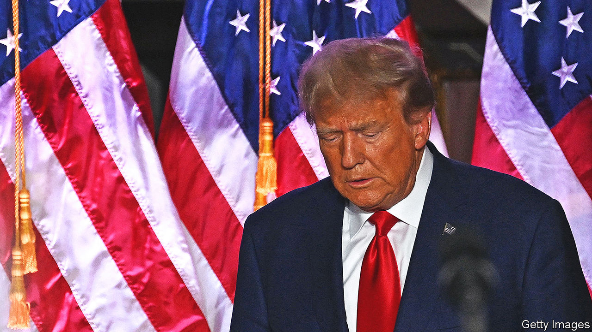
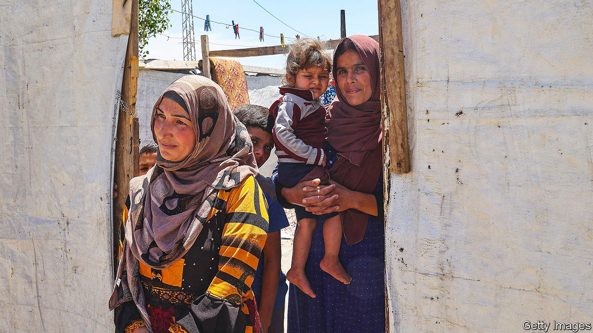

###### The world this week

# Politics 

#####  

 

> Jun 15th 2023 

 appeared in a court in Miami to plead not guilty to 37 criminal charges related to his mishandling of classified documents. It is the first time an American president, former or sitting, has been charged in a federal court. The indictment claims Mr Trump stored secret papers haphazardly throughout his home in Florida, such as in a shower stall. Some of the material related to the defence and weapons capabilities of America and foreign countries, including America’s nuclear programmes. Before his court appearance Mr Trump vowed to remain in the presidential race, even if he is convicted. “I’ll never leave,” he said. 

Italy held a state funeral for, who died aged 86. Italy’s longest-serving prime minister was a media tycoon and unapologetic populist. He was known for a string of corruption and sex scandals, the most infamous being the “Bunga Bunga” parties at his villa, where he cavorted with (very) young scantily clad women. He was still a force in politics. His Forza Italia party forms part of Italy’s coalition government. 

 counter-offensive trundled on. It claims to have retaken several villages from Russia. Russia said that one of its senior generals had been killed in the fighting. Russian missile attacks killed 12 people in Kryvyi Rih, a town in central Ukraine known for being the birthplace of Volodymyr Zelensky. Russia also attacked the Black Sea port town of Odessa. Meanwhile the governor of Russia’s Kursk region accused Ukraine of firing missiles over the border. 

Alexander Lukashenko, the dictator of Belarus, said his country had started to take delivery of some Russian , the first time they have been deployed outside Russia since the fall of the Soviet Union in 1991. 

 published its first-ever national security strategy. It said that Russia poses the “most significant threat to peace” and pointed to China as a menace for using its dominance in supply chains to wield its political clout. The document reiterated Germany’s commitment to increase defence spending. 

 prime minister, Albin Kurti, offered to hold fresh local elections in areas where ethnic Serbs form the majority, in an effort to defuse tensions that has led to attacks on NATO peacekeepers. The trouble was sparked by the imposition of ethnic Albanian mayors in the Serb areas following municipal elections that Serbs largely boycotted. Mr Kurti has come under pressure from America and the European Union to calm the situation, and to stick to a deal that gives a degree of autonomy to Serb municipalities. 

Bye-bye Boris

 resigned as an MP ahead of a damning report from the parliamentary Privileges Committee that found he had deliberately misled Parliament about lockdown parties held in Downing Street when he was prime minister. Mr Johnson accused the committee of being a “kangaroo court”. He also took umbrage with another committee that rejected eight people from his honours list, which former prime ministers are allowed to recommend. Just two of Mr Johnson’s allies said they would also quit Parliament in solidarity with him.

Scotland’s former first minister, , was for once glad that Mr Johnson hogged the headlines to divert attention from her troubles. Ms Sturgeon was arrested in connection with a police investigation into the Scottish National Party’s finances while she was its leader. She was later released without charge. 

A 44-year-old mother of three was imprisoned in Britain for having an  after the legal limit of 24 weeks post-conception. The woman took abortion pills, which are allowed for home use up to ten weeks after conceiving (she was over 30 weeks pregnant). Calls were made to release the woman from prison in the highly unusual case. 

At least 78  died and hundreds were missing, after their boat sank off the coast of Greece. The vessel was en route to Italy from Libya. Many of those on board were from north African countries. 

 


The UN’s refugee agency said that there were 19m more refugees at the end of last year than at the same point in 2021, an increase of 21%. The total number of  was around 108m. That number is the highest ever and includes people displaced within their own country as well as refugees. Before the civil war began in Syria in 2011, the figure in the agency’s annual report had been steady at around 40m. At the end of 2022, 11.6m Ukrainians remained displaced.

 new president, Bola Tinubu, suspended the governor of the central bank, leading to hopes among investors that the country will abolish its cumbersome system of multiple fixed exchange rates. The naira, which was kept artificially inflated by the central bank, plunged against the dollar.

 have been re- introduced to the Garamba national park in Congo 17 years after the last one was killed by poachers. The park is one of Africa’s oldest, but conflict and poaching have denuded it of many of its animals.

America warned that  may be preparing to send weapons to Russia, after Kim Jong Un, the North Korean dictator, called for closer strategic ties with Russia, which he summed up as “holding hands firmly” with Vladimir Putin. America believes that North Korea sent rockets and missiles to the Wagner Group, Russia’s mercenary force, last November. Meanwhile, the UN said Russia had restarted oil exports to North Korea. 

The government of  introduced a bill to criminalise the public display of Nazi and Islamic State symbols, and ban trading in items bearing the designs. Laws on accessing and sharing violent extremist material online will also be toughened. 

At least nine people were killed in the latest clashes between rival ethnic groups in the Indian state of , which borders Myanmar. The groups are fighting over government quotas for jobs, among other things. At least 80 people have died since the violence erupted in May and 40,000 have been displaced. 

Trying to block Twitter

Jack Dorsey, one of the founders of Twitter, accused  of threatening to shut down the social-media platform across the country during the farmers’ protests of 2020-21. The deputy minister for IT described Mr Dorsey’s accusation as an “outright lie”. 

Reports that  planned to establish a  in  provoked outrage from some politicians in Washington, who drew comparisons to the Cuban missile crisis of 1962. But the White House said China had been gathering signals intelligence from Cuba for years. The furore did not stop America’s secretary of state, Antony Blinken, from moving ahead with a long-delayed visit to Beijing.

Four children, including a baby, were found after spending 40 days in thejungle. Their plane had crashed, killing their mother and two other adults. All four children were from the Huitoto indigenous group, and were fleeing their homes after a threat of being forcibly recruited by armed groups. 

