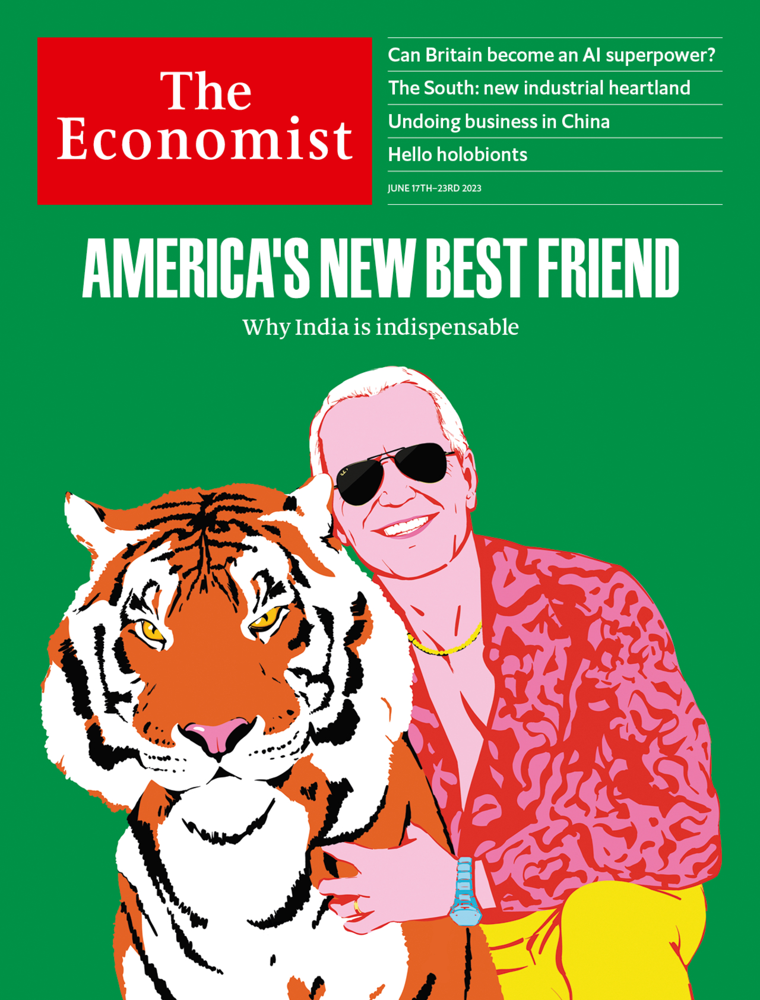

###### The Economist

# This week’s covers 

##### How we saw the world 

> Jun 15th 2023 

WE HAVE split covers this week. In the Americas and Asia we concentrate on the relationship between America and India. Can both sides gain the business and security benefits of co-operation even as they share fewer principles than they may care to admit? America and its allies should be realistic about where India’s sympathy lies—with its interests, not theirs—and creative in their efforts to find overlaps between the two.

 


: 

: 

: 

: 

: 


To readers in Europe, on the other hand, we show a cover focused on the British government and its dreams of making the country a science superpower. Generative ai has stoked a frenzy of excitement (and some fear) among techies and investors. But for Britain to prosper, much will have to change.

 


: 

: 

