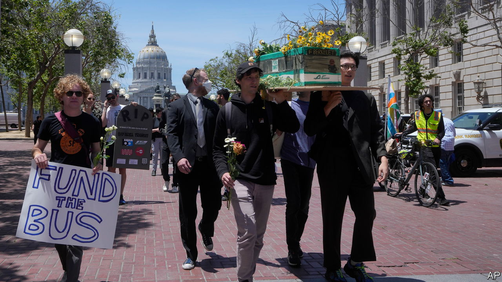

###### Going bus

# American states are bailing out public transport 

##### The alternative is fare rises and steep service cuts 

 

> Jun 15th 2023 

Sometimes, it turns out, protests work. On June 3rd, over a hundred San Franciscans mounted a mock funeral for public transport. Walking to city hall in the sun, they carried on their shoulders models of buses and trains like coffins, as musicians played a funeral dirge on trumpets and a saxophone. Their anger was over a proposal by Gavin Newson, California’s governor, that would have cut $2bn of spending from public transport in an attempt to balance the state’s hefty deficit. muni, San Francisco’s local transport agency, had suggested it might have to remove the equivalent of 20 bus routes to stay solvent.

Within a week, a deal had been worked out by the state legislature. Assuming it passes (and Mr Newson signs it), instead of cuts roughly $1.1bn a year will be made available to public transport, raised from the state’s emissions cap-and-trade scheme. California will thus stave off a problem afflicting public-transport systems across America: that of a fiscal cliff, as federal covid-relief money dries up. The Golden State is not alone in creating a financial parachute. In May New York legislators agreed a budget with over $1bn of new funding for the Metropolitan Transit Authority, New York City’s system. Minnesota has also introduced a new sales tax to raise $450m a year for the system in Minneapolis and St Paul.

Compared with other countries, public-transport use in America has been slow to recover from the pandemic. The number of bus and train passengers in May was still at only 69% of the pre-pandemic level, according to data from the American Public Transportation Association, an industry group. In May New York’s subway was carrying a mere 71% of the passenger total in 2019. Ridership on BART, in the San Francisco Bay Area, was at just 37% of the 2019 figure. In London in May, travel on the Underground system was already back to around 87% of pre-pandemic levels.

If it persists, lower ridership means less revenue from fares. For example, the ticket take on the Chicago Transit Authority was almost $300m lower last year than in 2019. Awkwardly, those agencies which were considered to be doing the best job pre-pandemic—because they raised lots of fare revenue, and so were subsidised less—are now the ones most in trouble, notes Yonah Freemark of the Urban Institute, a think-tank in Washington, DC.

In 2008, when the Great Recession created similar deficits, the result was often steep service cuts and fare rises. That could happen again. “We have some very serious fiscal challenges,” admits Leanne Redden, the director of Chicago’s Regional Transportation Authority, an umbrella agency for the region’s three transport agencies. She projects a $730m deficit by 2026. The transport systems of Boston and Philadelphia also face funding shortfalls that have yet to be tackled. Seattle’s has already announced cuts.

Yet even if states put up money, other changes will be needed to encourage ridership. Rising crime and disorder have kept some passengers off the subway in New York, says Nicole Gelinas of the Manhattan Institute, a think-tank. In Los Angeles, where homelessness has become an extreme problem, 22 people died in the year to March on buses and trains, most from drug overdoses. Crime also makes holding onto employees trickier, says Kam Buckner, a state representative in Illinois. Drivers he knows “have walked away because they don’t feel safe”. Staff shortages mean service is already shoddier even as the money still flows.

Yet good public transport is needed in America’s cities more than ever. Ted Egan, the chief economist of San Francisco, says the city’s economy will struggle to recover without it. “You can’t have everyone drive in,” he says. Without decent buses and trains, building more housing while lessening punishing congestion will be tricky. Yet the benefits, while immense, are also diffuse. By contrast, cliffs, fiscal or otherwise, are difficult to miss.■


