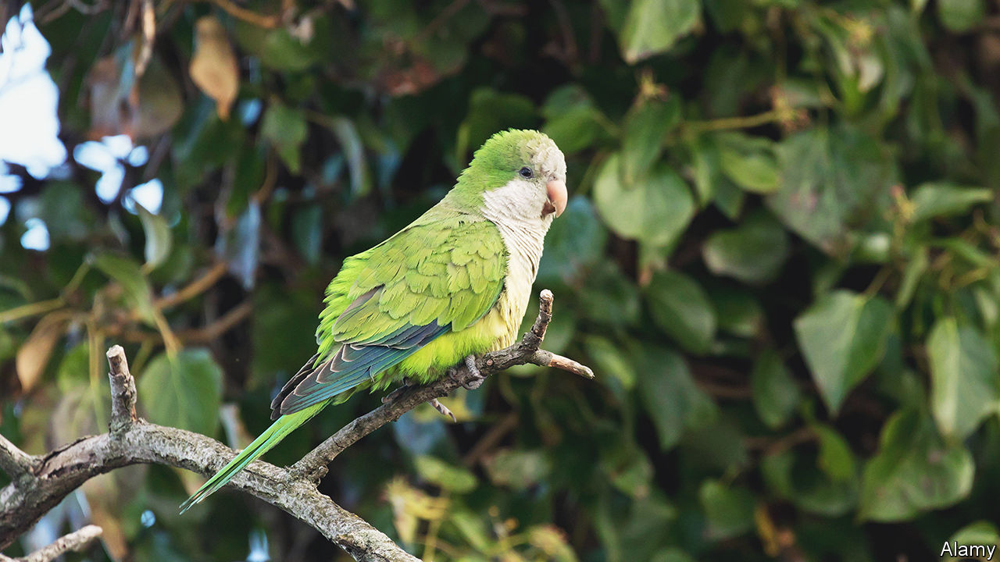

###### Invasive species in America

# Attack of the feral parakeets in New York 

##### Pretty pests present power problems 

 

> Jun 15th 2023 

“These guys are tenacious,” says John Stalzer, of PSEG Long Island, a utility company. No matter what his team does to stop them from building nests, the monk parakeets prevail. The birds will find the smallest gap, as teeny as a quarter of an inch (6mm), and insert a twig. “They will literally build off a twig and build their nests,” says Mr Stalzer, an environment specialist. “We should hire them as engineers.” The nests can be ten feet (three metres) in diameter , apartment buildings for the feathered set. When the birds expand their nests around electrical equipment, which keeps them warm, they can cause power cuts and sometimes fires. Since May 2021 they have knocked out power for 41,000 customers on Long Island. 

Monk parakeets, also known as Quaker parakeets, come from Argentina, where they are pests to farmers. But they look cute and are sociable, so lots were exported. Birds now breed in more than 20 states, including cold spots like Chicago. Stephen Pruett-Jones, a professor of ecology and evolution at the University of Chicago, says most of the colonies in America are probably descendants of escaped or released pets (another theory, almost certainly not true, is that the wife of a pet-shop owner released all the pet parakeets after a bitter divorce). 

America has about 50,000 non-native plant and animal species. About one in nine of those species has become invasive. Their cost is huge—estimates of the damage run to $120bn a year.

California has made it illegal to own a monk parakeet. In general, though, cuteness is an excellent survival strategy in the Anthropocene. PSEG does not destroy nests during nesting season. A lawmaker in New York introduced a bill to give monk parakeets protected status. Before the pandemic Stephen Baldwin gave parakeet safari tours in Brooklyn. Bird-watchers trek to Green-Wood Cemetery to see the nests built atop its Gothic Revival entryway. Other invasive species, like the Burmese pythons in Florida or the hemlock woolly adelgid (an aphid-like critter with no natural predators in North America), have less support. ■


