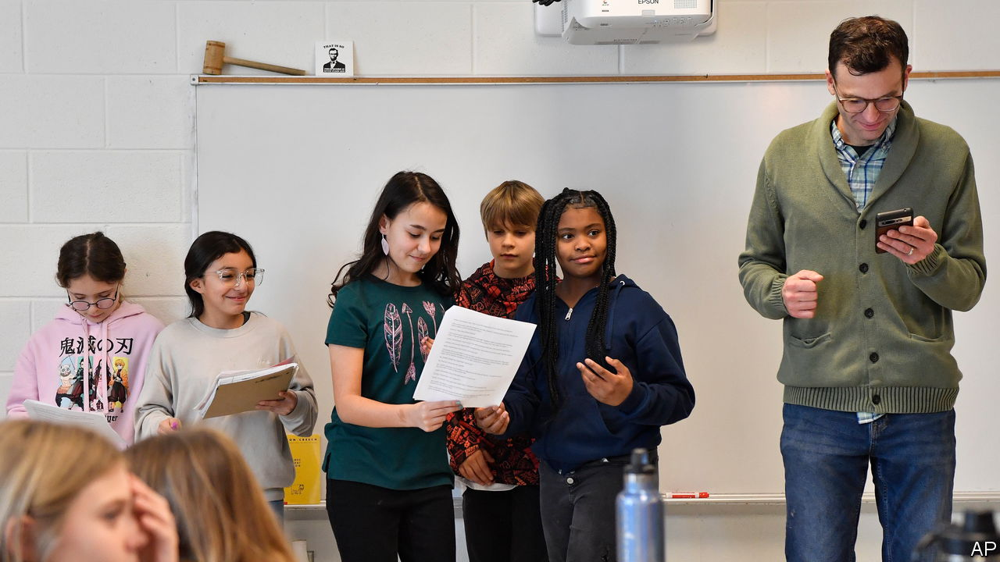

###### Teacher’s pet

# How ChatGPT could help teachers and lower the cost of college 

##### The college essay may be dying, but AI has plenty of upsides in education 

 

> Jun 15th 2023 

Many have mused on how ChatGPT could change the world, not least schools. Plenty fear the worst. The college essay has been pronounced dead. ChatGPT is causing an educational “crisis”, claims . Maybe so; but ChatGPT could also be a teacher’s friend.

It is easier to see the threat. Users can ask Chatgpt to compare Milton Friedman with Paul Samuelson, and it will create a five-point summary that contrasts their views. Ask it to create a rap about Friedman, and it delivers lines like: “He was an economist with a unique vision / Spittin’ truth about free markets with precision”. This sophistication and creativity worries lots of teachers and schools. New York City public schools, America’s largest school district, banned ChatGPT in January, only to reverse the decision in May. Some universities abroad have banned its use.

“Initially…everybody was thinking that the sky was falling,” says Jonathan Torres, an assistant professor of English at Quinnipiac University in Connecticut. He also trains teachers at Quinnipiac, and argues that AI can push them to become better. For example, before ChatGPT came along, an economics teacher might ask pupils to write an essay describing Keynesianism. With ChatGPT as an option, the teacher might ask the students to assess and revise the chatbot’s response to the same question—a more difficult task. AIs have other practical uses for teachers. They can help write lesson plans and worksheets at different reading levels and even in different languages. They can also cut down the time spent on duties, such as writing recommendation letters, that devour time that could be spent teaching.

Some organisations are going even further. Khan Academy, an education non-profit, recently launched a pilot of Khanmigo, its virtual guide that uses GPT-4, the latest upgrade of ChatGPT, to support pupils and teachers. If pupils gets a wrong answer to a maths problem, the chatbot helps them solve it on their own. In science, the program evaluates open-ended questions. In English class, it asks pupils questions about their essays. And in history, a pupil can debate with the bot to prepare for an in-class discussion.

The program provides teachers with a report on their pupils’ activities. Khanmigo can help teachers create lessons and test pupils’ knowledge afterwards. It can support pupils in different languages. It even allows pupils to “talk” to historical figures or literary characters via simulations. “This gives us the opportunity to give every student a one-on-one tutor, every teacher a teaching assistant, and more,” says Sal Khan, the founder of Khan Academy.

For those in charge of school and college administrations the benefits are, if anything, clearer. David Harris, president of Union College, a liberal-arts college in New York state, decided to play around with ChatGPT. He asked it to write a letter announcing that the college would no longer require the covid-19 booster jab after the spring term. The results were good enough for him to show examples to each of his senior staff—a letter to students about changing the campus mascot for his communications director, an Instagram post for campus photos on spring break, a final warning for an employee with chronic lateness for human resources.

Dr Harris is excited about what all this could mean for college costs. Many universities, including Union College, Stanford University and others, will charge about $80,000 a year next year for tuition, room and board. In 2021 the median household income in America was $71,000. College administration in America has become bloated. AI could eliminate the need for some of these jobs, and maybe enable colleges to pass savings on to students. ChatGPT may have killed the college essay, but with all its potential in and out of the classroom, perhaps that is ok. ■


