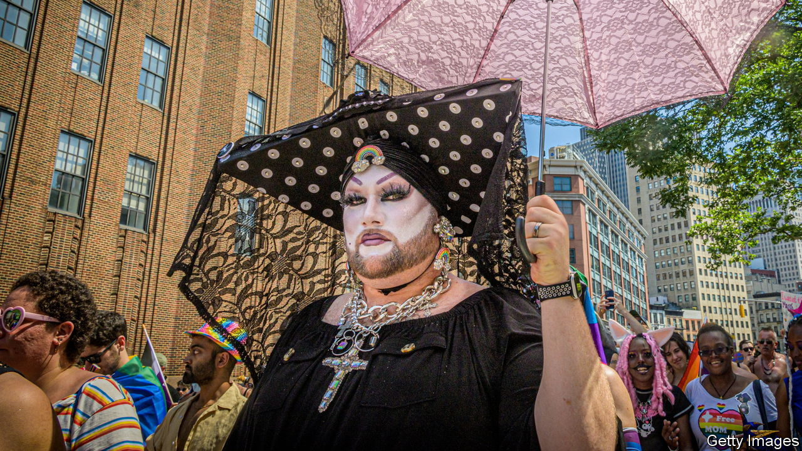

###### Pride/prejudice

# How LA’s drag nuns took centre stage in the culture wars 

##### A backlash against gay-pride festivities is rooted in gender-identity politics 

 

> Jun 15th 2023 

IT IS not your average group of nuns. In fact, the Sisters of Perpetual Indulgence are not nuns at all. They are transgender and queer drag queens dressed in technicolour—or sometimes leather—habits, who raise money for local charities. The sisters’ fame grew last month when the Los Angeles Dodgers invited, uninvited and then re-invited them to the club’s annual gay-pride night game. The baseball team suddenly found itself caught between conservatives who consider the drag nuns an anti-Catholic group and liberals outraged that the team capitulated to appease the conservatives. The Catholic League for Religious and Civil Rights is filling Los Angeles’s airwaves with radio ads urging the faithful to boycott the game. Attendance on June 16th will reveal whether LA’s religious baseball fans feel the need to stop worshipping at Dodger Stadium. 

As absurd as the fight over the sisters has become, it is just one of many political skirmishes over gay-pride events this year. In Glendale, a city next to Los Angeles, a brawl erupted outside a school-board meeting in which officials were deciding whether to recognise June as LGBTQ pride month for the fifth year running. Parents protested against a pride assembly at an elementary school in North Hollywood. Nor is the backlash limited to California. Conservatives called for the boycott of Bud Light, Cracker Barrel, Target, The North Face and other brands that recognise pride month, work with transgender influencers or hawk rainbow-flecked merchandise. 

Bill Clinton first declared June to be national “gay and lesbian pride month” back in 1999. So why, more than 20 years later, has pride become controversial? Two connected trends explain it. First, the scope of pride has changed over the years, perhaps faster than public opinion. During their presidencies Barack Obama and Joe Biden expanded their pride declarations to include more people of different sexualities and gender identities. This year Mr Biden proclaimed June to be “lesbian, gay, bisexual, transgender, queer and intersex pride month”. LG has become LGBTQI+. 

More Americans than ever, about 71%, support gay marriage. But there is less enthusiasm for the latter bits of the initialism. A recent survey for  by YouGov suggests that about a third of Americans think society has gone too far, and the same think it has not gone far enough, in accepting trans people. One opponent of pride month in Glendale identified herself as an LGB activist. “LGBTQIA [”A” stands for asexual] is so broad that it really is quite difficult…to hold together as a front,” says Karla Jay, who helped organise the first pride marches in New York and Los Angeles in 1970. 

Second, issues around gender identity have become core to the culture wars. The Republican Party’s presidential hopefuls are betting that framing their  and books with queer characters as a battle for parental rights will win them votes. Nikki Haley has suggested, without evidence, that trans children playing in girls’ sports has led to more teenage girls contemplating suicide. Mike Pence called the Dodgers’ drag-nuns invitation “deeply offensive”. And , by prioritising anti-LGBTQ bills as governor of Florida, has turned himself into America’s biggest anti-woke warrior. 

Florida has pushed anti-LGBTQ bills, such as the so-called , which bans teachers from discussing sexual orientation or gender identity with young pupils (something it is not clear they were doing in the first place). But it is not the only state doing so. The American Civil Liberties Union reckons state lawmakers have introduced nearly 500 gender-identity bills in 2023 alone. Nearly half concern education, and would do such things as ban students from using bathrooms that do not correspond to their biological sex, or oblige schools to inform parents if children change their pronouns. 

 Meanwhile in Los Angeles, the Sisters of Perpetual Indulgence are declaring victory. “May the fans be blessed!” they wrote after being invited back to the baseball game. “May the beer and hot dogs flow forth in tasty abundance!”■


