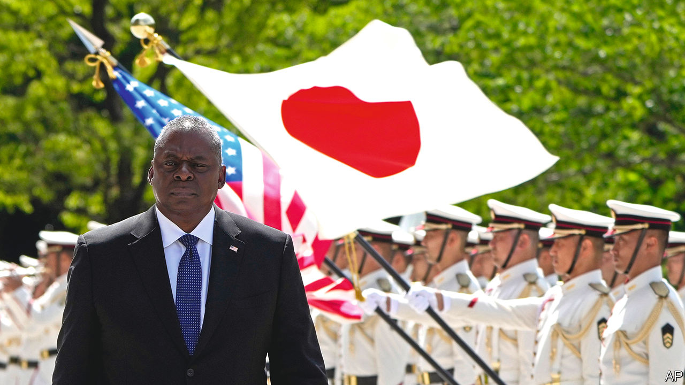
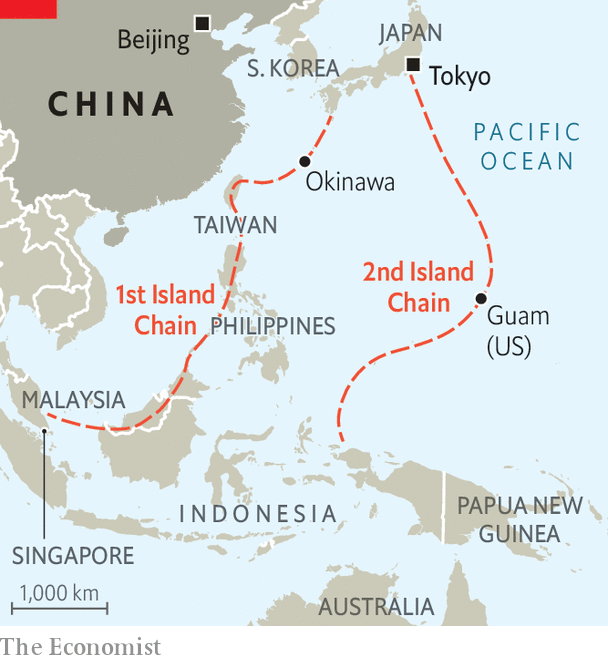

###### The chain

# How the Pentagon thinks about America’s strategy in the Pacific 

##### Our correspondent travels through Asia with Lloyd Austin, the defence secretary 

 

> Jun 15th 2023 

How to prevent war with China? And how to win if one breaks out? As American strategists turn to the map, one school argues for holding the “first island chain” that girdles China, from Japan to Malaysia; others prefer to draw the line at the second chain, which runs from Japan to New Guinea. The first is populous and important economically but also vulnerable, lying well within the “weapons engagement zone” of many Chinese missiles; the second is safer and offers more certain access—including American outposts such as Guam. To judge from a flurry of moves by America and its allies, the answer is: redouble the defences of the first chain, but also strengthen the second.

In defence terms, America’s “pivot to Asia” is not a single move, but a weaving of initiatives—with overlapping bi-, tri-, quadri- and multilateral deals—to create an ever-thickening lattice on China’s periphery. Some deals are modest; many are uncertain if tested in war. But they amount to the “fortification of America’s forward defence perimeter in the western Pacific”, says a senior American defence official. 

 


American planners once traced east-west lines of coaling stations in the Pacific to reach China and Japan. But the second world war changed their perspective, says Michael Green of the United States Study Centre in Sydney. The attack on Pearl Harbour showed that vast distances do not guarantee safety; America’s island-hopping campaign highlighted the importance of north-south axes. Later on, the first island chain helped America contain the Soviet Union. Now it holds back China. 

To see how, begin with the northernmost link, Japan. Despite its pacifism, it is greatly boosting defence spending. American marines in Okinawa are practising how to scatter and defend the islands and sea passages. The next link, Taiwan, is under intense strain, given China’s aim to retake the self-governing island by force if necessary. America may soon announce the first “drawdown” of weapons from its own arsenal, pre-emptively strengthening Taiwan much as it has armed Ukraine. The Philippines, the next link, is weaker but has agreed to give America access to nine bases in the country; in return America is helping to beef up its forces. 

In the second chain, meanwhile, America is devising ways to disperse its jets in wartime and hardening the defences of Guam. It wants to project more power from Australia, where it rotates air force and marine units. It is working with Britain to supply nuclear-powered submarines to Australia under the AUKUS deal; the three are also working on new weapons, including hypersonic missiles. Farther afield, the Quad—America, Australia and Japan working with India—is not a formal security grouping, but their navies exercise together. Across the region, American-led war-games are becoming bigger and more sophisticated. Sometimes America’s security arrangements are limited, for instance its new defence deal with Papua New Guinea; or its efforts to help littoral states improve “maritime domain awareness” to, say, curb illegal fishing by Chinese fleets. This, too, helps enmesh America in the region.

Travelling across Asia on an E4-B, the flying command post of Lloyd Austin, America’s defence secretary, brings alive this web-weaving strategy. One expected highlight turned to disappointment when the Chinese defence minister, Li Shangfu, declined to meet him at a talkfest in Singapore—even as a near-collision of American and Chinese warships in the Taiwan Strait on June 3rd made plain the need for such contacts. (Antony Blinken, America’s secretary of state, is visiting on June 18th).

Still, Mr Austin was busy strengthening links. In one meeting he sought to hasten the rapprochement between Japan and South Korea and integrate their missile defences. In another he brought forth a new quad with Australia, Japan and the Philippines. In Tokyo he promised to help Japan develop “counter-strike” missiles that could reach mainland China. In Delhi he prepared an ambitious l with India. 

China accuses America of building an “Asian NATO”. But the reality is a looser system. America’s friends and allies in the “Indo-Pacific” have no mutual-defence commitments akin to NATO’s Article 5, under which an attack on one is an attack on all, nor integrated multinational commands. Japan is just starting to develop a joint headquarters for its own military branches. How that might connect to American command structures is unclear. 

In any war, the US official admits, America cannot be sure who would fight or offer help. Much would depend on the politics of the day. But he notes: “China also faces growing uncertainty. It is one thing for China to threaten one country, another for it to risk war with the whole region.” ■


