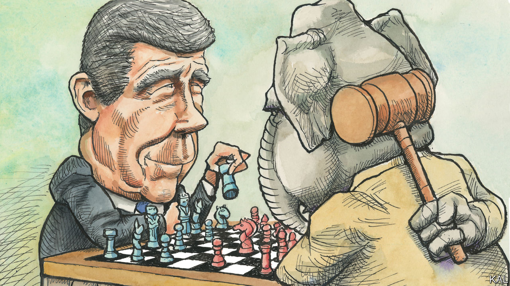

###### Lexington

# North Carolina may be the hottest political battleground of 2024 

##### Political manoeuvring and changing demography are making it the most interesting state to watch 

 

> Jun 15th 2023 

The most fascinating political chess match in America outside Washington, DC—where the usual game is more like 52-card pickup anyway—is taking place in North Carolina, involving races from the local to the national level. Joe Biden, who is already running campaign advertising in the state, made his sixth trip there as president on June 9th, the same day as Governor Ron DeSantis of Florida and a day ahead of two other Republican candidates, Mike Pence and Donald Trump. 

At the state Republican convention in Greensboro on June 10th, Mr Trump called North Carolina “a very, very special place” and boasted of his “tremendous success here”. He chose not to mention that from 2016 to 2020 his margin of victory plunged by 2.3 percentage points, to fewer than 75,000 votes out of more than 5.4m cast. Among the 26 states he won in 2020, that was his narrowest edge. Whereas a Democrat has a plausible path to victory without North Carolina’s 16 electoral votes, a Republican does not. 

Having dominated legislative races in rural areas, Republicans have the chance to entrench control: this spring a Democratic lawmaker stunned her party by defecting, thereby providing Republicans with majorities big enough to make law over vetoes by the governor, Roy Cooper, a Democrat in his second term. Republicans won a majority on the elected state Supreme Court last year, removing another check.

Yet the governor gives every sign of feeling he has the Republicans right where he wants them. A genial, canny centrist first elected to the legislature back in 1986—he wrote the veto law, in 1995—Mr Cooper thinks they are overplaying their hand. “They’re beginning to hear from their constituents,” he says with a chuckle, sitting in the governor’s mansion in Raleigh and gesturing toward the statehouse. “I’m talking to their constituents and informing them of what’s going on behind closed doors over there.”

The legislature has begun stripping the governor of some powers, granting itself authority to make certain appointments. Mr Cooper is worried about what that means for the balance of power, but does not think voters will pay much attention to such mechanics. “They care about the issues that affect their day-to-day life, so they care about some of the things that are beginning to result from this grab for power,” he says. He points to a 12-week ban on abortion that the assembly just imposed over his veto, and a school-voucher plan to let parents, regardless of income, use public money to pay for private school. 

Mr Cooper, whom polls show to be the most popular state politician, has declared a state of emergency in public education and is using his bully pulpit to warn that the abortion ban is a step toward even tighter restrictions. A poll by Meredith College in February found that 57% of the state’s residents supported keeping or expanding the previous law, which allowed abortion up to 20 weeks. Republican lawmakers argue that their law is a sensible middle ground. “The things in this bill are not obstacles to abortion,” the state’s speaker pro tempore, Sarah Stevens, insisted during floor debate. “They’re safeguards.” That is a posture unlikely to satisfy either Democrats or fervently anti-abortion Republicans. 

Mr Cooper is term-limited, which means North Carolina will have one of the fiercest races for governor in 2024. The likely Democratic nominee is Josh Stein, the state attorney-general, who is cut from Mr Cooper’s cloth. The Republican front-runner is Mark Robinson, the lieutenant governor, elected separately from the governor. He models the Trumpist flair that enraptures Republican hardliners but tends to dismay everyone else. He has compared abortion to slavery, called homosexuality and transgenderism “filth” and ridiculed survivors of a school shooting as “media prostit-tots”. He has praised Joe McCarthy and attacked the civil-rights movement as destroying freedoms. Mr Robinson, who is black, complained on Facebook that the movie “Black Panther” was “created by an agnostic Jew” and “put to film” by a “satanic Marxist.” At the state convention, Mr Trump called Mr Robinson “one of the great stars of the party” and said he would endorse him.

Carolina blues

Some Republican activists believe their party’s dominance is assured by the erosion of the historic Democratic loyalty of voters in the rural east of North Carolina, Mr Cooper’s home turf. But Paul Shumaker, a longtime Republican strategist, does not share their optimism. He notes that 75% of the increase in voters in the past decade has occurred in just 12 of the 100 counties, in and near cities that favour Democrats. “My message to my party is if you don’t fix your urban-suburban problem, you won’t fix your statewide problem,” he says. “And not just your supermajority, your majority will be gone by the next decade.”

Mr Cooper is not counting on that trend alone. “Demography may be destiny, but you have to make it work, and you have to get people out to vote,” he says. With all legislative seats on the ballot in 2024, he plans to run a Democratic candidate in every district to motivate Democrats even in overwhelmingly Republican areas. “That will help us overall statewide,” he says. “And I think there’s going to be a historic amount of investment in the governor’s race, because of what’s at stake.” 

Republican legislators plan to rewrite voting laws in ways that will advantage them, and they will also be able to draw favourable state and congressional districts. Under the “independent state legislature theory”, North Carolina’s Republicans are arguing at the Supreme Court that legislatures should be free of any court oversight of election laws. The court seems unlikely to endorse that view, but Mr Cooper worries about what it implies for election integrity. “The foundation of democracy is at stake when you have a legislature, just like President Trump, who would do anything to the fabric of the system to stay in power,” he says. “And my goal is that we would never find out whether they would go that far.” ■


