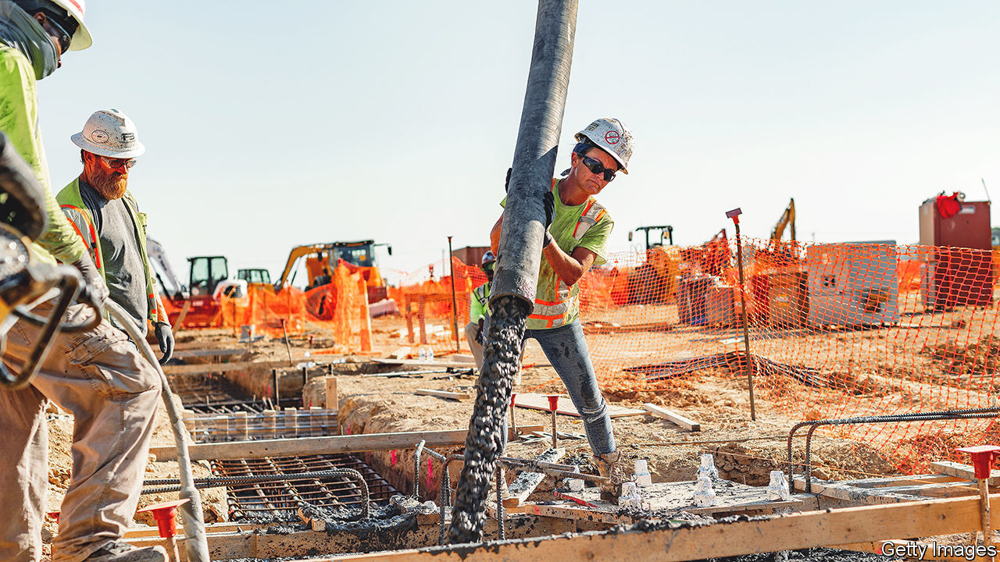
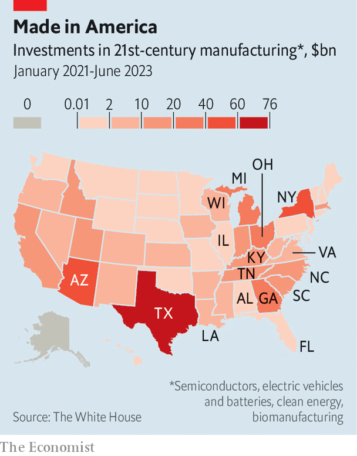
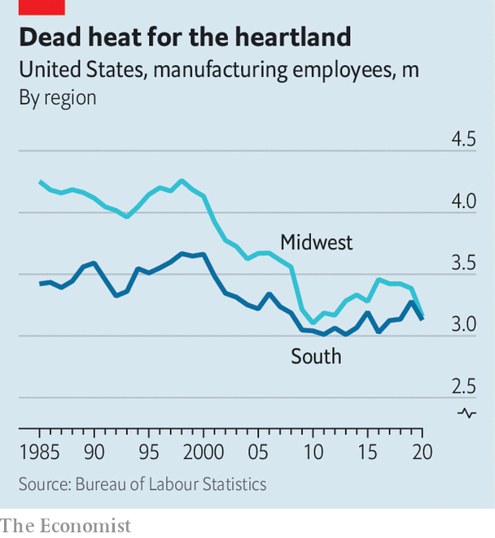

###### Southern shift

# The South is fast becoming America’s industrial heartland 

##### Joe Biden’s manufacturing boom is accelerating the region’s rise 

 

> Jun 12th 2023 

In popular perception America’s industrial heartland is its Midwest. Just look at where President Joe Biden has travelled for many of his big made-in-America speeches: Ohio thrice, Michigan twice and Wisconsin. (These, helpfully, are also political battleground states.) But look at where the money is flowing, and a different picture emerges. It is the South—a region running from Texas to Virginia—that is fast becoming America’s new  (see map).

 


The shifting of American factories has been years in the making. When Japanese and German carmakers started production in America in the 1980s and 1990s, most chose the South. They were attracted by a dearth of unions and generous subsidies. Nissan went to Tennessee, Toyota to Kentucky, Mercedes-Benz to Alabama and BMW to South Carolina. In 1985 the Midwest had 1.25 workers making durable goods such as cars and electronics for each one in the South, according to the Department of Labour. By 2021 the South had just about drawn even (see chart).

What stands out now is the pace of change. The industrial policies crafted by Mr Biden’s administration—notably, incentives and rules to boost the production of semiconductors, renewable energy and electric-vehicles (EVs)—have catalysed a surge in investment, much of it in the South. S&amp;P Global Market Intelligence, an analytics company, calculates that about two-thirds of planned EV jobs will be there. The White House keeps a tally of investments in “21st-century industries” since Mr Biden took office: the South has received more than twice as many as the Midwest. The Midwest is getting plenty of new factories, too. It is just that the balance has tilted southward.

 


For a glimpse, visit the once-sleepy fields of south Hardin County in Kentucky. New high-voltage lines run to a giant lot where thousands of construction workers have already completed the grey carapace of one warehouse-like building and are busily putting up a second. It is a 1,500-acre supersite—roughly equivalent to about 1,140 American-football fields—given in 2021 to Ford and SK, a South Korean industrial group, for an EV battery joint venture. 

For Rick Games, president of a local development office, it is a sweet reward for two decades of patience. Hardin County has sat on the plot since 2002, making sure it was connected to highways, railways, power and water supplies, but waiting for the right buyer. “There were maybe three or four semi-serious inquiries for nearly two decades,” but then from around 2020 “things just started going crazy,” he says. “The phone was ringing off the hook and I started showing the site once or twice a month.” The venture, known as BlueOval SK, expects to invest nearly $6bn and to employ some 5,000 people—making it, at a stroke, the biggest business in the county.

The availability of big land plots is a crucial part of the South’s recipe for success. Nathan Niese of BCG, a consultancy, says the region’s officials were ahead of the curve. “They have been focused from the beginning on the ease of doing business. They have well-prepared megasites, and within 24 hours of a request can get full details about them into your hands,” he says. Georgia started a programme to pre-certify industrial sites, setting them up for fast-track construction, in 2008. Tennessee launched a similar initiative in 2012. In the Midwest, Ohio was similarly proactive, but others have been slower: Michigan passed site-readiness legislation in 2021; Illinois founded a megasite-investment programme just a few months ago.

The absence of a century-old carmaking legacy in the South also means that its officials have had a freer hand in luring firms across a range of industries, from chemicals to batteries and plastics. “We have a good diverse portfolio thanks to the fact that we were once such an agrarian state,” says Jeff Noel, secretary of Kentucky’s cabinet for economic development.

The South has other selling points, too. It has cheap power, critical to battery factories that use vast amounts of energy. Of the ten regions monitored by the Energy Information Administration, a government agency, the “east south central”, including Kentucky and Tennessee, has the least expensive power in America, at about six cents per kilowatt hour, nearly 20% cheaper than power in the Midwest. 

Awkwardly for companies aiming for greener growth, that cost advantage is predicated on the south-east’s continued reliance on coal: Kentucky, for example, generates about 70% of its electricity from coal, the fourth-highest share of any state. It is adding more renewables to its mix, though progress is slow. “The fundamental reality is that today, coal-fired facilities are delivering reliable, efficient electricity,” says Mr Noel.

The relative lack of unions in the South is less compelling than it once was. Just 6% of America’s private-sector workers were union members in 2022. But workers come into the equation in another way: firms have a bigger pool of potential labour in the South. Texas has attracted more new residents than any other state in recent years; Georgia, Tennessee and the Carolinas have also been magnets. State investments in worker training make this migration even more potent. A ranking of workforce programmes by , a site-selection magazine, is telling: in 2022 its top five were Georgia, Virginia, South Carolina, Alabama and Louisiana. Alabama, for example, offers free specialised technical training to both firms and jobseekers.

Geographical advantages play out differently depending on the sector. For EVs many companies aim to be near the I-75 interstate highway, which runs from Ontario through the Midwest and the South, and down Florida’s Gulf coast. It puts most suppliers and many customers within a day’s drive. The south-west, and specifically Arizona, has become the preferred destination for semiconductor manufacturers, thanks to its cheap land and stable geology.

Might the South’s manufacturing boom have political consequences? The investment surge resulting in part from Mr Biden’s policies so far looks like the opposite of pork-barrel politics: most of the money has gone to places that do not favour him. According to a database of EV investments announced in the 300 days since the passage of the Inflation Reduction Act, Mr Biden’s clean-tech law, more than 80% has gone to Republican-controlled districts. Could the presence of more manufacturing—an industry once aligned with Democrats—move their politics leftward? Perhaps. But as factories become less labour-intensive, their political weight may well diminish. Robots do not vote.

Still, an increase in manufacturing may reshape political priorities in other ways. Susan Elkington, president of Toyota’s Kentucky plant in Georgetown, notes how companies there are struggling to find enough workers—a national concern that is especially acute in factory towns. One solution is to lure more women into work: in Kentucky only 53% are in the labour force, among the lowest rates in the country. That, in turn, points to a need for more child care. Toyota provides onsite day care for its employees, but many workers elsewhere struggle to get similar support. “It’s difficult to find quality child care, and then it is difficult to afford it,” says Ms Elkington. State funding for child care is an objective which Mr Biden failed to enshrine in law, but manufacturers may yet push it to the fore at the state and local level.

For now such challenges are not getting in Toyota’s way. On May 31st it announced that it will produce its first American-made electric vehicle—a three-row SUV—at its factory in Georgetown. These cars are likely to hit the road in a couple of years, with batteries from a new plant in North Carolina. It is a $600m investment in Kentucky, but it barely made a ripple in national media. That is testament to how far the South has come. In 1986 Toyota’s decision to pick Kentucky as a factory hub was groundbreaking; in 2023 it seemed an obvious choice. The South is no longer a manufacturing upstart. Instead it looks more like the incumbent power. ■


