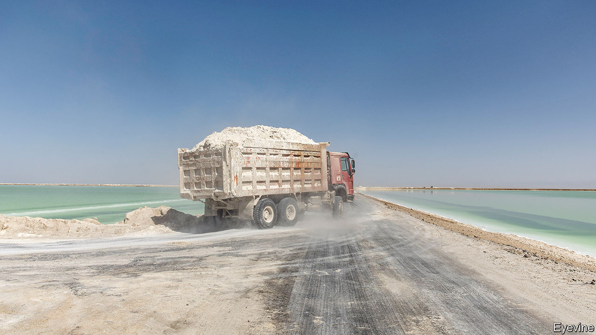

###### High on their own supply

# Can Australia break China’s monopoly on critical minerals? 

##### Asia’s new resource competition 

 

> Jun 20th 2023 

JUST AS OIL was weaponised by its suppliers in the 1970s, so China’s dominance in the supply and processing of critical minerals could prove threatening. Cobalt, graphite, lithium, nickel, the rare earths and more are called critical for good reason. They are crucial to defence, smartphones and other digital technologies. A handful are essential to wind turbines, batteries and electric vehicles. A clean-energy future is inconceivable without them.

China has a near monopoly on many of these minerals. It supplies nearly 90% of processed rare-earth elements. It is by far the biggest processor of lithium. In the Indo-Pacific region, this is driving Australia, Japan, South Korea and others to seek to diversify away from China—in the process defining a new resource-based geopolitics.

Plans for new critical-mineral supply-chains are being drawn up in multilateral forums such as the Quad grouping of America, Australia, India and Japan. Resource-rich countries like Australia and Indonesia (with lots of nickel and plans for a battery industry) aim to profit from a minerals bonanza. The focus of much of the strategising, according to the National Bureau of Asian Research, a think-tank in Seattle, is on three things: “friend-shoring”, shifting supply-chain management from “just in time” to “just in case”, and ensuring spare capacity in minerals processing.

Mineral-related initiatives are coming in droves. China’s dominance, says Australia’s resources minister, Madeleine King, is a “strategic challenge”. On June 20th her government unveiled a critical-minerals strategy to address it. Australia is the biggest producer of lithium, the third-biggest producer of cobalt and fourth-biggest of rare earths—yet a processing minnow. It aims to become, by 2030, “a globally significant” producer of processed critical minerals. It can “play its part in making sure we build secure supply chains”, says Ms King.

To that end Australia is committing A$500m ($343m) to projects under its new strategy. That is in addition to an existing A$2bn fund to get early-stage critical minerals projects off the ground, among them a rare-earths refinery. This year Australia’s government blocked a Chinese entity from raising its stake in a rare-earths company on national-security grounds.

As a free-trade partner of America’s, Australia hopes to qualify for green subsidies under President Joe Biden’s Inflation Reduction Act. In April a delegation of Australian producers visited Tokyo, hoping that Japanese investment and long-term purchase contracts will do for Australia’s critical-minerals industry what they did for its now pre-eminent iron-ore and gas sectors. Last year Japan made critical minerals one of 11 strategic sectors deserving of government support. In March, Japan and America agreed to co-operate on minerals supply chains, including by countering “non-market” actors (ie, China). 

South Korea, with global ambitions for electric vehicles and batteries, looks especially vulnerable to competition between America and China on this issue (and others). As part of President Yoon Suk-yeol’s commitment to “comprehensive resource-security measures”, his government earlier this year released a plan to secure critical-mineral supplies. The aim is to cut the country’s import dependence on China from 80% to 50% by 2030 and to increase its use of recycled minerals, from 2% to 20% of the total. South Korea has struck partnerships with countries including Australia, Indonesia and Kazakhstan, as well as the eu. It has joined an American-led, multi-country Minerals Security Partnership, announced last year.

Taiwan and India are also groping their ways towards adopting new critical-minerals strategies. The challenge, in nearly all cases, is China’s lock on processing, which is costly, complex and potentially environmentally hazardous to develop. Dozens of metallurgical stages are required to turn a rare earth ore into the final product. Only tiny amounts of critical minerals can be extracted from vast quantities of ore. Decades ago, China made processing central to its industrial plans, using massive subsidies and lax environmental standards. Its domination reflects that decades-long strategy.

By and large, its customers did not mind when it used its processing monopoly to drive down prices in order to deter global competitors. The risks of China’s dominance have grown, however. For Japan that became apparent in 2010, when China suspended exports of rare earths to it in reprisal for a spat over some disputed islets. Last year it threatened to withhold critical minerals from two American defence contractors, Lockheed Martin and Raytheon Technologies, in protest over America’s arms sales to Taiwan. 

The pandemic caused others to wake up to the perils of a monopoly processor, by underscoring the vulnerability of supply chains generally. Russia’s invasion of Ukraine further highlighted the risks of doing business with a potential enemy. By withholding supplies of gas to European customers, Russia sought to weaponise a crucial commodity. (It is also a key exporter of nickel and palladium.)

Yet one case study shows how hard creating alternative mineral supplies can be. After Japan’s China stand-off in 2010 its government encouraged a Japanese trading house, Sojitz, to sign purchase contracts with an Australian producer, Lynas Rare Earths, while backing it with cheap loans. China fought back by flooding the market to suppress rare-earth prices. In Malaysia, political opposition grew to a new Lynas processing plant, despite the International Energy Agency giving it a clean bill of health. A Chinese propaganda group backed by the Communist Party had spread disinformation about the project. Lynas survives thanks to cheap loans from Japan, which recently advanced it a further A$200m (S136m) in investment.

Given such hurdles, and the high costs of environmentally safe processing, any new capacity will require long-term support, Ms King argues. Tiny rare-earth mining companies cannot afford the railways and other supporting infrastructure that Australia’s giant iron-ore companies run. Lynas’s chief executive, Amanda Lacaze, calls for “straight-up industry planning” to rival China’s 30 years of strategic thinking on critical minerals. Co-operation among like-minded countries will also be crucial, says John Coyne of the Australian Strategic Policy Institute in Canberra. His institute’s “Darwin dialogue” aims to enhance co-ordination between America, Australia and Japan on rare earths.

How different might critical-mineral supply chains eventually look? Mr Coyne says the goal, achieved through investment and co-operation, should be more resilience and competition and less reliance on China. There is far to go before reaching even that modest aim. China’s hold is imposing, and the costs of entry into processing steep. Even the boss of Raytheon, the world’s biggest maker of guided missiles, this week told the s that ending its reliance on Chinese supplies of critical minerals looked “impossible…We can de-risk but not decouple.”■

