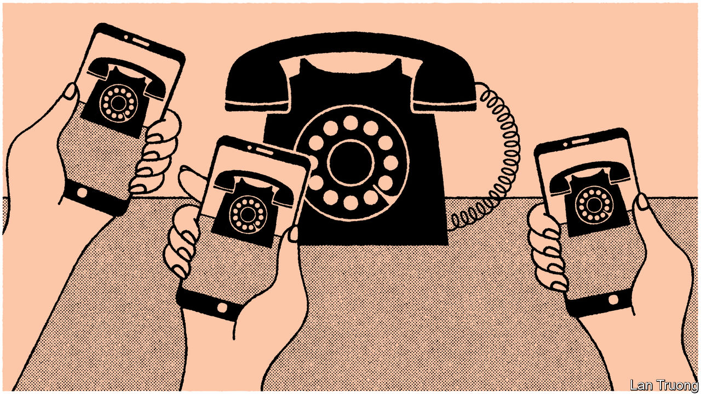

###### Banyan

# Japan is nostalgic for a past that was in part worse than its present 

##### The country has lost the dynamism of the Showa period, and retained its stultifying mores 

 

> Jun 22nd 2023 

THE YEARS slip away as one walks through the gates of Daiba Itchome Shotengai, a 1960s-themed shopping district in Tokyo’s bay area. Children munch on cheap and old-fashioned Japanese snacks. A couple of 20-somethings take turns at dialling a rotary telephone. A newspaper headline on the 1964 Tokyo Olympics reads dreamily: “Clear blue sky—opening ceremony of the century”. A model of an under-construction Tokyo Tower, the building that would come to symbolise Japan’s post-war recovery and economic boom, stands in one of the hallways.

The mall is one of many odes to Japan’s Showa era, which corresponds to the reign of Emperor Hirohito (1926-89) but which has become synonymous with the boomtime 1950s-80s. Seibu-en, an amusement park in Saitama, near Tokyo, rebranded itself as a 1960s-themed townscape in 2021. Rural areas have started promoting Showa architecture to attract tourists. For some young Japanese, the epitome of cool involves visiting 1960s-style cafés known as ; pictures of their archetypal fare, such as emerald-green melon soda floats, flood social media. Kayokyoku, tunes from the Showa era, and city pop, an upbeat, Western-fused music genre that peaked in the 1970s, are back in vogue. 

The fascination with Showa reflects a longing for Japan’s more dynamic past. The country has never been richer or safer at home than it is today. Yet to many Japanese it feels stagnant, mired in political apathy, slow economic growth and a pervasive sense of relative decline. A recent survey showed that only 14% of young Japanese believe their country’s future will “get better”. Showa Japan, a place of remarkable growth, was a different case. Voter turnout among young Japanese was then twice as high as it is today. “It was a time when people strongly believed: all your dreams can come true,” says Kubo Hiroshi, 64, who founded Daiba Itchome Shotengai.

That social and economic dynamism is reflected in Showa’s adventurous aesthetics. Bright colours and exuberant designs—such as the glitzy chandeliers and plush velvet seats in many —are common features. An exciting inrush of Western influence on music and fashion added to the feeling of post-war transformation; disco-like city pop often features English lyrics. The atmosphere of the subsequent Heisei imperial era (1989-2019) can feel cold and sterile by comparison. (Otaku culture, which involves geeks obsessing over manga and video games, emerged during Heisei.)

Showa retro has a demographic significance, too. It reflects the country’s bulge in pensioners, who naturally hanker for the time of their lost youth. Inamasu Tatsuo of Hosei University suggests that Showa nostalgia is distinct from the retro fashions of America and Europe because of how many of those who experienced the period first-hand are participating in it. Some nursing homes and sports gyms aimed at older users have been redecorated in 1960s colours and style.

There is a downside to Japan’s nostalgic obsession. Young Japanese use the term “Showa” to denote outdated, yet irksomely persistent, views—similar to the way that young Americans use the phrase “OK Boomer” to express indignation at pampered and entitled baby-boomers. Outworn Showa attitudes include sexism, wage slavery and an adherence to seniority-based hierarchies. When Banyan asked a group of 20-something Japanese, including aficionados of Showa chic, if they would actually like to have lived in that bygone time, almost all shook their heads. “Maybe I’d like to experience Showa just for a day to see the architecture and culture,” says Shichijo Miu, 20, who runs a Showa retro student club at Musashi University in Tokyo. “But when it comes to social attitudes, there’s a lot I don’t support.”

The endurance of Showa’s stultifying side also has to do with demography. Men who came of age in the post-war era still dominate Japanese politics and the upper echelons of many institutions. The average age of Cabinet members is over 60, and only two out of 24 are women. Japan’s gender-pay gap is the worst in the G7. In the hands of its fuddy-duddy leaders, Japan has been slow to embrace digital technology (sending faxes is still routine in offices). The government opposes legalising same-sex marriage, even though a majority of the public supports it. The Showa aesthetic can enrich contemporary Japan, and a memory of Showa dynamism inspire it. Still, in some ways the Showa mindset is holding it back.■


