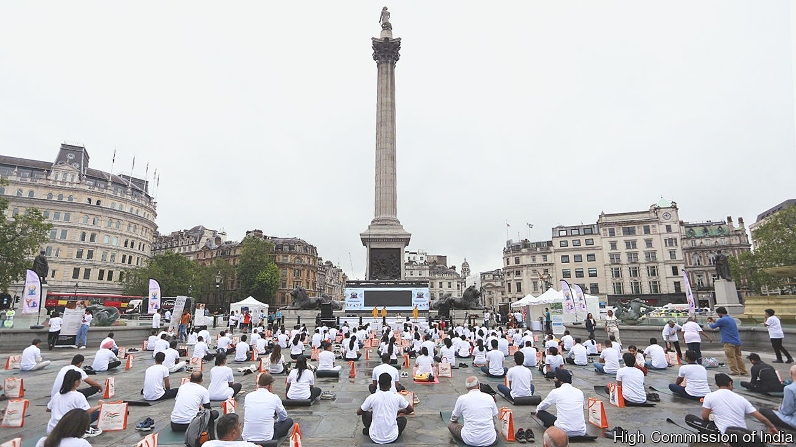

###### International yoga day

# Narendra Modi’s yoga evangelism 

##### The Economist joins an invigorating mass contortion in Trafalgar Square 

 

> Jun 20th 2023 

Trafalgar Square, like many public places in London, is crammed with British Indian history. On one of its giant plinths is a statue of Charles James Napier, conqueror of Sindh in 1843. On another is Henry Havelock, who beat the rebels at Kanpur in 1857. On June 20th the square hosted a more contemporary display of Indian empire-building—in the form of 300 British Indians and assorted others (including  practising yoga.

It was an early celebration of international yoga day, a UN initiative launched at the urging of Narendra Modi in 2015. Critics of the Indian prime minister’s  view his yoga evangelism with suspicion, given the practice’s Hindu origins. The yoga chant “Om” is a sacred sound in Hindu scripture. The Sun Salutation, a common set of yoga poses, is associated with Hindu prayer. Yet the annual yoga day is, like the practice itself, more obviously inclusive. It also signifies increased Indian confidence and visibility—and Mr Modi’s genius for marketing his country and himself. A daily practitioner, the Indian leader himself marked yoga day by leading a multinational contortion at the UN headquarters in New York. 

For many in Trafalgar Square, yoga was a spiritual, but non-sectarian, answer to the pressures of modernity. Inderpal Chandel, a 45-year-old from Hounslow, credited her daily practice with easing a workplace injury that for 17 years put her on crutches: “My life was changed by yoga.” For many, too, it was a way to sustain an Indian identity in the West. “Yoga should not be minimised for recreation, but appreciated culturally and wholly,” says Mamata Subramanian, a 30-year-old raised in Ohio. Though relatively few were diehard Modi fans, most said the prime minister had raised the prestige of Indian culture. “He’s not polite but he’s pushy, and that’s a good thing,” says Mohit Singh Bharti, 31, mortgage adviser and immigrant from Jaipur. 

Yoga-wise, this newspaper concurs. Trafalgar Square, a place of protest and revelry, had never rung with more civilised instruction than that offered over the course of the two-hour session. “Feel awareness in your toes intently.” “Any remaining thoughts and feelings, just relax and make a note of them.” And, ahead of the gut-crushing, which encourages flatulence: “If you hear any noises, be kind to yourself and your neighbour.”

If this was rascality, as the imperialist Napier said in an altogether less benevolent context, it was a “very advantageous, useful, human piece of rascality”.■

