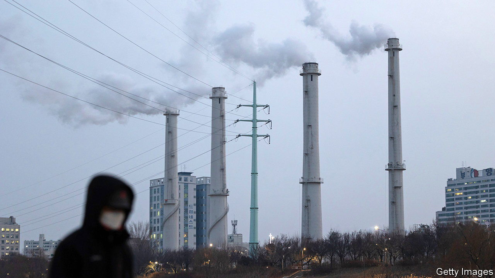

###### Greenwashing in Seoul

# South Korea, having sworn to lead the green transition, is holding it up 

##### The country has given its polluting industries even longer to cut their emissions 

 

> Jun 22nd 2023 

Addressing the UN‘s annual climate summit in 2009, South Korea’s then-president promised his country would be “an early mover when it comes to tackling climate change”. Lee Myung-bak pledged that South Korea would allocate the equivalent of 2% of GDP per year to the fight over the next five years and host an inter-governmental initiative, the Global Green Growth Institute, outside Seoul. “Instead of saying you first’,” said Mr Lee, the former head of Hyundai Construction, South Korea would henceforth act “me first”.

Considering the shape of the country’s economy, this was ambitious. South Korea’s rise from post-war destitution, to become the world’s 12th-largest economy, was driven by polluting heavy industry and fossil fuels. Perhaps predictably, then, neither Mr Lee nor his successors have done much to help the country meaningfully curb its emissions. A decarbonisation “blueprint” recently released by the current government of Yoon Suk-yeol provides further reason to doubt that it will.

South Korea’s emissions did not peak until 2018, almost a decade after Mr Lee made his commitment and much later than in most other industrialised countries. The country subsequently adopt a legally binding commitment to reduce its emissions by 40% relative to their 2018 level by 2030, and to achieve net-zero emissions by 2050. But this would be hard even with massive government intervention. To achieve its net-zero target South Korea would have to reduce emissions by an average of 5.4% a year. By comparison, the EU must reduce its emissions by an average of 2% between its baseline year and 2030, while America and Britain must achieve annual cuts of 2.8%.

Far from broaching the necessary serious measures, South Korea seems content to pay lip-service to the issue. In effect, Mr Yoon’s proposals take aim at the too-modest measures promised by his predecessor, Moon Jae-in. Besides instituting South Korea’s net-zero commitments, Mr Moon aimed to cut reliance on coal-fired electricity generation, from 42% of total generation to 22%. His government issued fairly modest subsidies to renewables. It also “instructed” South Korean industry to curb its emissions, from 261m tonnes a year in 2018 to 223m by 2030, without providing many regulatory or fiscal measures to help it do so. Mr Yoon, while reaffirming South Korea’s headline targets, has back-pedalled on much of that.

He has cut his predecessor’s renewables subsidies, and also his targeted increase in renewables. Mr Yoon has at least proposed a welcome boost to South Korea’s nuclear-power generation, which Mr Moon disliked on the basis of his supporters’ exaggerated safety concerns. But Mr Yoon has not yet revealed plans for new nuclear power stations. Bowing to corporate pressure, he has also watered down his predecessor’s demands of industry. Its lobbyists complained that the pollution curbs demanded of businesses would “weaken industrial competitiveness”, destroy jobs and be a “burden” on the economy. Mr Yoon has both reduced and deferred them. Around 75% of the wished-for industrial emissions cuts are now supposed to happen after 2027, which is when Mr Yoon is due to leave office.

His government claims South Korea will still meet its commitments for 2030. Its promise to bring some nuclear power plants already under construction online and increase renewables, somehow or other, would at least help with that. So, if realised, would the government’s talk of increasing use of hydrogen as an industrial fuel, as well as carbon-capture technology. Mr Yoon has gone so far as to promise public investment, subsidies and loans for such clean technologies. But those measures are yet to materialise, and unless that changes it will be hard to accept the president’s claims at face value.

The main outcome of his blueprint is a signal to industry that there is no hurry, says Youn Se-jong of Plan 1.5, an NGO working on climate policy. “It’s only going to postpone the necessary transition.”■


