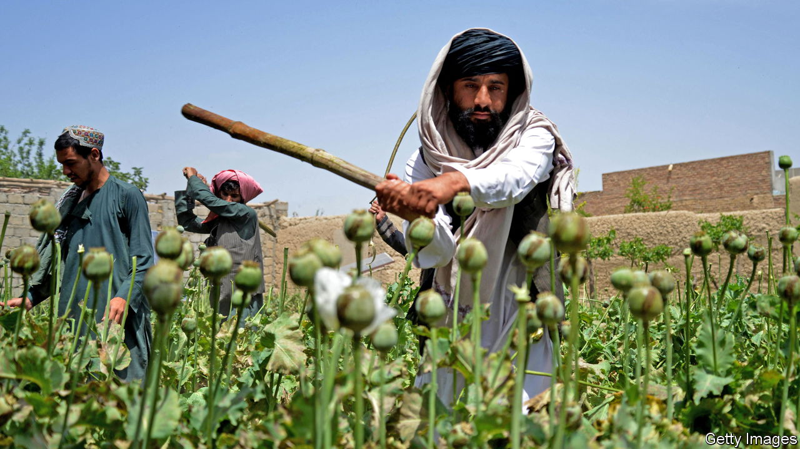

###### Afghanistan

# The Taliban have launched an impressive new war on drugs 

##### After two decades of lawlessness, Afghanistan has a government able to enforce its writ 

 

> Jun 22nd 2023 

Early this month, the Taliban turned up at Akhtar Mohammad’s farm in Helmand province, in southern Afghanistan, wielding sticks. In half an hour they destroyed a field of poppies that had taken the farmer a year to cultivate—leaving Mr Mohammad close to despair. “Now the Taliban have destroyed my opium I demand they feed my children,” he says. “Or I will have to sell one of them to feed the others.”

Before the Taliban seized power in August 2021, the illicit trade in opium, a gum produced from poppies, helped pay for their insurgency. The mullahs encouraged farmers to plant poppies and taxed the trade. But drugs are deemed  (prohibited) under Islamic law. Shortly after taking power the Taliban’s supreme leader, Hibatullah Akhundzada, banned narcotics. And stunning recent evidence from across the country’s opium belt in the south and east suggests he meant it.

According to satellite imagery from Alcis, a British firm, poppy cultivation in the southern province of Helmand, where most of the crop is grown, fell from over 120,000 hectares in April 2022 to less than 1,000 hectares a year later. Anti-poppy units are patrolling the province, meting out the treatment Mr Mohammad received. The results in Nangarhar province, another big producer, are similar. Only 865 hectares are under poppies now, compared with over 7,000 hectares in 2022.

It will be harder to eliminate poppies in remoter regions, such as Badakhshan in the north-east. Still, the results thus far point to a dramatic success. David Mansfield, a researcher who has studied Afghanistan’s illicit economy for over 25 years, reckons Afghanistan’s poppy production will drop by 80% between 2022 and 2023. 

It is hard to exaggerate how bold this is. When the Taliban took over, Afghanistan produced 85% of the world’s opium. According to UN estimates, the crop and related drug trade provided a total income of $1.8bn-2.7bn in 2021, equivalent to 9-14% of GDP. That was more than official exports of goods and services. Around 450,000 Afghans were employed in the opium trade.

The Taliban have form. They banned poppy cultivation during their previous spell in power, in 2000, with similar results. It duly dropped from around 82,000 hectares in 2000 to less than 8,000 in 2001. The ban was rolled back only later that year, amid the looming prospect of an invasion by America and its allies. For the next 20 years, despite promises of government enforcement and millions of dollars spent by Western donors and UN agencies on “alternative livelihoods”, Afghanistan saw an opium-producing bonanza. This was a totemic failure for the Western-backed development effort. Nothing was more indicative of the weakness of the country’s elected governments, and the impotence of their Western allies.

Some doubt the Taliban can sustain the ban. Afghanistan’s economy is in crisis. It shrank by 35% between 2021 and 2022. Two-thirds of the population needs urgent humanitarian assistance. This is not, to put it mildly, a good time for thousands of itinerant harvesters to lose their jobs.

Poppy farmers are increasingly aggrieved, as the opium price climbs. In the south and south-west of Afghanistan the price of a kilogram of opium reached almost $360 in November 2022, three times the price a year earlier. In the bazaars of Helmand and neighbouring Kandahar province, rumours are rife that the Taliban are slyly profiting from the ban. “I respect the decree of the Taliban’s supreme leader, but the decree should apply to all farmers,” says Haji Mohammad Jan, a farmer in Kandahar, whose two-hectare poppy plantation was razed last month. 

Even if sustained, the ban may have less impact on the global drug trade than some hope. As Vanda Felbab-Brown at the Brookings Institution, a think-tank in Washington, points out, cheap synthetic opioids abound. If Afghan production dries up for long, fentanyl producers from China and India could take over the profitable European market. For now, however, it is worth marvelling at the spectacle of an Afghan government enforcing its writ. Under 20 years of Western-backed government, the country’s opium producers were largely unpoliced. That is no longer the case. ■

