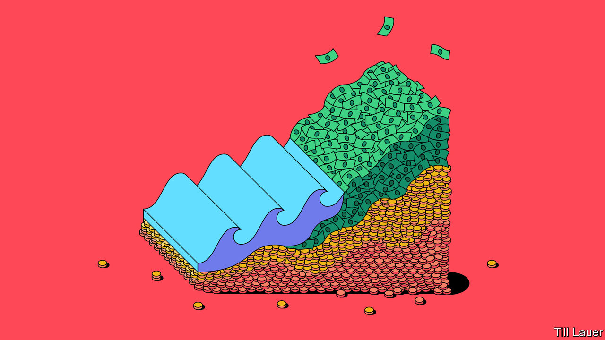
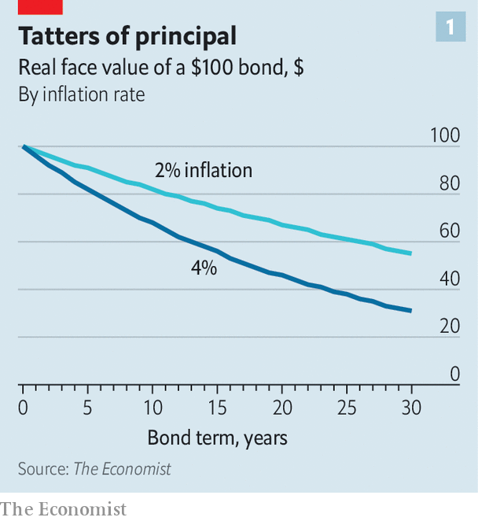
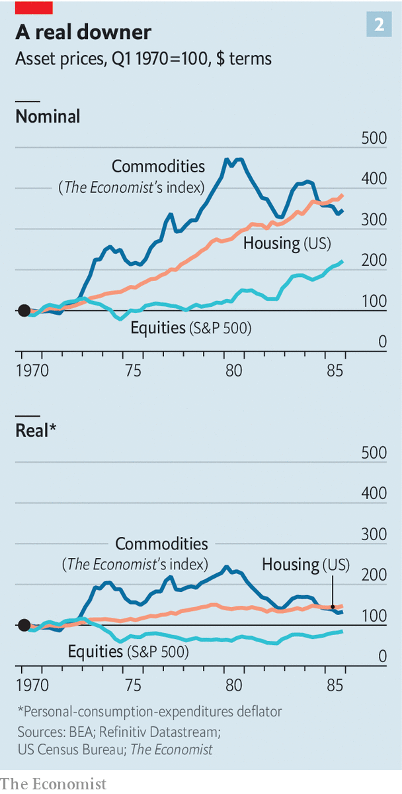

###### A sticky predicament

# Inflation is as corrosive to investing as it is to the real economy 

##### The failure to quell it quickly will transform financial markets 

 

> Jun 21st 2023 

It is more than two years since high inflation returned to the rich world, and hopes that it will quietly fade are themselves fading. True, prices are rising more slowly than in 2022, when the pace hit 9.1% in America, 10.6% in the euro area and 10.4% globally. But the view that this was just a passing lurch looks ever less plausible. Britain’s rate has been stuck at 8.7% for two months. American “core” prices, which exclude volatile food and energy, are 5.3% higher than a year ago, a rate that has barely fallen for the past six months.

If inflation continues to fester, the effects will quickly be felt in financial markets. Sustained price rises do not affect all asset classes equally, so a relative repricing will be required. But those one-off profits and losses will not be the only consequence. In the real economy, inflation corrodes trust by continually and arbitrarily redistributing wealth. In the financial one this corrosive dynamic is less obvious, but just as real.

Central bankers remain adamant that they will return inflation to their targets, . Many on Wall Street, though, are sceptical. Jean Boivin, who runs the research arm of BlackRock, the world’s biggest asset manager, makes his argument bluntly. “Central banks can always bring inflation back to 2% if they really want to, but now it would require too big of a demand crush to bear.” He believes it will instead settle around 3-4%. Richard Clarida, vice-chair of the Federal Reserve from 2018 to 2022, has a similar view. “Mr Powell’s Fed…will eventually get the inflation rate it wants,” he recently wrote for this newspaper. “But it is likely to be something more like ‘two point something’ than ‘two point zero’.” Asked what “something” means, he replies: “It could be 2.8% or 2.9% when they start to consider rate cuts.” 

The likelihood of monetary guardians explicitly admitting that they will tolerate inflation above 2% is low. Every time Jerome Powell, the chairman of the Federal Reserve, is asked about the possibility, he vehemently denies it. Such a shift, especially with prices already rising much faster than 2%, would immediately damage the Fed’s credibility: if the target can be ignored once, why not again? 

Yet the forces ranged against central bankers, which will push up prices by constraining supply and boosting demand, are fearsome. Demographic trends are shrinking workforces in much of the rich world, which may lead to shortages of labour. The fragility of global supply chains—exposed by the covid-19 pandemic, the war in Ukraine and fracturing Sino-American trade—has incentivised countries to replicate them locally. On the demand side, higher defence spending, the investment required to cut greenhouse-gas emissions and the costs of supporting ageing populations are all increasingly seen as essential. 


Rate-setters could, through ultra-high interest rates, destroy enough demand in other parts of the economy to bring inflation down to 2%. But with so many structural factors pushing prices up, the sceptics argue, this would involve inflicting a politically unacceptable level of economic damage. And the longer inflation remains above target the more it raises expectations of future price rises, which can then become self-fulfilling. The world may thus have entered a regime in which central bankers pay lip-service to their inflation targets but shy away from measures severe enough to meet them. In other words, 4% may be the new 2%.

Another roll of the price

 


An extra percentage point or two in the annual rate of inflation may not seem much. Yet the impact on investment returns is huge. Buy a ten-year government bond when inflation is 2%, and the principal that is eventually returned will be worth 82% of its original value. When inflation is 4%, that figure falls to 68% (see chart 1). Over the longer run the gap yawns even wider. The principal on a 30-year bond will, when returned, be worth 55% of its original value if inflation averages 2% over that time. With 4% inflation, it will be worth 31%.

But the erosion of the value of both the principal and the fixed interest payments is not the only way that higher inflation affects investments in bonds. Rising prices fuel expectations that central banks will raise rates, which in turn pushes yields in the bond market up to match those expectations. Bond prices are an inverse function of yields: when yields rise, prices fall.

The scale of this second effect would depend on the duration of the bond. If markets think central banks are prepared to tolerate slightly elevated inflation, they will assume there will be fewer increases in rates in the immediate future, not more. This expectation would push short-term yields down and prices up. Meanwhile, in addition to the expectation of higher rates eventually, the volatility and uncertainty brought on by higher inflation would raise the “term premium” (financial jargon for the extra yield long-term lenders demand in return for taking on more risk). The overall effect would be that, during the initial adjustment, bond portfolios with shorter durations would do much better than those with more distant maturities.

Could inflation-linked bonds offer more protection? In theory, yes, though in practice there are not enough of them to go around. Inflation-linked Treasuries, for example, comprise just 8% of the total. And even these can fare badly under inflation that is not merely high but also volatile and unpredictable, if this instability prompts large swings in real yields. Last year was a case in point. Real yields soared alongside inflation, hurting the value of inflation-linked bonds alongside the vanilla sort. An index of inflation-linked Treasuries compiled by Bloomberg, a data provider, fell by 12% over the course of the year.

On the face of things, shares are ideally suited to weathering spells of high inflation. They derive their value from the underlying companies’ earnings, and if prices are rising across the economy then those earnings, in aggregate, ought to be rising as well. Suppose inflation stays elevated but stable and the economy is otherwise humming along, says Ed Cole of Man Group, an asset manager. Managers should be able to control costs and adjust prices in response. And in any case, “Equities are nominal beasts. If the numbers are going up, everyone pats themselves on the back.”

In the very long run, data compiled by Elroy Dimson, Paul Marsh and Mike Staunton, three academics, for Credit Suisse’s  back this up. Globally, between 1900 and 2022, stocks beat inflation handily, posting an annualised real return of 5%. 

But there is a snag: the higher inflation rises, the less stable it tends to be. Take American consumer-price inflation going back to 1913, when official data begin. After years in which prices rose by between 0% and 5%, the average inflation rate for the subsequent 12 months was within 1.8 percentage points of the first one. (So a year of 2% inflation was, on average, followed by one of between 0.2% and 3.8%.) When prices rose by between 5% and 10%, the average change for the subsequent year jumped to 3.8 percentage points. Inflation of 4% would leave little room for error.

Once bitten, price shy

Such volatility is much harder for businesses to handle. Mr Cole points to industries with high fixed costs, such as IT outsourcing, commercial services and construction, in which firms can do little to trim wage bills while remaining in business. If those costs rise in line with inflation, but revenues are slower to adjust, volatile inflation can generate big swings in margins and earnings.

Moreover, during individual periods of high inflation, the historical record is less comforting for shareholders. Between 1900 and 2022, in years in which inflation rose above around 7.5%, the average real return on equities flipped from positive to negative. Even when inflation was lower than this, it tended to reduce the real returns from shares. In other words, though stocks tend to outpace inflation in the long term, in the short term they do not offer a true hedge against it.

 


Real assets will fare much better if inflation remains high (see chart 2). Property and infrastructure generate income streams, in the form of rents and usage charges, that can often be raised in line with inflation or may even be contractually linked to it. As the supply of such assets is constrained, their real prices are also likely to rise as investors seek out assets that carry some protection against inflation. 

That is also true of commodities. Measured by returns on commodity futures (financial contracts that give investors exposure to commodities without the hassle and expense of owning actual iron ore or cattle), this class of assets has historically done even better in real terms than stocks. In years of above-average inflation, the excess real return of a diversified portfolio of commodity futures over cash has averaged 11.4%. The asset class even tends to do well when high inflation combines with low or negative growth, with excess returns averaging 10% in such “stagflationary” years.

The trouble with all such physical assets is the difficulty of investing in them. The total value of all commodity futures is less than $500bn—barely 1% of that of America’s stockmarkets. Should investors pile into them en masse, they would push prices up enough to render the exercise futile. Infrastructure, meanwhile, is dominated by private investment managers, who tend to focus on selling to big institutional investors, such as pension funds and university endowments. Individuals, in contrast, struggle to buy such assets despite their appeal in a high-inflation world.

Other vendors poised to capitalise on churn in the financial markets are active asset-managers. They have had a miserable time during the years of easy money that followed the financial crisis of 2007-09. Data compiled by Strategas Securities, a brokerage and research firm, show that in each year from 2010 to 2021, the majority of active managers who measure their performance against the S&amp;P 500 share index failed to beat it. Such underperformance is not limited to America. S&amp;P Global, another research firm, reckons that in the ten years to 2022, 90% of European active managers produced worse returns than the broader market.

 


In part this is down to arithmetic. Overall market performance is the average of each investor’s, which makes beating the index a zero-sum affair. On top of this, active managers charge fees (often 1-2% or more a year), which brings their average performance down—so in aggregate, they are likely to underperform. Even accounting for this, though, the years of rock-bottom interest rates and relentlessly buoyant markets were hard on stockpickers. “If everything goes up together, it doesn’t matter how much skill you’ve got,” says Luke Ellis, Man Group’s boss.

By contrast, the return of high inflation and the volatility it brings allow skilled investors to outperform. In particular “dispersion”, or big differences in performance among different assets, offers active managers the chance to prove their worth. “Lots of people having a tough time doesn’t mean a bad opportunity set,” says Mr Ellis.

Yet even Mr Ellis does not think that “you’ll suddenly see 70% of active managers outperforming the index”. Many will be wrong-footed by macroeconomic conditions that they have never had to grapple with before. More insidiously, their clients will only gradually adjust to the wealth-destroying effects of inflation. Jeremy Grantham, a veteran fund-manager, recently wrote of his surprise that money-managers have not yet started to routinely adjust share-performance charts for inflation, as was routine in the 1970s and 1980s. 

Do so, and the numbers look much worse. Nominally, the S&amp;P 500 index fell by 19% in 2022, but it would need to rise by more than 30% over the course of this year to recoup its losses in real terms. And as investors see chunks of their savings being eaten away by inflation, paying another couple of percentage points to their fund-managers will become much harder to stomach. Just as, in the real economy, inflation prompts consumers to suspect firms of profiteering, in the financial one it will pit both retail and institutional investors against those managing their money.

Sugar and price

A surprising winner from sustained high inflation, argues Martin Jaugietis of BlackRock, might be defined-benefit pension schemes, which in America hold assets worth some $17trn. Such schemes invest regular payments from workers and their employers in return for the promise of a set income in retirement (usually a fixed percentage of the worker’s final salary). The financial health is determined by their “funding ratio”, or the value of their assets relative to the present value of the future payments they must make to retirees. As interest rates rise, this present value shrinks, since schemes can buy higher-yielding bonds, locking in cash flows that will help pay future liabilities. 

Provided their assets do not fall too much, the higher nominal interest rates brought on by persistent inflation would therefore be a fillip for defined-benefit schemes. This is especially true for American ones, says Mr Jaugietis, since they do not typically raise payouts to pensioners in line with inflation. Sure enough, in 2022 the funding ratios of American schemes improved markedly as inflation and interest rates rose, despite plunging asset prices. Even in Britain, where retirement payouts tend to be linked more closely to inflation, funding ratios shot up.

Yet, as in the real economy, each winner from inflation creates a loser. In this case, the workers who have contributed to defined-benefit schemes that are not inflation-linked will lose out. After ten years of 4% inflation, someone who expected to retire with an income of $50,000 a year would see the purchasing power of that income fall by around a third. In effect the boon for defined-benefit schemes would be paid for by an arbitrary reduction in their members’ wealth. Many pensioners would be in the same position as workers who struggle to secure pay rises that keep pace with inflation, and just as aggrieved.

The final category of participants in financial markets that might welcome higher inflation is governments. The world over, their debt burdens have ballooned—first in the aftermath of the financial crisis of 2007-09 and then during the covid-19 pandemic, on which the rich world spent 10% of its GDP. Europe’s energy crisis has triggered yet more spending. Six of the G7 group of large, developed economies have gross government-debt-to-GDP ratios above 100%; only Germany’s is below. 

The only ways to chip away at these vast piles of debt other than inflation are turbocharged growth, tax rises or spending cuts. The first is unlikely; the others are politically painful. So governments may quietly rejoice as the real value of their debt is inflated away. 

Yet in doing so, they risk falling foul of two groups. One is voters, whose savings lose purchasing power at the same time. The more immediate danger comes from the bond market. Investors in sovereign debt will be acutely aware that inflation is eating into their returns. Expect them to rake through governments’ fiscal statements with ever finer-toothed combs for signs that worse is to come.

Emerging-market countries are used to this treatment, and to the wild swings in borrowing costs and exchange rates it can bring. But for the rich world the adjustment would be painful. Britain’s flirtation with disaster in September, when an irresponsibly inflationary budget sent gilt yields soaring and the pound through the floorboards, may offer a taste of things to come. Governments that lose the trust of lenders are in for a rough ride.

The idea that central banks might quietly allow inflation to fester, taking a chunk of society’s stability and trust with it, may seem speculative. But look back at the past century and you will struggle to find an instance of inflation rising as far as it did in 2022, then immediately coming back under control. The trade-offs required to get it there look nightmarish. The generation of investors that is learning for the first time how to deal with elevated inflation may have plenty of time to study it. ■

