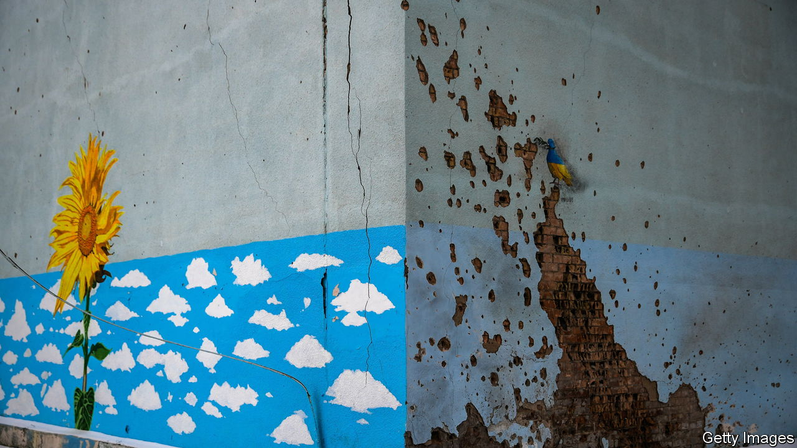
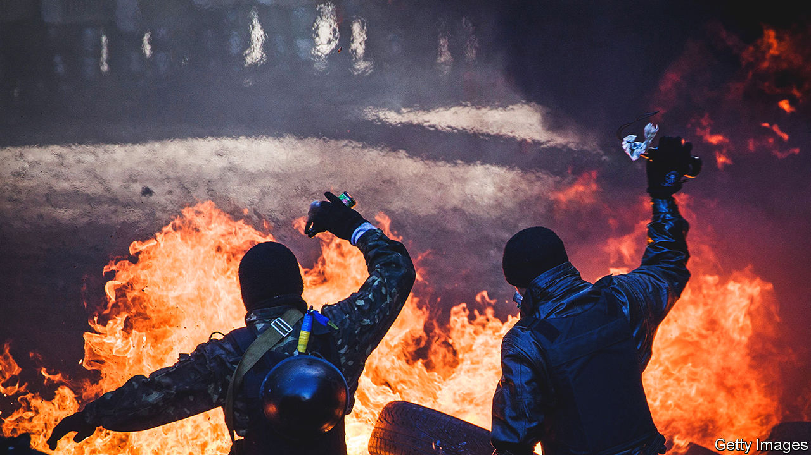
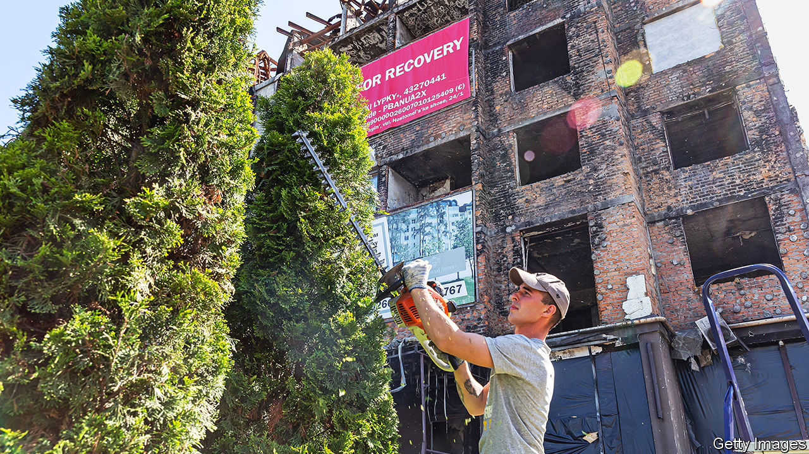

###### Ukraine 2.0

# War is reshaping the Ukrainian state—for the better 

##### But corruption remains a plague 

 

> Jun 22nd 2023 


WHEN RUSSIAN tanks began bearing down on Kyiv, Ukraine’s capital, in February of last year, Mykhailo Fedorov was overseeing improvements to an app that provides Ukrainians with easy access to government services. At the time the app focused on fairly conventional tasks: filing tax returns, obtaining business permits, claiming benefits and so on. But the 32-year-old Mr Fedorov and his colleagues quickly added extra features. Now DIIA (the Ukrainian for “action” and also an acronym for “the State and Me”) allows patriots to donate to the war effort, struggling businesses to apply for state support and ordinary citizens to report Russian troop movements. And with the war making it hard for people to visit government offices, the ability to conduct official business online has become a godsend for many.

When Volodymyr Zelensky became Ukraine’s president in 2019, he promised to modernise a state that until then had been a byword for bureaucracy and corruption. DiIa, launched in 2020, was the centrepiece of this effort. But what began as a means to mollify exasperated voters quickly became part of Ukraine’s struggle for survival. To beat back the Russian onslaught and keep the government functioning, the state has had no choice but to become vastly more nimble and effective.

Wreckage and resolve

The young, tech-savvy Ukrainians leading this overhaul see it not just as a necessity, but also as an opportunity. “We call it Ukraine 2.0. We all loved Ukraine as we knew it, but there were a lot of things in it which we don’t want to bring into a new one. We got a unique chance to build a new country,” says Oleksandr Kamyshin, a 38-year-old former manager of a venture-capital fund who is now restructuring Ukraine’s arms industry. “The full-scale Russian invasion not only brought the horrors of war to millions of Ukrainians. February 24th 2022 was also an occasion for Ukraine to rethink itself,” echoes , an online newspaper. 


Like Mr Fedorov, the Ukrainian state was born in 1991. A vestige of the Soviet Union, it was seen by many Ukrainians as more of a nuisance than a benefit. Corruption was endemic, from the bribes demanded by traffic cops to the kickbacks needed to secure government contracts. The public put far more faith in civil society than in official institutions.

It was civil society, naturally enough, that spearheaded the campaign to change all this. It led the Maidan uprising of 2013-14 (pictured), a protest movement which brought about the fall of Viktor Yanukovych, the grasping pro-Russian president of the day. The new government, with the help of Western aid agencies, set up a series of institutions to battle corruption, including an independent investigation bureau, dedicated prosecutors and a special court. Mr Zelensky has since strengthened this system by installing a new council composed partly of retired American and European judges to regulate judicial conduct. The details of most public procurement are now made public, to make crooked transactions easier to spot. 

 


These new rules and institutions have not eliminated corruption, but they have made it a far riskier undertaking, rather than the accepted norm. In the three-and-a-half years that the anti-corruption court has been operating, 65 people have been convicted in it, including 20 judges and several mps and senior officials. Such prosecutions were unheard-of before 2014. “In the past few years corruption stopped being a system and became an ailment that could be dealt with,” says Vitaly Shabunin, an anti-corruption activist. 

Threatened by rectitude

This change seems to have infuriated Vladimir Putin, Russia’s president. Not only had the popular campaign for good government caused the downfall of a pro-Russian regime; it was also undermining Mr Putin’s favoured technique for suborning Ukrainian politicians and, worse, it was creating an alarming example of successful reform that might inspire his own citizens. In a speech laying out Russia’s case for war days before the invasion, Mr Putin included among Ukraine’s supposed crimes the creation of the new units to fight corruption. It was not just a passing reference: he listed each agency individually, and denounced them all as tools of America. “Not every politician in Ukraine could name all these institutions. This was a real tribute to our work,” says Mr Shabunin. “Putin realised that if he does not interfere now, these reforms would lead Ukraine into the Western world.”

But far from halting the overhaul of the Ukrainian state, Mr Putin’s invasion has accelerated it. The state-owned railway company, Ukrzaliznytsia, is a good example. In August 2021, just months before the invasion, it was put in the hands of Mr Kamyshin, who has not only a Cossack-style semi-shaved hairdo, but also a degree from INSEAD, a French business school. At the time, he says, Ukrzaliznytsia was a feeding trough for corrupt officials, politicians and shady intermediaries, who sold it second-rate supplies at inflated prices.

Mr Kamyshin quickly cleared out the middlemen. But to keep the trains running throughout the war, despite relentless shelling and blackouts, he also had to empower not just thrusting young managers but also the grizzled engineers who know the tracks inside out. As a result, Ukrzaliznytsia has kept essential cargo moving, be it weapons, troops, humanitarian aid or refugees. It even ferried Joe Biden, America’s president, across the country on a visit in February, earning its special service the sobriquet “Rail Force One”. All this has made Ukrzaliznytsia a popular brand among young Ukrainians. In November it opened its first merchandise shop in Kyiv.

In March Mr Kamyshin became the minister in charge of the defence industry, another pit of inefficiency and graft. State-owned factories produced more shells in the first month after his appointment than they had done in the entire previous year. Mr Fedorov, now a deputy prime minister, has found a different way to speed up military procurement, crowdfunding the purchase of around 4,000 drones and the training of 10,000 people to use them.

Mr Fedorov has also turned his hand to streamlining the operations of the armed forces. (In his trainers, sweatshirt and jeans, wielding only a sticker-spattered laptop, he has probably done more damage to Mr Putin’s war machine than most men in uniform.) He has helped create software to pool information from assorted drones, sensors and cameras to provide a comprehensive picture of the battlefield, which can be viewed in real time by everyone from generals to foot soldiers. 

Appropriately enough for a system enabling quicker, less hierarchical decision-making, the software in question was developed not at a secret military research institute on orders from on high; instead, shortly before the war began, the army assembled a team of volunteer programmers and activists; they have applied themselves to problems as they have arisen. Mr Fedorov organises hackathons to come up with solutions to specific programming conundrums. “There is a fundamental change now in how we think, how we make decisions and what kind of a country we are building,” says Mr Fedorov.

The distaste for rigid hierarchies and the devolution of decision-making are among the defining features of this new approach to administration. Those may sound like boilerplate principles of good government, but they are rare in post-Soviet states. Their adoption by the Ukrainian army helps explain why it has been able to keep Russia’s numerically superior forces at bay. They have also been used to great effect by Mr Kamyshin’s former boss, Oleksandr Kubrakov, the minister of infrastructure, in the mammoth task of distributing all the weapons and supplies donated by Ukraine’s allies. These have to be brought to the front lines without being stockpiled in big warehouses or transported along predictable routes, since both would create easy targets for Russian bombs. He has achieved the near-impossible by dividing deliveries into multitudes of small consignments, the vast majority of which are moved by private hauliers along a plethora of obscure and ever-evolving routes. 

That hints at another change: treating ordinary Ukrainians as allies of the state, rather than adversaries or subjects. Civil society has also grown stronger during the war. A survey conducted in mid-2022 found that 86% of Ukrainians had volunteered in some way to support the war effort. There has been an eight-fold increase in the number of registered charities since the start of the war. At the same time, there has been a blurring of the lines between activism and government. Mr Shabunin has enlisted in the army. Mustafa Nayyem, a journalist whose social-media posts were a catalyst for the Maidan uprising, served for a time as a deputy to Mr Kubrakov, overseeing the road network, and now heads the agency charged with post-war reconstruction. His brother, a human-rights lawyer, also enlisted, and lost an eye in combat.

The new generation of reformist administrators is well aware that they are not just restructuring ministries and state-owned enterprises, but are laying the foundation of a new country. “It is essential that everybody has a vision and understands what they have fought for, what we are building” says Mr Fedorov. “Without that vision, there can be no success.” 

 


Success is far from guaranteed, however, even if the war goes well. The forces arrayed against the reinvention of the Ukrainian state are many and powerful. For one thing, not all Ukrainians support the idea. Many in the old elite are losing their meal tickets. The office of the president is preoccupied not just with the war, but also with politics; the nitty-gritty of administration is a much lower priority. And the exigencies of the invasion have put the security services in positions of great authority, often with little oversight.

Corruption remains rife, a clear sign that not all bureaucrats have turned over a new leaf. Last month the most senior judge on the Supreme Court was charged with taking bribes. A scandal involving the procurement of military rations has also come to light since the beginning of the war, leading to the sacking of several officials and the resignation of the deputy minister of defence. A reforming official gripes that in some parts of the country businesses are suffering extortion on a par with the depredations of Mr Yanukovych’s tenure. 

What is more, the war is robbing Ukraine of many of its best and brightest. In addition to those killed or disabled on the battlefield (Ukraine does not disclose casualty figures), some 6.2m people have fled the country over the past 18 months, more than 15% of the pre-war population. The workforce has shrunk by the same proportion. And some 60% of the adults who have left had university degrees, says Tetyana Berezhna, deputy minister for economy.

The exodus is currently constrained, since men of working age are not allowed to leave the country. But with so many Ukrainians now settled elsewhere in Europe, in many cases with jobs or children in school, the likelihood is that lots of Ukrainian men will go join their relatives whenever travel restrictions are lifted. Those who stay will present problems, too: they will be traumatised by fighting, and in many cases gravely injured. “The war has generated a major demographic crisis in the country,” says Ms Berezhna.

Although the economy is showing some signs of life, it has been clobbered. It shrank by about 35% last year. The World Bank predicts that more than half the population may be living in poverty by the end of 2023. Some 3m people are unemployed. Roughly 5m are internally displaced. 

The government’s priority is to try to stop the economy from atrophying yet more. It is handing out grants to small and medium-sized businesses and farmers on the condition that they create new jobs. Some 6,000 new businesses have sprung up since the war began and some 40,000 jobs have been saved by relocating firms from the most war-torn parts of the country to safer areas in the west. The state is also creating programmes to reintegrate veterans into civilian life and to make it easier for the disabled to work.

In the longer run the government also wants to make Ukraine a more attractive place to invest and do business. It is debating sweeping deregulation of the labour market—to such an extent that some observers worry it will gravely reduce workers’ rights. Accession to the European Union, which officially accepted Ukraine as a candidate last year, will require detailed reforms to everything from energy markets to customs procedures. The process is seen by reformers as a critical safeguard, preventing the reinvention of the state from going into reverse.

The government has set all manner of lofty targets, such as doubling the size of the economy in a decade, which would require average annual growth of 7%. Its official “Recovery Plan Blueprint” calls for privatisation, stronger laws on competition and corporate governance and “de-oligarchisation”. Mr Fedorov expresses hope that the war will transform Ukraine from an economy focused on natural resources and the associated rents to one driven by technology and innovation. The authorities see it, already 5% of gdp, as an important potential source of growth. 

All of this is contingent not only on restoring security, but also on attracting vast amounts of investment. The government estimates the bill for reconstruction at more than $750bn. Ukraine’s allies and donors  for a big conference intended in part to work out how to drum up such a daunting sum. 

But Ukrainian civil-society groups’ biggest worry about reconstruction is not that there will too little money, but rather that it will not be well spent and much of it will be embezzled, according to a recent survey conducted by Chatham House, a British think-tank. These sorts of concerns are widespread: according to a recent poll commissioned by , another Ukrainian online newspaper, 84% of Ukrainians agree that, even during the war, “The facts about corruption should be made public, because through corruption we will lose unity, the support of partners, and, ultimately, victory.” 

The war on graft

“Ukraine in this war is fighting not only for the right to exist, but also for the opportunity to become a European country, intolerant to corruption…That is why scrutiny of officials and government becomes even more important for journalists than before the war,” says Segvil Musaeva, the editor-in-chief of . “We cannot allow our society, our army to find out after the end of this war that all this time officials have persisted in misconduct, bad governance or corruption.” 

Mr Fedorov agrees. In the eyes of the trailblazers of Ukraine 2.0, it is the government’s efforts to work for its citizens, rather than exploit them, that make Ukraine worth fighting for. Everyone has been profoundly affected by the war, he explains, and everyone has become an activist, in effect. “Our society has grown tremendously,” he says, “It will not allow us to turn in the wrong direction.” ■

