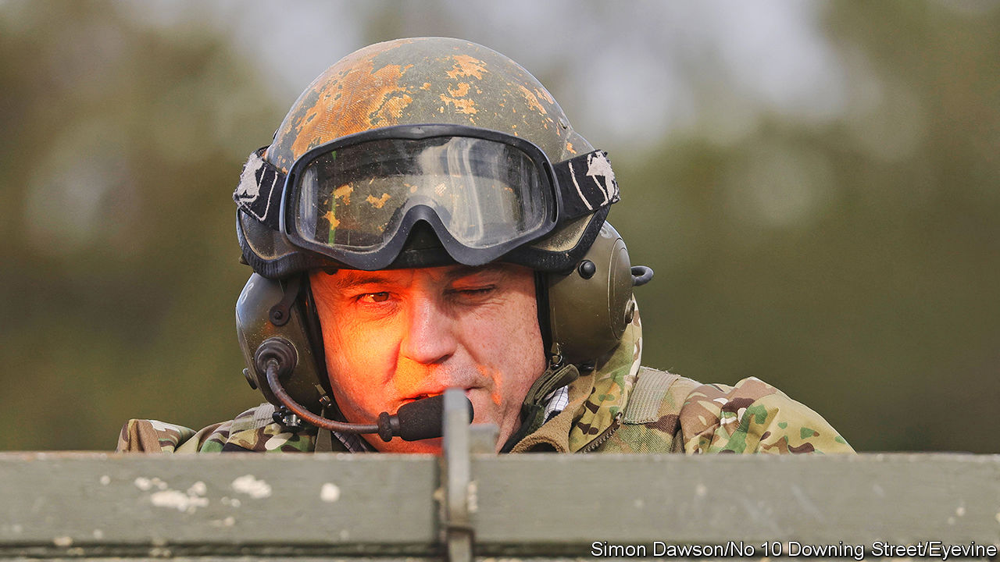

###### Britain and Ukraine

# Ben Wallace says he is out of the race for NATO’s top job 

##### The British defence secretary, a fierce friend of Ukraine, looks sidelined 

 

> Jun 21st 2023 

BEN WALLACE is the great survivor of the most tumultuous recent period in British politics. He has held ministerial office, uninterrupted, from the premierships of David Cameron to Rishi Sunak. He emerged from the Boris Johnson years with his dignity intact and adoring support from the Conservative Party. His relentless backing, as defence secretary, for Ukraine has earned plaudits abroad. He had also hoped, until recently, he might succeed Jens Stoltenberg as secretary-general of NATO. “It’s not going to happen,” he tells . America wants Mr Stoltenberg to stay, he says, visibly deflated. That would defer the decision to next year.

No time for recrimination exists: a “defence command paper” is due within weeks, updating the previous one from March 2021. It will reflect many lessons from Ukraine. Mr Wallace, a former captain in the Scots Guards, identifies air defences, electronic warfare and “deep fires”, such as longer-range artillery, as crucial areas for investment. The previous review assumed Britain could expand its ground forces over the decade to 2030. The war has accelerated everything. Challenger tanks will be upgraded 12 months sooner than planned, and new Swedish howitzers, bought in March to replace older guns sent to Ukraine, will be ready next spring. 

The snag is money. Before a spending review in March, Mr Wallace asked the Treasury for roughly an extra £10bn ($13bn). He got half, which will largely go to submarine projects, nuclear warheads and the replenishment of munitions. The annual defence budget, adjusted for rampant inflation, will be a puny £1.1bn higher in 2024-25 than in 2021-22. The army, which has lost almost 20,000 soldiers in a decade, is unlikely to grow. He is unapologetic: “I would rather we were medium and perfectly formed than large and hollow.” 

He is scathing about retired admirals who demand more ships: “These people would have us lined up with platforms that can’t go to sea or regiments that can’t deploy as long as they can tick the Top Trumps box”, a reference to a classic children’s card game. He is similarly harsh on the military services that he oversees, complaining that the army, navy and air force have favoured “trophy platforms over the mundane”. The navy, he argues, has over 30 years purchased warships without investing in vital enabling capabilities such as dry docks, cranes and the like. Ship and sub availability has suffered as a result.

Ammunition stockpiles remain a serious problem, say defence insiders. Mr Wallace notes that the Storm Shadow cruise missile, which Britain gave to Ukraine in May, has been out of production for a decade. It took almost a year to revive supply chains for NLAW anti-tank weapons, he adds. Arms companies retort that European governments will not place long-term orders. “The big challenge,” reiterates Mr Wallace, “is we don’t have the money.” The Treasury has agreed that defence spending will rise to 2.5% of GDP “as fiscal and economic circumstances allow”. But unless the prime minister and chancellor set a date, says Mr Wallace, “officials will ignore it”.

If only I were in charge

Mr Wallace at times sounds like an opposition politician attacking the Ministry of Defence, not the man who has led it for almost four years. He laments a tendency to defer big projects rather than cancel them. Putting off the f-35 fighter jet cost an additional £500m, he says; that of an aircraft-carrier, billions. He complains that national regulations have hamstrung technological innovation, with rules on civil airspace impeding the development of drones: “If you have anything over a certain height, the whole bloody civilian aerospace industry descends on you.” 

He remains a political enigma. He emerged unscathed from the vicious battle between Mr Johnson, his successor Liz Truss and her replacement, Mr Sunak. His views on non-defence issues are largely a mystery. Some ministers grumble that he is locked in constant warfare with other departments. Tory members like the look and sound of him, and especially his role in shaping Ukraine policy. He deserves “enormous credit in getting arms to Ukraine before the war in the teeth of opposition from some in the White House”, says a military official familiar with those debates. Britain is the second-largest individual contributor of military aid to Ukraine, with over £6bn pledged. Leaked Pentagon documents this spring suggested that 50 British special-forces personnel were in Ukraine, compared with just 14 Americans. A quiet flow of British intelligence has been vital. 

All this was evidently not enough to get America’s support for Mr Wallace’s NATO candidacy. “Maybe they want a prime minister,” he suggests. The White House may have favoured Mark Rutte, the Netherlands’ long-serving leader, but he is said to have twice turned down the job. Mette Frederiksen, Denmark’s prime minister, was until recently a front-runner. But Denmark is far short of meeting the NATO target of spending 2% of GDP on defence, which irks many eastern European countries that do. Sources close to Mr Wallace stress that the process remains open. 

Whoever gets the job will have to deal with “a lot of unresolved issues in NATO”, warns Mr Wallace. Many countries have no appetite for the 2% target, he says. And there is the question of the alliance’s role beyond Europe. Britain’s latest foreign-policy review, in March, described China as an “epoch-defining challenge” and talked anew of a “tilt” to the Indo-Pacific. Mr Wallace is more circumspect. “NATO should not mission-creep to the Pacific,” he says, adding that he shares French opposition to opening a NATO office in Tokyo—an initiative he says was agreed by foreign ministers who blindsided him.

Mr Stoltenberg’s eventual successor “is going to have to please both Macron and Biden”, he says. America wants allies to help in confronting China. France emphasises European strategic autonomy. Perhaps surprisingly, for it is not a popular view in his party, Mr Wallace, while hailing America’s extraordinary support for Ukraine, expresses sympathy with Mr Macron, pointing out the importance of collaboration by Europe’s defence industries. “The French have a point in lots of areas,” he says. “The answer to everything is not America first, when it comes to procurement.” That is just the sort of thing a secretary-general of NATO could never say. ■


