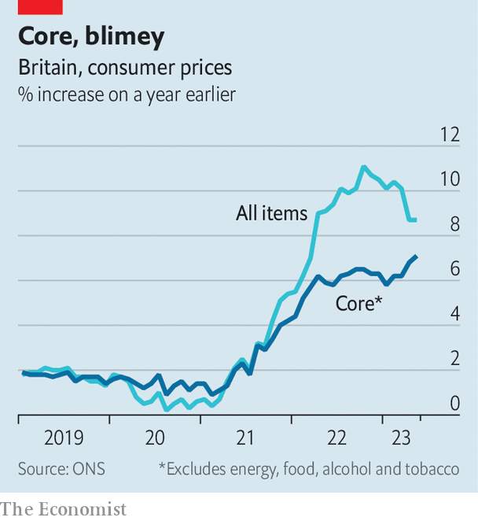

###### Made in Britain

# Britain’s inflation pain is mostly self-inflicted and getting worse 

##### Bringing down high prices is going to hurt, a lot 

 

> Jun 21st 2023 


THE LATEST, grim, inflation figures in Britain were not—truly—a shock. For each of the past few months a routine has emerged: the numbers come in worse than had been forecast, traders adjust expectations upwards for how fast, and far, the Bank of England will raise interest rates, and thus the cost of borrowing jumps. After that, mortgage holders fret and the government makes sympathetic noises. The figures for May, published on June 21st, followed that sorry script to the letter. The headline figure remained steady from the previous month, at 8.7%. That was above economists’ expectations of a fall to 8.4%. More ominous was that core inflation, without food and energy, jumped to 7.1% from 6.8% in the previous month. 

 


Britain is an outlier, and not in a good way. Core inflation both in America and the euro zone, though still high, has been ticking down gently—it reached 5.3% in May, in both places—and headline numbers in those economies, including food and energy, have tumbled faster. Among the G7 countries, none has higher inflation than Britain. Only Italy comes close, with a headline rate of 7.6%. Even its trend, unlike in Britain, is firmly downwards. You have to look to smaller places, such as Austria, Iceland or Sweden, or to eastern European economies still battered by war in Ukraine, to find examples of economies in the same—miserable—inflationary boat.

What has gone so wrong? Britain is exposed to higher prices for natural gas. Put that aside, however, and it is clear inflationary pressures are overwhelmingly the result of decisions taken at home. Inflation, unlike much else, is made in Britain. Old excuses that it is imported, because of war, snarled-up supply chains or high global food prices, no longer wash. The rate of services inflation, overwhelmingly a domestic factor, rose in May to an annual rate of 7.4% from 6.9% previously. The rate of goods inflation did drop slightly, from 10.0% to 9.7%, in part because food-price increases are not quite so rapid as before. 

The culprits behind Britain’s problems are many. Don’t take seriously claims about Prince Harry, who recently published an overpriced but popular memoir. It’s true that inflation measured by the culture sub-index is soaring, in particular non-fiction books are up by 29.4% over the last year. But the real question is why sellers in that sector can get away with high prices. The answer: they operate where demand for goods and services has grown faster than supply. 

Demand is strong, in turn, because policymakers have long been trying to rev it up. Consider fiscal efforts. Britain stands out for the stimulus it gave to the economy in the pandemic and then, last year, during the energy crisis. One measure of this is to combine an estimate from the International Monetary Fund of covid-era support with one from Bruegel, an EU think-tank, of help for households and firms hit by painful energy bills. Only America doled out a bigger stimulus. Britain heavily outspent other peers: around 23.1% of national income, vastly more, for example, than the 13.3% in France. 


Those setting monetary policy are also to blame. In hindsight, they were too cautious. A so-called Taylor Rule for monetary policy sets a simple guide for the right level of interest rates given the rate of unemployment and core inflation. Even a version calibrated to avoid big changes in rates says the bank should have been preparing to lift them to around 5.7% at a meeting on June 22nd. The central bank is now, belatedly, catching up: the monetary policy committee voted seven-to-two to raise interest rates to 5% from 4.5%, surprising markets that had been forecasting a 25-basis-point increase only the day before. The minutes noted that inflation was proving more persistent than the bank had previously expected.

Come on down, the price is wrong

Easy policy combines with a weaker supply side. Again, Britain stands aside from its peers (again, in a bad way). Labour-force participation remains below its pre-pandemic level. One portion of missing workers are those—perhaps half a million more than before—too sick or tired to seek work. EU workers are also missing. And whereas, post Brexit, non-EU migrants have poured in, many are refugees or students, not full-time workers. Dario Perkins, of TS Lombard, a research outfit, calculates that total labour supply is down by about 3% from pre-covid trends. Pre-pandemic, the labour force was growing thanks to migration and a rising participation rate. He adds: “I don’t believe in wage-price spirals, but if they are going to happen anywhere, the UK seems like the obvious candidate.”

High demand with constrained supply has left some parts of the economy, such as professional services and hospitality, running hot while others, including the health service, struggle with bottlenecks and strikes. Fullers, a brewer, says it is tapping under-18s and the over-50s to work in pubs this summer. Other bars and restaurants are just cutting hours, says Tony Wilson of the Institute for Employment Studies, a think-tank. In professional services, including banking, consulting and accountancy, year-on-year pay growth is in double-digits, he says, as “firms are competing and outcompeting one another on pay”.

Inflation needs to fall, quickly. A study by the Federal Reserve, America’s central bank, earlier this year found that British inflation is unusually persistent: previous increases in core inflation had more power to predict further increases than those seen in Canada or the euro area. No one should expect the workforce to suddenly grow: rates of economic activity have only modestly improved over the past year as fewer workers retired and more students took on jobs. The likely alternative is for interest rates to rise. 

That means heavily indebted mortgage holders will feel more financial pressure. The chancellor, Jeremy Hunt, has ruled out government help, such as tax breaks on mortgage interest, saying, correctly, that would “make inflation worse, and not better”. He is due, however, to host a meeting with banks on June 23rd, where he is expected to ask them to show flexibility to struggling borrowers. Should he want to break Britain’s pattern of sticky inflation and ever-rising interest rates he could consider one other option: putting up taxes. ■


