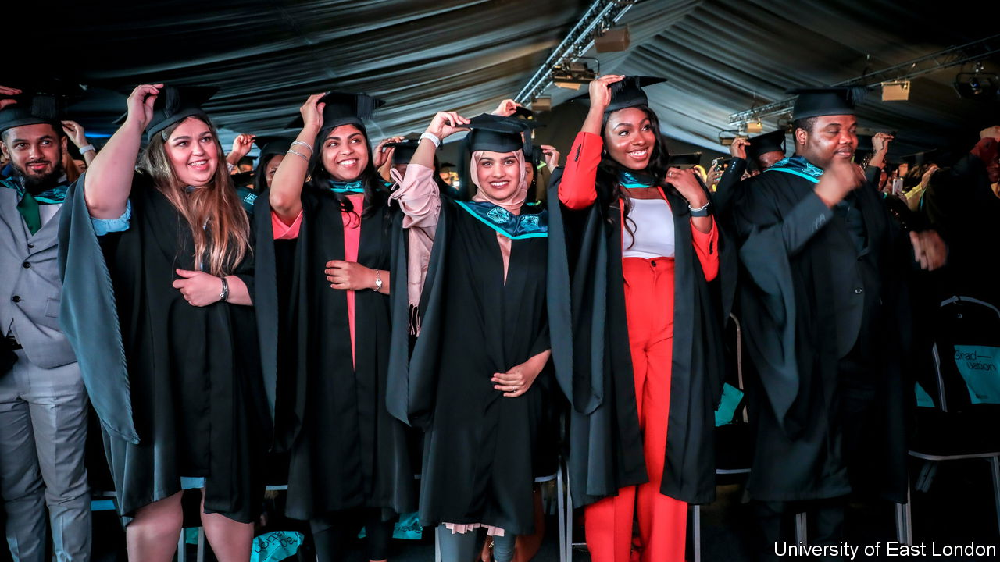

###### A boom in overseas students

# Indians are flocking to study at British universities 

##### European university students are mostly gone, replaced by ones from farther afield 

 

> Jun 18th 2023 

SIX YEARS ago only a few hundred Indian citizens took classes at the University of East London (UEL), a former polytechnic with campuses in Stratford and the Docklands. By last year over 6,000 students, or about one-quarter of the total, hailed from India. The newcomers are helping to transform it. The vice-chancellor, Amanda Broderick, whose office lies within earshot of the rumbling runway at London City airport, says her students previously were drawn from “only three boroughs”. Suddenly, UEL has a global feel and is booming. Total enrolment at the campuses has jumped by more than 60% since 2017.

 


Nor is UEL alone: universities across Britain have experienced a  from India, Nigeria and beyond. Between 2017 and 2021 Britain saw a sixfold rise in Indians starting new courses (see chart). Visa data suggest that by last year India had displaced China as the number-one sender of students. The new arrivals have more than made up for a sharp drop in Europeans, who fled after Brexit, which ended arrangements under which EU students paid domestic-level fees.

Most of the Indian newcomers are postgraduates. The largest cohort is drawn from Andhra Pradesh and Telangana, two south-eastern states with lots of tech and engineering firms, plus governments that encourage overseas study. And whereas Chinese students are more often undergraduates who cluster at the prestigious (and pricey) “Russell Group” universities, Indian ones are spread more widely. 

What explains the rise? Most important was a change in visa rules, in 2019. Officials restored a scheme that lets foreigners stay, and work, for two years after they graduate. This “time to breathe” is welcome says Darshan Dabhi, who is doing a Masters in business at UEL. Students use those years to find employers to sponsor longer-term visas, or earn to pay down debts. (No doubt they help to ease labour shortages, too.)

This is a boon for universities. Foreigners, who pay higher fees than locals, now provide around one-fifth of university income. That helps domestic students who have seen tuition fees (in England) held steady for six years, despite inflation. Some courses would barely exist without foreigners. In subjects such as business and management, overseas postgrads outnumber Britons by about ten to one. 

Not all is rosy. Ruling Conservative politicians trying to sound tough on immigration have been embarrassed to admit to booming numbers of overseas students. In May the government said most foreign postgraduates will be barred from having spouses or children accompany them: last year around 40,000 dependants joined the 140,000 Indian students in Britain. Quintin McKellar, the vice-chancellor of the University of Hertfordshire, with some 6,000 Indian students, worries that sends a message that Britain is unwelcoming.

A related risk is that migrant-students, who are often lured by smooth-talking recruiters, find that Britain offers a less than satisfactory experience. Amit Tiwari, of the Indian National Students Association UK, says an increasingly common complaint is over , especially costly housing. Some students also lament that, three years after the start of the pandemic, universities still deliver far too much instruction online. 

The danger for British universities is being seen to sell foreign students short. The supply of eager recruits won’t dry up soon, but international competition for them grows ever more intense. Not only that. Universities in India itself, both branches of foreign ones and the purely home-grown, are flourishing. Mr Tiwari says that studying at home can seem ever more tempting: “It’s not the India it was ten years ago”. ■


