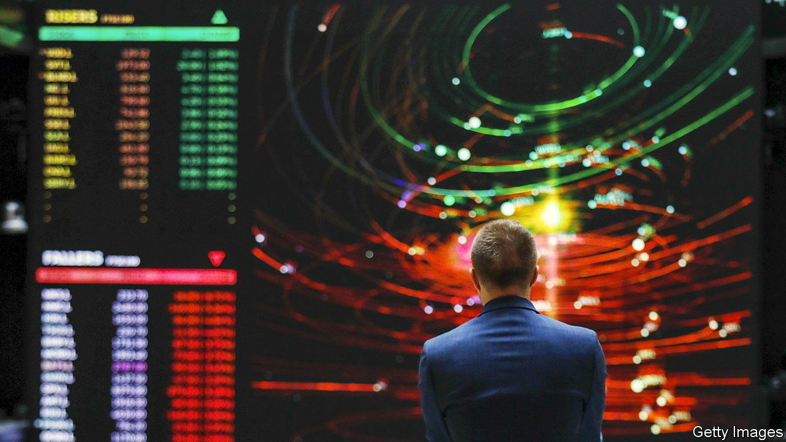

###### Executive pain

# Pay for bosses in Britain falls far behind America. Tough luck 

##### Is London suffering because bosses there are paid too little? 

 

> Jun 22nd 2023 

BRITAIN’S BOSSES are in a funk. Last year, one-tenth of the CEOs running FTSE 350 companies stood down, more than double the tally for 2021. The number of listed companies in London has fallen by two-fifths since 2008. Some of the country’s most treasured companies, such as Arm, a chip designer, are defecting to Wall Street.

Many factors lie behind the malaise. Could relatively paltry pay for those in charge be a big one? At first glance, yes. America’s top earners are vastly better rewarded than those in Britain. Take the extraordinary case of Laxman Narasimhan, who used to run Reckitt Benckiser, a London-listed consumer-goods giant. In that job, in 2021, he got by (somehow or other) while earning £4.7m ($6.5m), excluding his bonus. When he decamped last year to become the CEO of Starbucks he accepted a package, over $28m, that more than quadrupled his compensation.

That pay gap was not exceptional. Average rewards are far higher over the Atlantic. Chiefs of S&amp;P 500 companies enjoy compensation typically more generous than Mr Narasimhan’s: combine salary, bonus, stock awards and other perks and the median package is worth about $33m (£26m). That’s double the going rate of £13m for those running FTSE 100 firms, according to Refinitiv, a data provider. Julia Hoggett, who runs the London Stock Exchange, suggests that means the City scrimps on pay. And if companies won’t dole out top pound, she argues, they harm London’s ability to attract global talent.

The trouble with Ms Hoggett’s argument, however, is that the City brings in more foreign executives than are attracted to other stock exchanges. Around 45% of Britain’s largest businesses have a boss from overseas, whereas fewer than 10% of those in America are foreign, only 14% in France and 25% in Germany. As for those, like Mr Narasimhan, who leave for big payouts, such cases are vanishingly rare. Of the FTSE 100 CEOs who stood down since the start of 2022, the vast majority either retired or moved to another job in Britain.

It is likelier that American firms are overpaying, and perhaps needlessly. Evidence is patchy linking higher pay for CEOs with better company performance. As You Sow, a shareholder advocacy group which produces an annual ranking of overpaid S&amp;P 500 bosses, says the most overcompensated are also those who underperform the index. Alexander Pepper, a professor of management at the London School of Economics, sees something similar in Britain. He notes how pay for FTSE 100 bosses accelerated in the 1990s but that had little bearing on the success or otherwise of firms. Too much, evidently, is out of the control of the boss. 

America looks more like an outlier, therefore, not a standard-setter. Few markets could anyway hope to keep pace with the large sums on offer on Wall Street, where companies are usually larger, harder to run and more at risk from lawsuits than in Britain. A better comparison, then, is with Europe. Brits do tend to out-earn their continental counterparts: in 2021, average CEO pay at the biggest companies in France reached the equivalent of $9.5m and in Germany $6.7m. Given that gap, institutional investors in British stocks are reluctant to fatten compensation packages more. A survey by the London Business School suggests that over three-quarters of shareholders see corporate pay as already too high. 

Investors will probably keep a lid on pay rises. Both Pearson and Unilever have suffered shareholder revolts over remuneration plans this year. And unlike in America, British law requires that shareholders approve pay packages: dissenting votes are thus more common. As British households come under ever more economic strain, any signs of excess by company bosses will also grow harder, politically, to justify. Expect more rebellions, not fewer.■


