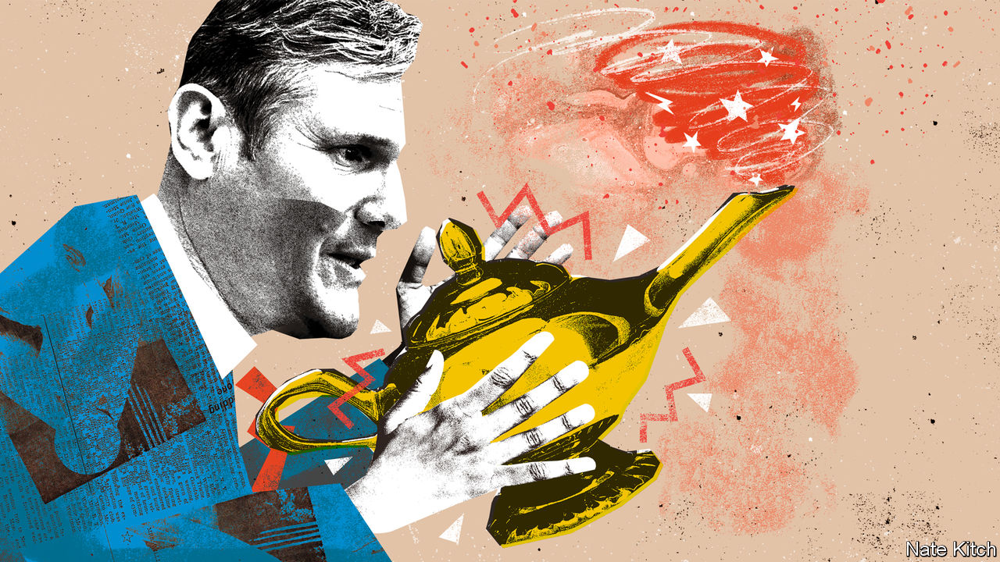

###### Bagehot

# Sir Keir Starmer’s magic lamp 

##### Luck often trumps skill and strategy in British politics 

 

> Jun 19th 2023 

Monday June 19th was a typical day in British politics in so far as it involved a series of humiliations for the Conservative Party. mps approved a report on Boris Johnson condemning the former prime minister for lying to Parliament over lockdown-busting parties. Rishi Sunak skipped proceedings for a fortunately timed meeting with Sweden’s prime minister. On the same day, the invite emerged for an illegal “Jingle and Mingle” event at the party’s headquarters during the Christmas lockdown of 2020. A video of the event had already circulated, with one staffer overheard saying it was fine “as long as we don’t stream that we’re, like, bending the rules”. Labour, through no efforts of their own, had their reputation comparatively enhanced. 

Luck is an overlooked part of politics. It is in the interests of both politicians and those who write about them to pretend it plays almost no role. Yet, as much as strategy or skill, luck determines success. “Fortune is the mistress of one half of our actions, and yet leaves the control of the other half, or a little less, to ourselves,” wrote Machiavelli in “The Prince” in the 16th century. Some polls give Labour a 20-point lead. Partly this is because, under Sir Keir Starmer, they have jettisoned the baggage of the Jeremy Corbyn-era and painted a picture of unthreatening economic diligence. Mainly it is because they are damned lucky. 

If Sir Keir does have a magic lamp, it has been buffed to a blinding sheen. After all, it is not just the behaviour of Mr Johnson that helps Labour. Britain is suffering from a bout of economic pain in a way that particularly hurts middle-class mortgage-holders, who are crucial marginal voters. Even the timing helps. Rather than a single hit, the pain will be spread out until 2024, when the general election comes due. Each quarter next year about 350,000 households will remortgage and become, on average, almost £3,000 ($3,830) per year worse off, says the Resolution Foundation. Labour strategists could barely dream of a more helpful backdrop. 

Political problems that once looked intractable for Labour have solved themselves. Scotland was supposed to be a Gordian knot. How could a unionist party such as Labour tempt left-wing voters of the nationalist Scottish National Party (snp)? The police have fixed that. Nicola Sturgeon, the most talented Scottish politician of her generation, found herself arrested and quizzed over an illicit £100,000 camper van and other matters to do with party funds. The snp’s poll rating has collapsed and another 25 seats are set to fall into the Labour leader’s lap thanks to PC McPlod and (at best) erratic book-keeping by the SNp. 

It is not the first time police have come to Sir Keir’s aid. He promised to quit in 2022 if police fined him for having a curry and beer with campaigners during lockdown-affected local elections in 2021. Labour’s advisers were adamant no rules were broken. But police forces were erratic in dishing out penalties, veering between lax and draconian. It was a risk. Sir Keir gambled and won. 

Luck will always play a large role in a first-past-the-post system that generates big changes in electoral outcomes from small shifts in voting. Margins are often tiny. Mr Corbyn came, according to one very optimistic analysis, within 2,227 votes of scraping a majority in the 2017 election, if they had fallen in the right places. Likewise, in 2021, Labour faced a by-election in Batley and Spen, in Yorkshire. A defeat would almost certainly have led to a leadership challenge; Labour clung on, and so did Sir Keir. If he enters Downing Street in 2024, he will have 323 voters near Leeds to thank. 

Sir Keir is hardly the first leader to benefit from Fortune’s favour. Good ones have always needed it. Sir Tony Blair reshaped Labour and won three general elections. But he had the job only because John Smith, his predecessor, dropped dead at 55. (“He’s fat, he’s 53, he’s had a heart attack and he’s taking on a stress-loaded job,” the  had previously written, with unkind foresight.) Without the Falklands war in 1982, Margaret Thatcher would have asked for re-election soon afterwards based on a few years of faltering experiments with monetarism. Formidable political talent is nothing without a dash of luck. 

Often the most consequential politicians are the luckiest. Nigel Farage has a good claim to be the most influential politician of the past 20 years. He should also be dead. The former leader of the UK Independence Party was run over in 1985. Then, in 1987, testicular cancer nearly killed him. In 2010, he survived a plane crash after a banner—“Vote for your country—Vote UKIP”—became tangled around the plane. Smaller factors also played in his favour: when he was a member of the European Parliament he was fortunately allocated a seat next to the European Commission president, providing a perfect backdrop for viral speeches. (“They handed me the internet on a plate!” chortles Mr Farage.) Britain left the EU, in part, because Mr Farage is lucky. 

Stop polishing that lamp, you’ll go blind 

Too much good luck can be a bad thing. David Cameron gambled three times on referendums (on the country’s voting system, on Scottish independence and on Brexit). He won two heavily and lost one narrowly. Two out of three ain’t bad, but it is enough to condemn him as one of the worst prime ministers on record. “A Prince who rests wholly on Fortune is ruined when she changes,” wrote Machiavelli. It was right in 1516; it was right in 2016. Labour would do well to heed the lesson. It sometimes comes across as a party that expects the Conservatives to lose, rather than one thinking how best to win.

Fortune has left Labour in a commanding position. Arguments against a Labour majority rely on hope (perhaps inflation will drop) not expectation. Good luck may power Labour to victory, but it will not help them govern. The last time Labour replaced the Conservatives, in 1997, the economy was flying. Now, debt is over 100% of GDp. Growth prospects are lacking, while public services are failing. It will be a horrible time to run the country. Bad luck. ■


