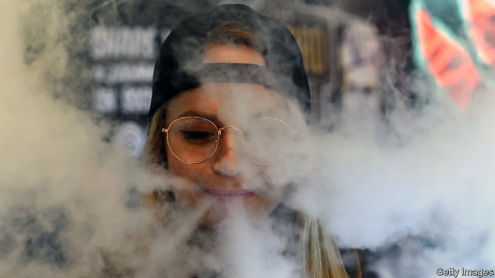

###### E-cigarettes

# Vaping among schoolchildren has become a moral panic in Britain 

##### E-cigarettes are bad, but other things are far worse 

 

> Jun 22nd 2023 

CURIOUS ODOURS swirl in the bathrooms of Copthall School, an all-girls comprehensive just north of London. Pupils who puff on e-cigarettes say that “lemon and lime” and “sour apple” are the most popular hits. But it’s not only flavours that appeal: as ever, being a part of the crowd matters. Kids who vape are “more accepted,” says Manha, a 13-year-old (who has, nonetheless, resisted). Poonam Dave, a senior member of staff, estimates a quarter of the children use them. That’s broadly in line with a recent survey by an anti-smoking group, ASH, suggesting a fifth of 11- to 17-year-olds have tried vaping.

Buying e-cigarettes is illegal for those under 18, but vaping rates are drifting upwards. The most recent figures, from 2021, suggest 9% of students in secondary schools are regular or occasional vapers, up from 6% three years before. The increase coincides with the proliferation of cheap, plastic, disposable vapes from China that are sold in bright colours and heavily promoted in shops and on social media.

Similar trends exist in other countries, where authorities are more stirred up. China and many states in America have banned flavoured vapes, which are reckoned to be alluring to children. In recent months Australia and New Zealand said they will ban most disposable vapes, largely out of concern that tobacco companies, who own many e-cigarette-brands, are trying to get children hooked. In Britain Rishi Sunak, the prime minister, has no plans to follow suit but has said an “illicit vape enforcement squad” will raid shops that are known to sell to children.

It would be better if children did not vape. Long-term health effects of the habit are still unknown. Potentially vaping is associated with a higher risk, versus those who don’t smoke at all, of users developing cardiovascular disease. Vapes can also contain highly addictive nicotine—albeit in much lower quantities than cigarettes. Illegal vapes, meanwhile, often have dangerous levels of lead and nickel.

But excitable talk in the press of a vaping “epidemic” among children is misplaced. Slightly more consumption of e-cigarettes has coincided with a welcome drop in smoking of the old, tar-filled and much more dangerous sort. Only 3% of secondary students regularly or occasionally smoke cigarettes (again, as of 2021), and only 12% say they have ever tried. Back in the 1990s around half had done so. This is part of a dramatic, positive trend across the general population that is too little remarked upon: estimated annual sales of cigarettes plunged from 38bn to 20bn in the past decade. Speeding that decline by getting remaining smokers, some 13% of the total population, to switch to vapes is smart: a new government scheme tells (adult) smokers to “stop to swap” to vapes. 

Nor is it obvious that doing away with fruity flavours helps. A 1,468-page government review into vaping last year failed to conclude whether or not banning the sweetest flavours would discourage young vapers. It did warn that a ban could instead nudge some to buy illegal vapes. It could also put off adult smokers with a sweet tooth, who might otherwise give up their tar-filled cigarettes.

More tax on disposable vapes, making them pricier, would help. And cracking down on shopkeepers is likely to be more beneficial: there the focus should be on alcohol, which evidently causes more harm. Shopkeepers routinely offer 12-year-olds booze, says Kalwa, another Copthall pupil. Hospitals in England admitted 46 children for vaping-related reasons in 2022, but recorded 5,010 alcohol-related admissions among under-16s alone in 2018-19. Those who chug bottles of raspberry-flavoured Bacardi (around 6% of secondary students drink alcohol weekly) have a more dangerous habit than the vapers.

On the front lines of the battle against youth vaping, many tactics look ineffective. At Copthall much-vaunted “vape detectors” (white boxes to alert staff when students are puffing in the toilets) have not yet been installed. A “metal detector” (a cheap wand bought online) to sweep some pupils for vapes is easily evaded: vapers hand their goods to more cherubic children. Still, the fashion may turn. Reema, 13, who took up vaping because her mum did it, says she has stopped. The reason? She finds it “boring”. ■


