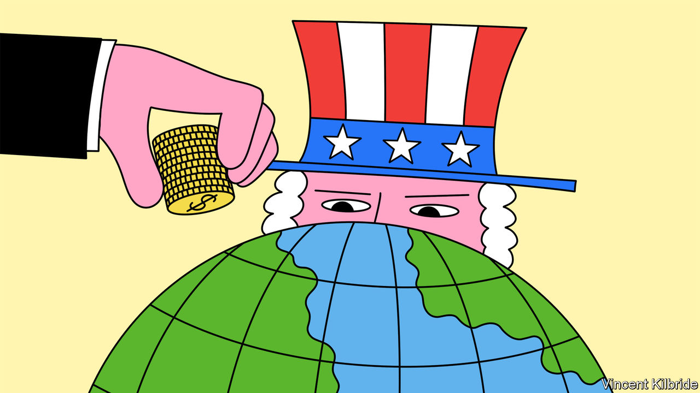

###### Outward bound

# America’s plan to vet investments into China 

##### Citing national security, America’s government considers tighter rules on outbound capital 

 

> Jun 22nd 2023 

Rules to police investment by American firms in China have acquired a phantom quality: always imminent, always delayed. In recent months the steady beat of debate on the topic has quickened to a drumroll. In March America’s Treasury and Commerce Departments delivered reports on potential rules. The next month Jake Sullivan, President Joe Biden’s security adviser, trailed the policy in a speech. An executive order from Mr Biden is expected to follow. America’s allies are mulling similar restrictions. On June 20th the European Commission announced plans, albeit vague ones, to propose an initiative by the end of the year.

 


When Mr Biden’s executive order does appear, it is likely to focus on investments in three “force-multiplying” technologies: advanced semiconductors, artificial intelligence (AI) and quantum computing. The exact permutation of prohibitions and notification requirements remains unclear, but the rules will affect only a sliver of American investments in Chinese firms, which were worth more than $1trn at the end of 2021. According to data from Rhodium Group, a research firm, American firms made $120bn of foreign direct investment in China and $62bn of venture-capital (vc) investment during the past decade (see chart).

Geopolitical brakes on American capital are not an entirely new idea. Some companies with ties to China’s military are off-limits to investors and the CHIPS Act bars firms that receive its subsidies from making investments that could benefit China’s semiconductor industry. Advocates say outbound-investment rules are a necessary extension to America’s patchwork of trade restrictions: if export controls prevent Chinese firms from buying some dual-use technologies and inbound-investment screening stops them snapping up American firms that make them, American capital should not be allowed to fund the technology’s development in China.

Placing limits on America’s globetrotting investors comes with risks. One is writing over-broad rules which limit capital flows and burden investors without good reason. Paul Rosen, a Treasury official, said in May that the rules would focus on “investment dollars that come with know-how and expertise”. European leaders say restrictions are needed to prevent “know-how leaking”. But figuring out what sorts of investment are leaky is tricky. A tech giant hoping to expand its advanced-computing efforts in China would presumably fall foul of this standard, but the case of investment firms, and their ultimate investors, is less straightforward. A private-equity fund might acquire a company but offer no operational advantage, whereas a small vc investment could come with technical expertise worth protecting.

According to the Centre for Security and Emerging Technology, a think-tank, in 2015-21 American investors, including the vc arms of chipmakers Intel and Qualcomm, participated in funding rounds that accounted for 37% of the $110bn raised by Chinese AI companies. American pension funds’ appetite for returns has made them beneficiaries of such investments. Consider GGV Capital, one of the most active American investors in Chinese AI companies, according to data from PitchBook. Our analysis of public disclosures suggests that six American pension funds and endowments with combined assets exceeding $600bn have committed around $2bn to ggv Capital’s funds in the past decade.

The national-security risk presented by such investments is an open question. So is that of whether Chinese investors could in any case replace the funding if American investors were restricted. Some feel the Biden administration should provide firmer answers before it requires asset managers and pension funds, which are typically exposed to hundreds of global investment funds, to search for traces of Chinese tech companies in their portfolios.

Another danger is mission creep. Under Mr Biden, economic and national-security policy have become increasingly indistinguishable. Last year the president directed the Committee on Foreign Investment in the United States (CFIUS), the American inbound-investment watchdog, which has seen its caseload explode in recent years, to consider wider factors including supply-chain resilience. Scrutinising outbound investments on the basis of broad standards of national interest could become unwieldy. Fears of a growing investment bureaucracy have led some to suggest using existing sanctions rules instead. 

Though Mr Biden’s initial policy on outbound investment is expected to be narrower than anything that could be called a “reverse-CFIUS”, there is no shortage of hawks outside the White House who imagine outbound-investment screening as a tool for industrial policy. In 2021 a bipartisan group of congressmen introduced a bill to screen outbound investment broad enough to have affected more than 40% of American investment in China, according to Rhodium Group. Last month an updated version of the bill was released. It would establish restrictions on investments not just in advanced technology but in industries including carmaking and pharmaceuticals, and give the White House the authority to expand the list.

The proliferation of trade restrictions does not stop at America’s borders. Some attribute the delay in Mr Biden’s executive order to trouble gathering support for new rules among allied countries. The Group of Seven (G7) jamboree of world leaders came and went in May with only a milquetoast commitment on the issue. Few countries globally place any restrictions on outbound investment, but screening of inbound investment is increasing rapidly. Europe is beefing up its protections: 18 of the EU’s 27 members have such rules, covering an increasingly diverse list of “strategic” sectors. The commission’s plans for outbound-investment rules threaten a growing tangle of red tape. 

The effect on Western investment in China depends on the eventual scope of any rules. American investment is already falling. vc flows to China have plummeted by more than 80% since their peak in 2018. As the business environment in China worsens, there is no sign of a reversal. This month Sequoia, a big American vc firm, announced that it would split off its Chinese business by 2024. For now, hawkish policymakers can rest assured that China is doing their job for them.■


