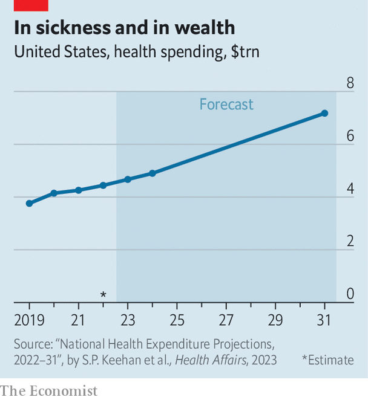

###### Health care

# Doctor Walmart will see you now 

##### American retailers see opportunities in the primary-care business 

 

> Jun 21st 2023 

WITH HIS long white coat, stethoscope, genially soothing manner and wonky eagerness to discuss “population health management” and “patient-centred” medicine, Ronald Searcy seems the Platonic ideal of a primary-care doctor. The most unusual thing about him is where he works: a compact facility complete with examination rooms, dentist’s office, phlebotomy lab and X-ray room tucked into a Walmart in north-west Arkansas. Since 2019, Walmart has opened 32 of these “health centres” in five states; by the end of next year it plans to more than double that number, and expand into two more states.

Walmart is not the only big company expanding its medical offerings. Earlier this year Amazon acquired One Medical, a concierge practice (meaning clients pay an annual membership fee) with offices in cities across America. Dollar General, a discount retailer, has set up a partnership with DocGo, which runs mobile health clinics, and has launched a pilot programme at three shops in Tennessee. Walgreens and CVS, both retail pharmacies, have robust primary-care offerings; last year more than 5.5m patients visited a CVS MinuteClinic, making it one of the biggest providers in the country, and earlier this year CVS completed its acquisition of Oak Street Health, an elderly-focused primary-care provider with offices in 21 states. What do these companies see in the medical business? The answer, befitting America’s Byzantine and rent-filled health-care system, is both simple and complex.

 


The simple answer is money. Americans spend a stunning amount of it on health: roughly 18% of GDP in 2021, far exceeding the rich-country average of about 10% and more than double the ratio of some, such as South Korea, with healthier and longer-lived populations. Americans’ spending is forecast to rise by 5.4% per year over the next eight years (see chart), outpacing economic growth and accounting for almost 20% of GDP by 2031. The bulk of that spending will come from Medicaid and Medicare, federal programmes that cover health-care costs for, respectively, poor people and over-65s.

The complex part reflects changes in how insurers, including Medicaid and Medicare, pay for coverage; as well as changes in how consumers are willing to get it. Start with the insurers. The predominant payment model is fee-for-service, in which insurers reimburse doctors for each visit or procedure. Its advantage is simplicity. Its downside is that it encourages medical consumption but, for the most part, is indifferent to outcomes: doctors get paid the same amount whether a patient gets healthier or not.

From 2016 to 2021, however, the share of health-care spending on “alternative payment models” rose from 29% to 40%. In a survey in 2022 most payers believed that these payment models, in particular those that let doctors share in the upside of keeping patients healthy, would rise. This approach, known as “value-based care” (VBC), is an artefact of the Affordable Care Act. It incentivises doctors to keep patients healthy—for instance, by letting them share in savings if a patient with a chronic condition takes her medication and stays out of hospital—rather than simply paying them for every procedure performed. Companies are betting that they can make more money on this model than the old one.

Retailers launching or expanding their primary-care offerings are also betting on consumer habit. The most recent Consumer Pulse Survey by Accenture, a consultancy, showed that nearly one-third of consumers—and more than one-third of those between 18 and 35—were open to getting medical care at a grocery store or big-box retailer, and more than 90% of customers would trust a retailer with their medical data. Retailers believe that this sort of trust, along with their convenience (75% of Americans live within five miles of a Dollar General, and 90% within ten miles of a Walmart) is a winning combination.

Better technology improves VBC, both by giving insurers more health measures to judge a doctor’s success, and by providing doctors with a better way to stay in touch with their patients. Walmart Health and OneMedical, for instance, use apps that show patients their medical history, including upcoming appointments and when they need to repeat their prescriptions. Both of these companies also have in-house pharmacies to which they can direct patients. And the primary-care doctor is the de facto co-ordinator and gatekeeper for a patient’s whole medical care. Some worry that VBC could provide an incentive for insurers to deny referrals and necessary care, and keep the savings. But if the patient gets sicker, they share those costs too.

Managing that downside risk will be tricky. The sort of proactive care and patient contact that VBC requires may be cheaper with a smartphone than without one, but it is not cheap. Providers need to invest in technology, but may also need to keep on top of patients with repeated phone calls and home visits—the sorts of things that apps cannot do. Firms that get it wrong will struggle. Those that get it right will increase their share of the immense tide of money sloshing around America’s bloated and inefficient health-care system, and may also, incidentally, keep people healthier.■


