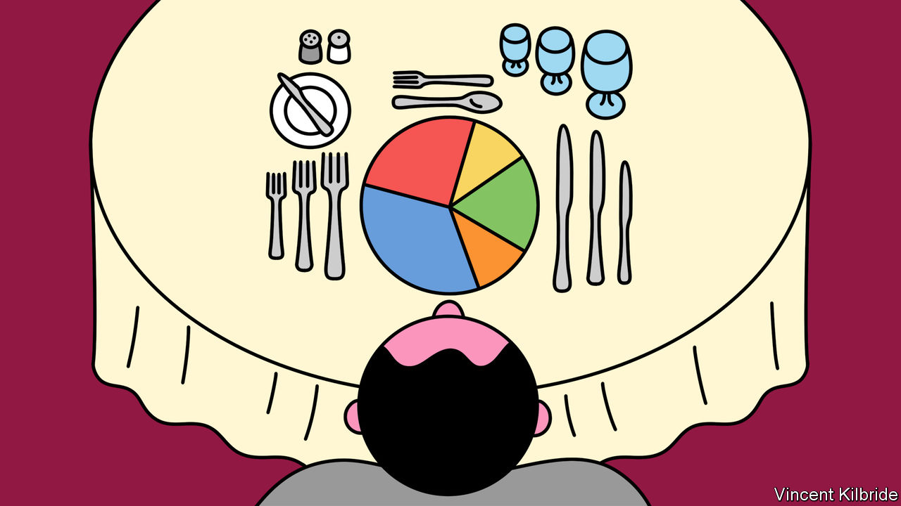

###### Work and savoir-faire

# Europe’s last finishing school targets anxious executives 

##### As the supply of debutantes dries up, etiquette experts explore a new market 

 

> Jun 22nd 2023 

The three-martini lunch may be over, but the business dinner is here to stay—and it is a prospect that fills some executives with horror. For those who find the multiple rows of cutlery and wine glasses baffling, or who keep forgetting which side-plate is theirs, help is on hand to decode the hidden rules of etiquette. On the hills overlooking Lake Geneva, a company offers executives an extra layer of social polish to boost their confidence—and, perhaps, their career.

Established in 1954, the Institut Villa Pierrefeu, perched above Montreux, is the last finishing school in Europe. Its courses, which range from one to six weeks, cover everything from seating precedence and tea-service protocol to black-belt-level etiquette challenges such as eating a banana with a knife and fork. Historically, most of its students were young women preparing for the marriage market. Today, as social codes relax and demand for such an education wanes, Villa Pierrefeu is exploring a new pool of clients: business executives. Viviane Néri, the Institut’s principal, says it is no longer a finishing school but a “starting school”.

A five-day course in the “European art of dining” (which costs around SFr5,000, or $5,570) features modules on menu planning, English-style table setting and French-style table manners. The students carefully taking notes on wine pairing and cutlery arrangement work in fields such as technology, corporate law and banking. Some are there to master a foreign culture. Ahmed Aftab Naqvi, the head of an advertising network in India, says that a spell at Villa Pierrefeu has helped him to “understand the diversity of cultures, customs, traditions and etiquette”. Others hope that their refined manners will command respect from colleagues. “I wanted to be elevated,” says one employee of a tech giant based in California. 

Some lessons have not changed in years. Students are instructed that, once a meal is over, they can place their linen napkin on the right (French style) or the left (English style). But in other ways the school has had to adapt. Ms Néri has changed courses to suit professionals, scrapping the old nine-month diploma and offering classes all year round which clients can attend on their annual leave. Schools which failed to adapt have had to close, or take on less glamorous roles. Le Manoir, a former finishing school in Lausanne, these days serves as the international headquarters of Tetra Pak.■


