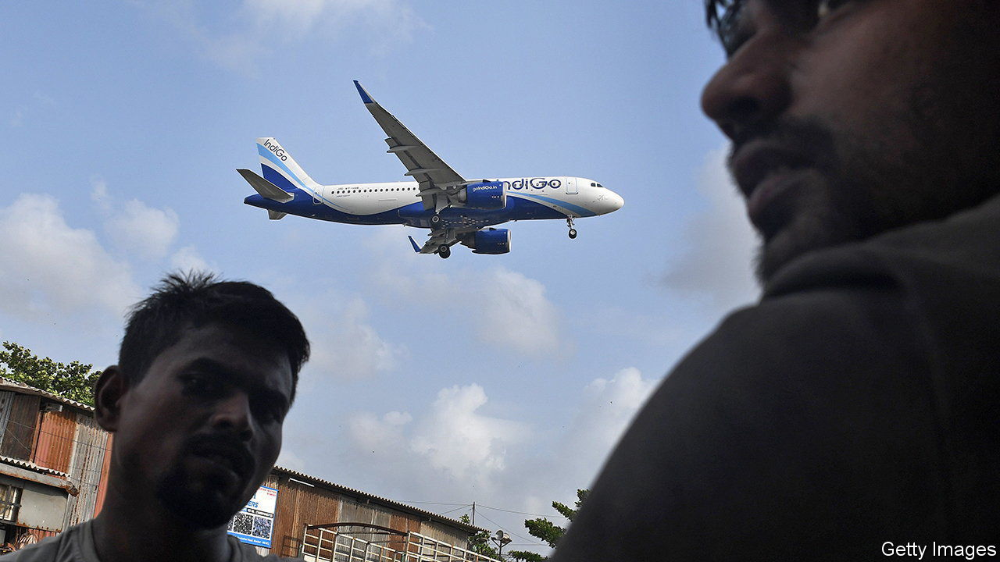

###### Jet stream

# India leads a boom in orders for passenger jets 

##### But can manufacturers make them in time? And will the clients still be around to receive them? 

 

> Jun 22nd 2023 

Traditions abound at the annual airshow that rotates between Paris and Farnborough. One is visitors’ observation that a glittering capital city, with the Eiffel Tower visible through the haze at the end of the runway, is preferable to a British town so unremarkable that its main attraction is its biennial airshow. Another is complaints about the heat from those trudging airstrips covered in commercial jets, fighter planes, helicopters and other pieces of high-tech kit.

The most predictable convention is that Airbus, a European aerospace giant, will take the opportunity while on home tarmac to deliver a blow to Boeing, its American rival in the duopoly supplying the world’s big passenger jets. On June 19th it did not disappoint. Amid a slew of smaller deals, the most eye-catching was a whopper from IndiGo, an Indian low-cost carrier. Its order for 500 narrow-body jets from Airbus’s A320 family, to be delivered in 2030-35, is the biggest ever struck. Boeing’s only significant riposte was to confirm an order made in February by Air India for 190 of its competing 737 maxs and 30 of its wide-body long-haul jets. 

If Boeing was disheartened, Darren Hulst, its boss of commercial marketing, did not show it. The orders unveiled in Paris are part of a rush by airlines to expand their fleets, in order to cope with a resumption of rapid growth in air travel as the pandemic recedes. Mr Hulst noted that Boeing’s order book swelled by over 1,100 planes in the ten months following last year’s Farnborough show, and that the world’s airlines would require 42,600 new planes by 2042. 

Carriers are clamouring for new metal. The combined backlog at Boeing and Airbus is around 12,000 planes. Air India wants almost as many as IndiGo; it confirmed in Paris that it would buy 250 Airbus jets. In May Ryanair, Europe’s biggest airline, ordered 300 737 maxs. Late last year United, an American carrier, ordered 200 jets, split between Airbus and Boeing. At the Paris show, Riyadh Air displayed a Boeing 787 painted in a striking purple livery. The new airline, financed by Saudi Arabia’s sovereign-wealth fund, has ordered 39 of Boeing’s popular wide-body jets, with a view to starting operations in 2025. Using the Saudi capital as a base, it aims to open up the country to international tourism. It is expected to place a huge order for short-haul planes soon.

Amid the bonanza, questions remain. First, can Airbus and Boeing increase production, laid low during covid-19, to meet demand? Airbus, which saw delivery rates of its A320s sink to 40 a month during the pandemic, aims to deliver 75 a month by 2025. Ramping up supply chains will not be easy, especially as many firms laid off their costliest and most experienced staff.

Another question lingers over India. Demand there is soaring, as the world’s most populous country gets richer. South Asia, where India accounts for 90% of the traffic, will be the world’s fastest-growing air-travel market over the next two decades, according to Boeing. Whereas China has a fleet of 4,000 planes, India’s fleet numbers just 700. IndiGo, which operates around 300 of them, has 1,330 more coming, to serve what has already become the third-largest domestic aviation market in the world.

Yet the rapid expansion of IndiGo, which controls around 60% of the domestic market, has come at a cost. Its latest fiscal year was the fourth in a row to end with losses. Part of its success is down to the failure of other Indian carriers. One competitor, Jet Airways, went bankrupt in 2019 and another, Go First, collapsed last month. Their grounding should enable surviving operators to increase ticket prices, but officials have been clear that such rises must be constrained.

A consequence is that underlying the excitement around the colossal new orders are concerns about whether some buyers will stay aloft. Another airshow tradition is for pundits to suck air through their teeth and wonder if the future is really as rosy as the numbers suggest.■


