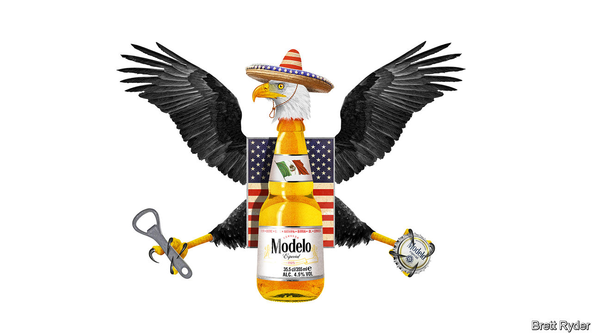

###### Schumpeter

# The new king of beers is a Mexican-American success story 

##### Move over, Bud Light. Heed the power of the Hispanic market 

 

> Jun 20th 2023 

The king is dead.  That is the cheer ringing through drinking dens this summer as Bud Light, America’s self-styled “king of beers” for 22 years, is dethroned by Modelo Especial, a Mexican brew. Spare a thought for the vanquished. Rarely has an effort to rejuvenate a brand gone as spectacularly wrong as when Bud Light’s marketers entered into a liaison with a transgender social-media star, only to fall victim to America’s culture wars. On the bright side, it offers a chance to examine a little-known success story. Constellation Brands, an American firm that went into brewing only a decade ago, offers a lesson in how to wage an old-fashioned corporate insurrection, Mexican-American style.

Schumpeter should declare an interest. Having lived for many years in Mexico, parts of his life have been spent accompanied by one Mexican brew or another. Modelo Especial was rarely one of them. South of the border, it doesn’t have huge cachet. Yet in America the same beer, with the same taste, has overtaken even Corona Extra, its better-known sister brand. That is because, in straightforward business terms, Constellation got everything right, from manufacturing to distribution to retailing. Most of all, it grasped the growing power of the Latino consumer. 

The Modelo Especial story starts with antitrust. Not the newfangled sort in which size itself is considered taboo, but the old-school idea that buying a competitor can lead to higher prices. It dates back to 2013, when AB InBev, the Belgium-based owner of Budweiser, paid $20bn to take control of Grupo Modelo, Mexico’s largest brewer, whose brands such as Corona and Modelo Especial were rivals to Bud Light north of the border. America’s Justice Department intervened. It determined that, in order to maintain competition, AB InBev should divest Modelo’s entire US business to Constellation, which was then a relatively little-known wine and spirits seller worth $8.1bn. (AB InBev kept the Grupo Modelo business in Mexico and the rest of the world.) Today Constellation is worth $45bn and is one of the most respected consumer-goods companies in America.

Bump Williams, a consultant who first noticed that in the four weeks to June 3rd, at-home sales of Modelo Especial had shot past Bud Light in dollar terms, uses a vivid expression to describe the way Constellation nurtured the brand. He calls it “feeding the hot hand”. When the company noticed that the beer was taking off, it did not let a perception that Corona was the front-runner distract it. It threw its weight behind the mood of the marketplace.

Its priority was to ensure that supply met demand. That involved making a huge bet on Mexico. When Constellation acquired the brands, it resolved to brew them south of the border. Since then it has increased its production capacity in Mexico fourfold, at a cost of $6.4bn—more than the $4.8bn it paid for the brands in 2013. It is not stopping there. It plans to invest up to a further $4.5bn over the next three fiscal years, boosting capacity by more than 70%. Investing in Mexico has not been without setbacks. In 2020 protesters, backed by Andrés Manuel López Obrador, Mexico’s populist president, voted in a plebiscite to stop Constellation from building a factory close to the border because of concerns about water shortages. So it moved the factory to Veracruz, on Mexico’s wetter east coast, with the president’s blessing.

Distribution in America was the next challenge. To start with, Constellation focused on bringing Modelo Especial to a few cities with big Hispanic communities, such as Los Angeles and Chicago. After the brand took off there, it expanded farther afield. It built brand awareness one step at a time and worked closely with its distributors to ensure that supply kept flowing. Once in shops, Constellation focused on showcasing the Modelo brand. “They’re wine guys, they know the value of display,” says Mr Williams. They also got pricing right. Instead of foisting large increases on consumers, Constellation made incremental price rises. For many years, Modelo Especial has been the fastest-growing beer in America, says Scott Scanlon of Circana, a market-research firm. Yet more impressive is that it is a premium brand, rather than a budget one, at a time when wallets are stretched—and a full-bodied beer, rather than a low-calorie one, when waistlines are. 

The reasons for its consumer appeal are twofold. First is advertising. Unlike Bud Light’s, it is not gimmicky. It tells stories of ordinary people who have overcome hardship. That has helped it pull off the trick of remaining authentically Mexican even as it joined the big-beer league. Second is the market itself. Its core consumers are Latinos, who have growing economic power in America. According to McKinsey, a consultancy, it is not just their population that is increasing faster than the American average. So is their spending power. If America’s Latinos were their own country, they would have had the third-fastest-growing economy after China and India during the past decade.

The flamin’ hot hand

This power may cast a halo effect on other products of Mexican descent. Tequila looks likely to overtake vodka as America’s best-selling spirit. Grupo Bimbo, a Mexican multinational that is America’s biggest baker is, like Constellation, a respected consumer-goods company. In a sign of the times, a new film, “Flamin’ Hot”, tells the story of how a Mexican-American janitor convinced Frito-Lay, owned by PepsiCo, to produce spicy Cheetos to win over the Hispanic market, reviving its business. (The snack’s true genesis is disputed, but its popularity is in no doubt.)

Modelo Especial may yet lose its crown as Bud Light gets over its current crisis. Yet the fizzing growth of the Mexican-American brand suggests it could eventually gain a more lasting lead. It is lamentable for business in general that America’s cultural divide has done so much damage to Bud Light’s reputation. But the consolation is that Modelo Especial’s success suggests the cultural divide between America and Mexico is narrowing. ■


