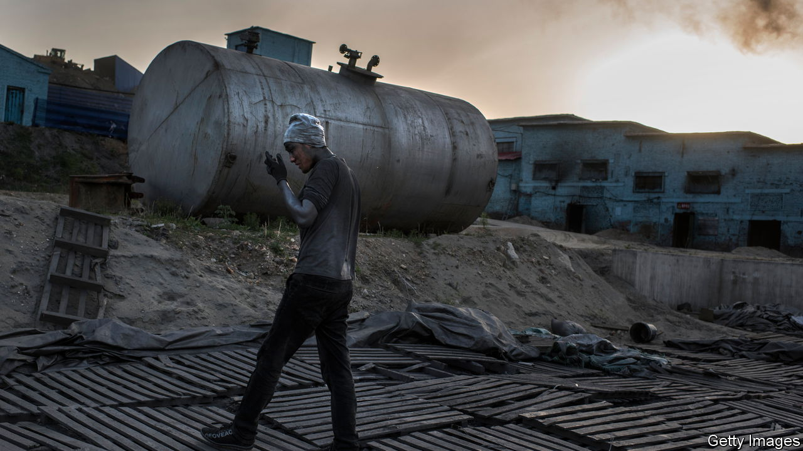

###### China and Europe

# Why is China blocking graphite exports to Sweden? 

##### Its motive may be more commercial than political 

 

> Jun 22nd 2023 

IN EARLY 2020 Swedish battery-makers noticed something alarming. Their Chinese suppliers were no longer able to sell them graphite, a mineral crucial to the production of lithium-ion cells. The Swedes assumed the problem would pass. Yet three years on, as Chinese investments in the battery industry have surged in Europe, Swedish firms are still largely cut off. In 2020 China’s exports to Sweden of two types of graphite nearly disappeared. In 2021 and 2022 they vanished completely.

Although China’s commerce ministry has issued no formal ban, many Chinese graphite exporters face a prohibition in all but name. One company was told that licences to export graphite to Sweden were no longer being issued by Chinese regulators. Given that China supplies more than 60% of the world’s natural graphite and almost all the man-made version, the situation alarms producers that rely on China for the graphite anodes used in their cells. A halt in supplies from China can upset supply chains, raise costs and disrupt production. For Sweden, where the industry is just getting off the ground, a total ban on exports could do serious damage. In its only official statement on the matter, the European Commission said earlier this year that the drying up of Chinese graphite exports “is creating negative repercussions for battery production in Europe, a key sector for the eu green transition”.

China frequently throws its weight around when it seeks to punish countries over political disputes. In a row with Australia that started in 2020, it officially banned imports of coal from down under (the restriction was lifted this year) and put in place an unofficial ban on lobsters, with devastating consequences for Australian sellers who had come to rely almost exclusively on Chinese appetites. Officials in China have often threatened to ban exports of minerals such as rare earths to America as retaliation for sanctions. Export bans for battery minerals such as lithium and cobalt have become more common. According to the OECD, a club mostly of rich countries, China was the greatest offender in restricting the supply of materials needed for the transition to renewable energy.

Grasping the reasons behind the Swedish graphite ban could be just as important as dealing with it. At first blush, the ban appears to have been triggered by one of many small diplomatic spats between China and Sweden in recent years. In late 2019 Swedish PEN, a free-speech advocacy group, gave an award to Gui Minhai, a publisher and dissident who is imprisoned in China. The Chinese embassy in Stockholm immediately lashed out with threats against Sweden. Mr Gui, a Swedish citizen, has been at the centre of a dispute between the two countries since he was kidnapped by Chinese agents in Thailand in 2015. In 2020 and 2021 people familiar with Mr Gui’s case believed it was the motive for the graphite restrictions. The same people now believe there could be more to it than a petty quarrel over an award. 

As graphite exports to Sweden have slumped, China’s overall battery and electric-vehicle investments across Europe have soared. In Hungary China’s top battery-maker, CATL, poured $8bn into a factory last year, which amounted to one of the biggest foreign investments ever made in the country. In Poland smaller but similar factories are being built by Chinese firms. At the same time, graphite exports to those two countries have rocketed. Hungary imported more than $230m-worth of one form of graphite in 2022, up from just a few thousand dollars’ worth of the stuff five years earlier.

As it happens, one of the most competitive firms in Europe’s nascent battery business is Northvolt of Sweden. The company has begun to expand in Europe and will receive subsidies to build new factories. It is unclear what impact, if any, the graphite ban has had on Northvolt. But it is believed to have the potential to raise costs at a time when competition to win market share is fiercer than ever. The insiders aware of the Chinese graphite ban have started to question if the unofficial measures have been designed to stymie innovation in Europe as China builds a foothold there. In May one Chinese firm, Putailai, announced a $1.3bn investment to build Europe’s largest factory for making anodes. It will become a core supplier to the Swedish battery industry. ■


