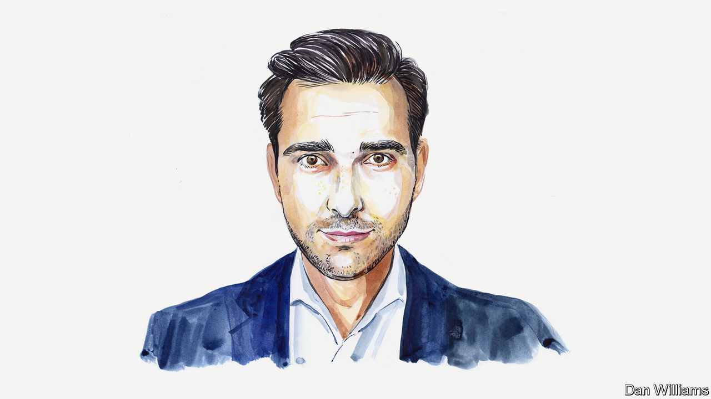

###### America and China

# Thom Woodroofe on why climate co-operation could be the key to improving Sino-American relations 

##### Here’s hoping John Kerry makes it to Beijing, says the former climate diplomat 

 

> Jun 22nd 2023 

THERE IS TALK of President Joe Biden’s climate envoy visiting China in the coming weeks. If the trip goes ahead, John Kerry will be the second senior American official to hold talks in Beijing in under a month. The recent visit of Antony Blinken, the secretary of state, secured the resumption of some of the bilateral dialogues suspended by China after Nancy Pelosi, at the time the speaker of the House of Representatives, went to Taiwan last year. 

In the wake of Mr Biden’s meeting with his Chinese counterpart, Xi Jinping, in Bali last November, Mr Blinken had been expected to go to China earlier this year. But the detection of a Chinese spy balloon over American airspace in February and the resulting diplomatic kerfuffle set back any attempt to normalise relations. Mr Kerry’s own visit is designed to unlock one big area of stalled co-operation: climate change. It will be a crucial test of whether the two countries’ officials can move beyond platitudes to construct what Mr Biden likes to call a “guardrail” to help stop the rest of the relationship from spiralling out of control.

This is not the first time Mr Kerry has tried to find a way for the two largest emitters of carbon dioxide to work together on the climate crisis. In 2014, as secretary of state, he conceived the joint pact between Barack Obama and Mr Xi that proved a catalyst for the Paris agreement between 196 countries the following year. Then, in 2021, at the height of the covid-19 pandemic and in a more strained geopolitical climate, he became the first senior Biden-administration official to visit China. Mr Kerry talks often of how he and his seasoned Chinese counterpart, Xie Zhenhua, have spoken almost weekly since calls from their respective presidents brought them both out of retirement. 

Mr Kerry will hope that even though the Chinese have still not agreed to treat climate as a “critical standalone issue”, hived off from the thornier parts of the bilateral relationship, they will at least be willing to dial the clock back to November 2021, when they agreed at COP26 in Glasgow on a framework for working together. This included a reasonably robust mechanism for China to disclose its methane emissions and revived a bilateral working group covering various climate-related issues. Since then, though, Chinese provincial approvals of coal-fired power plants have only gone up, highlighting the urgency to America of getting China back to the diplomatic table.

Chinese officials may prefer to talk about creating “safety nets” while the Americans envision guardrails, but working once again with the United States on climate change is not out of the question—assuming China does not view doing so as undermining its broader geopolitical objectives. Moreover, China is eager to ensure a warm reception for Mr Xi when he visits San Francisco later this year for a summit of Asia-Pacific leaders.

Alongside the stability of the global financial system and perhaps some aspects of nuclear non-proliferation and disarmament, the climate is an area in which America’s and China’s interests are at least partially aligned. Because of air pollution in Chinese cities, the vulnerability of many coastal conurbations to climate change and a lack of arable land or usable water, it is an issue of rising concern to people across the country. Gone are the days of the ill-fated 2009 Copenhagen climate conference, when China felt able to thumb its nose at the rest of the world. This is why Mr Xi set his landmark “”, or “dual carbon goals”, of starting to bring down emissions before 2030 and carbon neutrality by 2060. China is already the world’s largest carbon emitter. By the middle of the century it will surpass America as the largest historical emitter.

None of this means that America and China are suddenly going to launch joint projects to mitigate or adapt to climate change. But the recent slight thaw in relations and Mr Kerry’s trip present a rare opportunity for both sides to show that it is still possible to have a constructive dialogue.

The two countries are, of course, arch-rivals. Indeed, competition—in green tech, semiconductors and much besides—is a defining element of the Biden administration’s stance towards China. Nevertheless, it may still be possible to agree on areas in which competition might actually be helpful to the global fight against climate change and conducted in an orderly way, for instance in the provision of green finance and renewable-energy technologies to other countries. 

The true test will come when climate-related issues that cut across particularly sensitive areas of the bilateral relationship, such as trade protectionism and human rights, make their way onto the agenda. One question is whether America will, along with Europe, impose tariffs on imports of carbon-intensive products such as steel and cement, which would hit China hard; American officials are reportedly looking into the idea. And it has not gone unnoticed in Washington that an estimated 45% of the world’s supply of polysilicon used in solar panels comes from Xinjiang, a Chinese region where Uyghurs, an oppressed minority, are pressed into forced labour.

Mr Kerry and Mr Xie, 79 and 73 respectively, are wily diplomatic veterans who, although shut out of their governments’ broader geopolitical strategising, both have influence to wield in their domestic political systems. Nevertheless, the American envoy’s visit may be the last opportunity for progress before the American presidential-election campaign reaches fever pitch, making progress on global issues tricky—and, if Donald Trump or another Republican wins, possibly leading to America withdrawing from the Paris agreement once again. With a long line of American cabinet members also eager to visit China soon, Mr Kerry’s trip will be an important test of whether the latest attempts at a diplomatic  will prove fruitful or futile. ■


