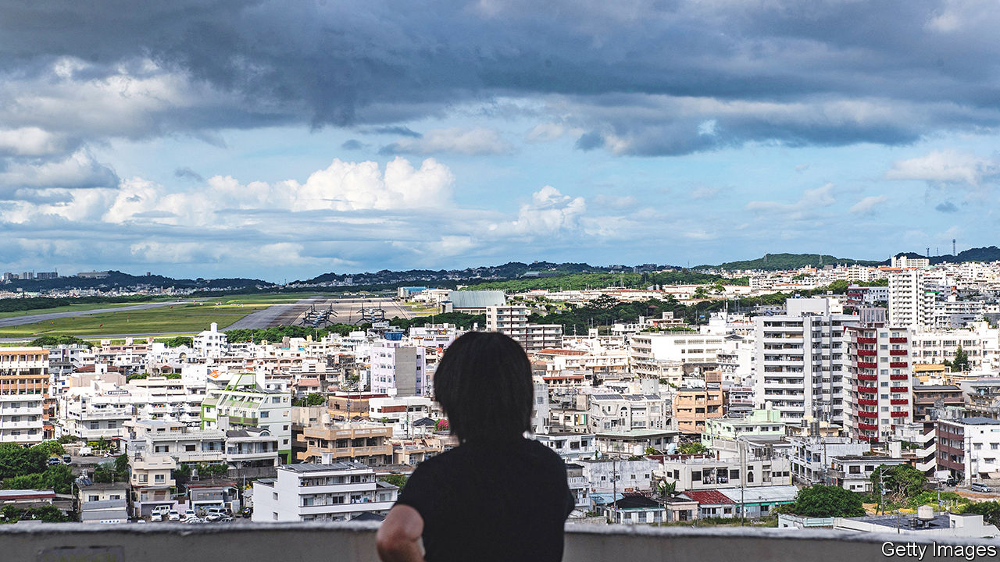

###### Another nationalist obsession

# China has its eyes on Okinawa 

##### As if the country isn’t involved in enough territorial disputes 

 

> Jun 22nd 2023 

When Xi Jinping strolled around the national archives in Beijing earlier this month, it seemed like a routine tour. China’s supreme leader commented on various items that piqued his interest, such as ancient scripts engraved on animal bone and an astronomical map from the Song dynasty (960–1279). But his remarks about a manuscript from the Ming dynasty (1368-1644) received the most attention. It described old ties between the Chinese province of Fujian and the independent Ryukyu kingdom, a collection of islands that was later annexed by Japan and turned into Okinawa prefecture. The book, said a staffer, “plays an important political role”. Mr Xi responded that, having served as a senior official in Fujian, he was aware of the “deep” history of the exchanges.

That may not seem like much of a statement. The Chinese government has never asserted a claim to the Ryukyu Islands. But for years a collection of Chinese scholars, analysts and military officials have questioned Japanese rule there, with some arguing that the islands’ inhabitants paid tribute to Chinese emperors long before they recognised Japan’s authority. So it is curious that Mr Xi’s comments were reported on the front page of the , the official newspaper of the Communist Party. Some observers think it was meant to send a message to Japan.

 


That was the idea a decade ago, during the first “Ryukyu boom”, as some scholars now call it. Back then, China and Japan were sparring over five East China Sea islets, which Japan controls and calls the Senkakus, but which China claims and calls the Diaoyus. As tensions rose, Chinese commentators also began pressing the Ryukyu issue in state-run media. Analysts believe they were allowed—and perhaps encouraged—to mouth off in order to strengthen China’s bargaining position and to make clear to Japan that nationalist sentiment was strong in China.

Today there are signs of a new Ryukyu boom. Days after Mr Xi made his comments, a state-television report in the southern city of Shenzhen raised many of the same questions about the islands and quoted Chinese specialists who stopped just short of denying Japanese sovereignty over Okinawa prefecture. They spoke of China’s benevolent role in the early history of the Ryukyus, contrasting it with descriptions of Japanese bullying.

June Teufel Dreyer, a specialist on both China and Japan at the University of Miami, sees a familiar pattern. When China wants to make a controversial claim, it may first get mentioned at a low-key conference, she explains, then cited in a government document or media report, followed by a reference from a senior official. “It’s a way to create a  by inches,” says Ms Dreyer.

In the case of the Ryukyu Islands, the inferences made by Chinese commentators extend to other territorial disputes. Japan’s claim to the Senkakus is based in part on its assertion that they had long ago been administered from the Ryukyus. But some observers think all the bluster is actually related to Taiwan. 

Last year Japan, citing concerns about a conflict over Taiwan, announced that it would boost its military capabilities in the Ryukyu Islands, expanding bases and adding troops. The island of Okinawa (which is part of the Ryukyu chain) is already home to several American military facilities. China may see its Ryukyu boom as a way of signalling its displeasure. But it is unlikely to dissuade Japan from beefing up the Ryukyus’ defences. Quite the opposite. ■


