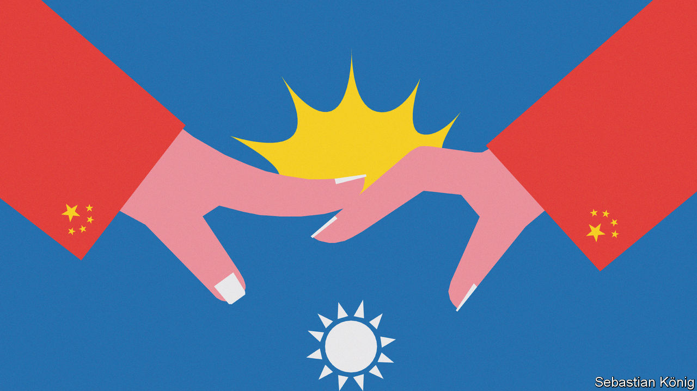

###### Conflicting thoughts

# When it comes to a war with Taiwan, many Chinese urge caution 

##### Even some ardent nationalists 

 

> Jun 19th 2023 

IT TAKES LITTLE to spark fury among nationalist netizens in China, especially when the topic is Taiwan. Any action that could be viewed as a challenge to China’s claim to the island arouses a chorus of calls for war. Their voices alarm Western officials, who fret that Chinese policymakers may make concessions to their public’s swelling nationalism and the bellicosity it has spawned. Last year China’s leader, Xi Jinping, hinted that the West may be right to worry. He warned President Joe Biden that, concerning Taiwan, the views of Chinese citizens “cannot be defied”. 

During a recent trip to Beijing, Antony Blinken, the first American secretary of state to visit China in five years, met Mr Xi, who made conciliatory comments about “stabilising China-US relations”. But for the rest of Mr Blinken’s visit the message was clear. “There is no room for compromise or concessions on Taiwan,” China’s most senior foreign-affairs official, Wang Yi, warned him. Qin Gang, the foreign minister, declared that Taiwan was “the most prominent risk” in bilateral relations.

Many online commentators in China argue that it is no longer worth trying kid-glove tactics with Taiwan. “Separatists”, they say, have become too entrenched there; only war can secure it for China. If Mr Xi agrees, he does not say so openly. At a Communist Party congress last October, he said China would “continue to strive for peaceful reunification with the greatest sincerity and the utmost effort” while reserving “the option of taking all measures necessary”. Despite his stated respect for public opinion, he does not want his hands to be tied by it. 

For now, Mr Xi may well prefer caution. War with Taiwan, after all, could mean taking on a nuclear-armed superpower, too. He may also wonder how much his own public would support it. The internet offers a crude guide. Lacking helpful clues that might be provided by a free press and open political debate, Chinese officials pay much attention to online opinion. They must sense that amid the clamour on social media for military action, some influential netizens oppose the idea. Even among ardent nationalists there are fissures. Some urge caution about going to war, or even argue that fighting may never be necessary: Taiwan will naturally capitulate when it becomes evident that China’s power has eclipsed America’s. 

In a recent paper, Adam Liu of the National University of Singapore and Xiaojun Li of New York University Shanghai argued that support for a near-term war, to the exclusion of all other options, was tiny. Their conclusions were based on a survey they conducted in China between late 2020 and early 2021. Of more than 2,000 respondents, a mere 1% wanted their country to mount a military assault on Taiwan (not just on its outlying islands) before the island’s presidential election in January 2024. The ballot will see a new leader elected to replace Tsai Ing-wen, who is retiring and whose centre-left Democratic Progressive Party angers China by stressing Taiwan’s separate identity. 

Even if China were to decide to go to war by next January, only 55% said that would be acceptable. One-third said it would not be. The authors said their data did not support the idea that demand for the swift mounting of a full-blown attack had grown sharply since Ms Tsai became president in 2016. On the contrary, their survey, taken together with other academics’ findings, suggested that “public support for armed unification has remained relatively stable, despite the rapid deterioration in Beijing’s relations with both Washington and Taipei,” the scholars wrote. 

Their research was conducted before Vladimir Putin launched an all-out invasion of Ukraine in February 2022. Russia’s unexpected setbacks in that war, and the West’s solidarity in response to it, must have been sobering for some supporters of rapid steps towards , the common shorthand in Chinese for reunification by force (online, to confuse censors, they often use the characters for “parasol tree”, which are also pronounced —though censors usually do not mind calls for war as long as the party and its leaders are not being criticised for failing to act). 

Wait, wait

Calls abound for caution about the scale of the task of conquering Taiwan militarily. One such has come from Wu Haipeng, the editor-in-chief of the government’s main portal, China.com. Last month Mr Wu wrote on his blog that China had to resolve various “problems” before it could use military means. His proposals for doing so sounded like distant goals. One problem, said Mr Wu, was America’s arms supplies to Taiwan and its strengthening of its military posture around the island. To counter this, he suggested, China should beef up its air and rocket forces, as well as its navy—implying that China’s military build-up in recent decades has yet to give it the muscle required. He also said China needed to enable its economy to resist sweeping American sanctions that a war would entail. That will not be easy for a country so dependent on global trade. 

In January Hu Xijin, a former editor-in-chief of , a nationalist tabloid, set out three conditions for launching a war. First, China should have at least 1,000 nuclear warheads (the Pentagon believes that it currently has more than 400 and will not achieve Mr Hu’s goal until 2030). Second, it should have more missiles and bombs ready for use than do the combined arsenals of America, Japan and Taiwan. Finally, it should be able to launch a rapid, crippling strike against all of Taiwan’s military facilities. He said this task would require “far more” munitions per day than the most intense periods of bombardment by America during the wars in Iraq and Kosovo in the 1990s and 2000s. Implicit in his message: much more time is needed. 

Like several other prominent nationalists (as opposed to the many who flood social media with short messages like “When are we going to attack? It needs to be quick!”), Mr Wu and Mr Hu do not appear to be braying for war as soon as some in America fear. In a memo in January General Michael Minihan, the head of America’s Air Mobility Command, wrote: “My gut tells me we will fight in 2025.” In 2021 Admiral Philip Davidson, then chief of the US Indo-Pacific Command, said: “I think the threat is manifest during this decade, in fact in the next six years.” 

Some of China’s most radical nationalists (the “parasol-tree faction”, as netizens often call them) have faced fierce criticism online. One of them is Li Yi, a commentator with more than 16,000 followers on Weibo, a Twitter-like service. Last month, in an online video, he said that even if China were to lose 140m people (one-tenth of its population) in a war over Taiwan “it wouldn’t be much at all” and that “with a bit of education” young Chinese would all agree that, for the sake of unification, casualties on such a scale would be fine. 

The backlash against Mr Li has come from within the nationalist camp as well as from more liberal types. “Which stupid people have given him the cloak of ‘patriot’?” said one nationalist blogger with 335,000 followers. Another, with 798,000 followers, asked: “How should we deal with such inhuman, Nazi language?” On June 3rd Huang Jisu—co-author of a book, “Unhappy China”, that became a huge hit among China’s nationalists in 2009—gave an online lecture to a neo-Maoist group (a flag-waving lot). Referring to Mr Li’s remarks without naming him, he described people who held such views as “fascists”. 

Some netizens have even been airing misgivings about going to fight. In April a screenshot of such a post, with its origin unspecified, circulated on Weibo. “If there’s a war, I wouldn’t go and I wouldn’t let my child go,” it said, a few days after China’s armed forces staged threatening exercises around Taiwan in response to a meeting in America between Ms Tsai and the speaker of America’s House of Representatives, Kevin McCarthy. “I live at the bottom rung of society. No one pays attention to us in peacetime. They only think of us at a time of difficulty,” the message said. Nationalists responded with outrage. “This kind of person will always be at the bottom, their thinking is at the bottom…” wrote one to his nearly 4.2m followers. But among hundreds who responded to his invective, some took issue. “I won’t go. Let the children of leading cadres go first, they have good red genes,” said one. Officials may be weighing up such words. ■


