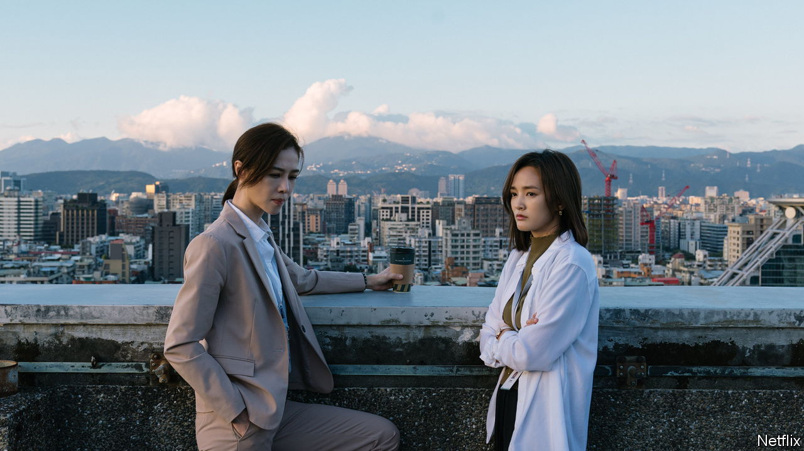

###### #MeToo in Taiwan

# A TV drama about Taiwanese politics has sparked a social reckoning 

##### The response to “Wave Makers” is a case of life imitating art imitating life 

 

> Jun 22nd 2023 

The clock is ticking down to presidential elections in Taiwan. Functionaries in the two main parties frantically smear the rival candidate and scramble to shape the image of their own, hiring influencers, coining catchy slogans and framing touching moments with voters on the street. But there is one key difference between the universe of “Wave Makers”, a hit political drama that came out on Netflix in April, and Taiwanese reality: in the series, the , usually the fulcrum of the island’s politics, does not exist.

This conceit means that the focus is on domestic issues rather than grand matters of national identity or the . Drawing on deep research and interviews, the show zooms in on the sacrifices women are asked to make for supposedly important causes. It tells a hopeful story of one character standing up for another—and, in a feedback loop between life and art, it has inspired real women in Taiwan to stand up for themselves.

The fictional election is a vehicle to examine thorny questions of  and morality. How much should people be willing to give up for the sake of a wider goal? Where is the line between pragmatic compromise and hypocrisy? All the characters wrestle with clashes between their political mission and personal ideals. The liberal presidential nominee is against the death penalty, but dare not say so in public. A young campaigner is castigated as a sell-out by his friends for missing protests because he was busy making party-propaganda videos. His well-worn riposte is that power, not protests, brings about change.

The compromises that have most stirred Taiwanese viewers are those demanded of the two main characters. Played subtly by Hsieh Ying-xuan (pictured left), Weng Wen-fang is the lesbian daughter of an influential elder in the liberal party. She loses a local election after a public spat with one of her father’s conservative friends, who insults her girlfriend. Weng’s mother urges her to apologise. In politics, she says, you think of the “big picture” and compromise. Weng refuses. The “greater good”, she realises, is often just an excuse to cover up wrongdoing. 

When she discovers that a young member of the campaign team, Chang Ya-ching (Gingle Wang, pictured right), is being asked to “let things go” for the sake of the party’s image, she insists that they fight back. Chang has fled from an affair with her former boss, a slick politician now running for vice-president with the right-wing party. He has a USB stick full of naked photos, which he uses to harass and control Chang and others. After Chang is molested by another man in her new job, Weng urges her to report it. But holding the assailant to account is tough: their party is nominally progressive, but its internal structures are stiff and patriarchal. Its female candidate for president asks them to hush things up.

Much of the plot was drawn from life. The two screenwriters of “Wave Makers”, Chien Li-ying and Peng Wei-chaoa former campaigner who goes by the pen name Cynical Chick, spent two years interviewing political operatives. At first, says Ms Chien, they simply thought that Taiwan’s election culture would be colourful material for a television series. Sexual harassment did not feature in their plans. But as they developed the characters, they realised that almost every woman they spoke with, in politics and other professions, had experienced it. Hardly any had reported it. 

That mirrors wider evidence about  in Taiwan. On the face of it, they are more equal than elsewhere in East Asia. A higher proportion of women sit in Taiwan’s parliament than in others in the region, for example. But ossified norms and taboos have hindered reporting of harassment, says Chi Hui-jung, an activist who serves in the government’s supervisory body: “Girls are taught to be very polite. You can’t be bad-tempered. You can’t complain.” As a result, Taiwanese women who are abused convince themselves “that it’s no big deal”. A survey in 2021 found that 82% of women sexually harassed in the workplace did not make formal complaints. Nearly half of those who kept quiet had “brushed it off as a joke”. 

Taken at the flood

“Wave Makers” has helped shatter the . On May 31st a woman who once worked for Taiwan’s ruling Democratic and Progressive Party declared: “I’m going to be my own Weng Wen-fang.” In a Facebook post she recounted being sexually harassed at work and how she was encouraged not to report it.

A cascade of #MeToo testimonies followed. Within a fortnight scores of allegations of sexual harassment were made against members of all the island’s main political parties. The wave of accusations took in prominent academics, doctors, musicians, writers, artists, diplomats and exiled Chinese dissidents. 

On June 2nd Ms Chien disclosed her own #MeToo experience. As a student, she said, she idolised a Chinese poet. She was flattered when, on a visit to Taiwan, he asked to meet her. Then, she alleges, he sexually assaulted her (he denies it). Ms Chien said nothing about the episode for years, even while writing “Wave Makers”. The man was famous; she felt she was a nobody. But the surge of denunciations in the show’s wake—and the overwhelming support for accusers in Taiwanese society—encouraged her to tell her story, too.

In the past, Ms Chien says, it was especially hard for women to speak up if an offence occurred in an organisation meant to serve a noble cause, whether that was artistic, political or the security of a place that sees itself as the idealised foil of a big bully: “They always make you think about the greater interest and swallow it.” Today Taiwan is entering a  and faces a military threat from China. But high stakes don’t justify silencing victims, Ms Chien insists—and Taiwanese women are no longer willing to be treated like hostesses. “We are educated intellectuals, not the armrests for your sofa. Please remove your hand from my thigh.” 

Witty and propulsive, “Wave Makers” was the most-viewed show on Netflix Taiwan within two days of its release; it stayed in the top ten for five weeks. And it has sparked a social reckoning. Tsai Ing-wen, Taiwan’s president, has apologised for failing to prevent sexual harassment in her party and across society. The cabinet has promised to review the legal framework for such cases and to propose amendments in parliament this summer. The writers are not surprised by the torrent of allegations, but didn’t expect their show to unleash it. “Everyone must have been holding it in,” says Ms Chien, “until they couldn’t.” ■


