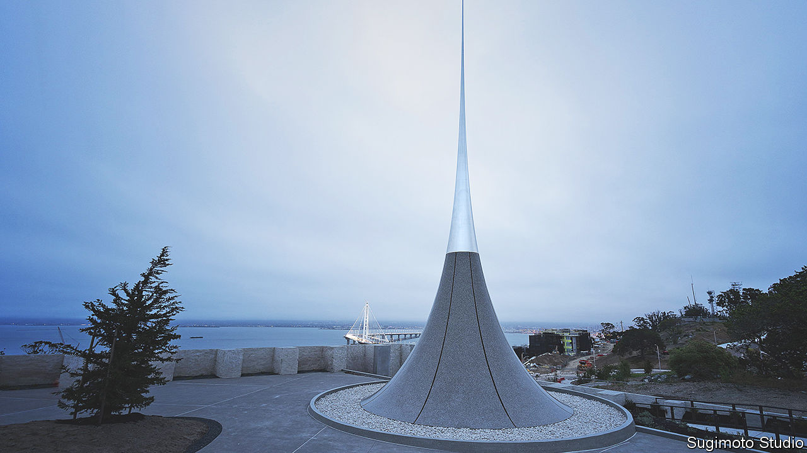

###### Art and regeneration

# A sculpture in San Francisco Bay points towards the future 

##### Hiroshi Sugimoto’s island installation is part of a bid to attract cultural tourists 

 

> Jun 22nd 2023 

Viewed up close atop an island in San Francisco Bay, the city’s newest public artwork rises like a tapering needle of polished steel. From a different angle, it blazes like a beacon at sunrise and sunset. From the vantage of a departing visitor turning to look back, Hiroshi Sugimoto’s “Point of Infinity” seems to be matte blue and nearly disappears, leaving a faint outline like a doorway cut into the sky.

Continuously shifting but always sublime, the monumental sculpture is a fitting first commission for San Francisco’s ambitious scheme to turn two Bay islands into a new offshore neighbourhood and art destination. Rising 69 feet (21 metres), the piece is a meditation on eternity and human imagination in a place that has seen its share of innovation and near-death experiences. Perspective is everything, it suggests. A and others have reported, San Francisco may have entered an economic “doom loop”. The spire is a sliver of hope for a rebirth.

The rocky outcrop called Yerba Buena Island sprouted the adjacent man-made expanse named Treasure Island in the 1930s as a Depression-era project to host America’s world’s fair. The Golden Gate International Exhibition opened on it in 1939, the pavilions stocked with art, including a huge mural begun on the spot by . The aim was to showcase America’s modernity and urban progress. Decades later the city’s goal is the same: to reinvent the urban experience for the 21st century, as a walkable community of 8,000 homes surrounded by water and parks and world-class works of art.

Taking inspiration from two famous arty islands, Governors Island in New York and  in Japan, the city’s arts commission seized on the rare opportunity to build “a magnet for cultural tourism” from scratch on the site, which was occupied by the Us Navy after the fair. The private development has a budget of some $5bn to build homes, shops, hotels and a ferry landing. The investors are subsidising the dwellings designated as “affordable” (around a quarter of the total), along with nearly 300 acres of parks and a budget of $50m for public art.

Mr Sugimoto’s sculpture was chosen unanimously by the commission from 495 contenders, says Jill Manton, director of the city’s Public Art Trust. The Japanese artist, who lives and works in Tokyo and New York, was initially approached to make a piece for San Francisco’s airport, but the hilltop location seized his imagination. The spectacular spot with panoramic views called for a special installation, one representing what Mr Sugimoto calls “humanity’s yearning for the infinite”. His sculpture is based on the mathematical formula for , and is made up of two converging curved lines, rendered in high-grade mirrored steel, which get closer and closer but never meet. The piece tapers to a vanishing point only 21 millimetres wide.

It is meant to be “symbolic of humankind’s pursuit of knowledge and innovation”, Mr Sugimoto said at its unveiling earlier this month. It is also a meditation on time, one of his enduring interests as a photographer and architect. Acting as a huge , it will throw a shadow on a precise point at noon on the autumn and spring equinoxes, registering the movement of the Earth. When it is formally opened later this year, visitors will wend their way up an elegant approach to a park designed by Walter Hood, an acclaimed landscape architect.

For V. Fei Tsen, president of the city development agency that is overseeing the project, the piece “sets the tone for what this island can be for art”. Not just international stars but local artists and community schemes will be represented. In its time Naoshima, too, was a disused military base that was revived through culture, Ms Tsen points out. Neither a recent spate of lawsuits between the investors nor San Francisco’s wider woes have dismayed her. “Economic cycles always come into play,” she says phlegmatically. Like many in a place built on the booms and busts of gold rushes, her credo is: “I have faith.” ■


