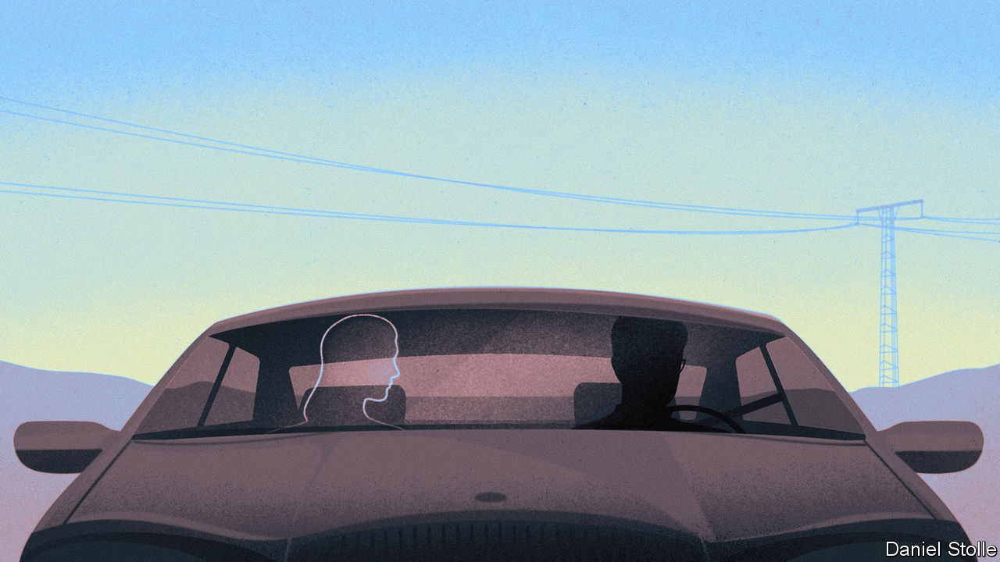

###### Kooky American fiction

# Lorrie Moore’s protagonist goes on a road trip with a dead girlfriend 

##### “I Am Homeless If This Is Not My Home” is a weird and wonderful novel 

 

> Jun 22nd 2023 

By Lorrie Moore. 

Finn is a schoolteacher who traffics in conspiracy theories. “The real story is never the official one,” he insists. He believes that PowerPoint augurs the end of civilisation, and he tests his own sanity by replying to newspaper editorials and waiting to see if his screeds are published: “In this manner he could tell, roughly, how deranged he was that day.” Finn is still hung up on his “richly bleak” former girlfriend, so he is glad to find himself on an unexpected road trip in her company. The only hitch is that his ex happens to be dead.

“Everyone at some point in their lives should have a long great love affair with a magnificent lunatic,” Finn declares in “I Am Homeless If This Is Not My Home”, Lorrie Moore’s weird and beautifully idiosyncratic new novel, her first since 2009. (She is better known for her , which have won numerous awards.) Running to only around 200 pages, this deceptively slim volume packs a wallop. It’s not just that the book ponders weighty themes, such as love, death, suicide and the meaning of life. It’s also that Ms Moore writes in a way that demands constant attention, imbuing each of her sentences with an almost antic ingenuity.

The American author’s —evident in abundance here—is for using humour and beguilingly odd details to yield grand truths about what it means to be human. Her characters are decidedly off-kilter, but feel more real than twee. Lily, Finn’s ex-girlfriend, is a suicidal depressive who works as a “laugh therapist”, dressing up as a clown to shake people, mostly children, out of their gloom. (She “even wore floppy shoes, the laces of which she had once used to strangle herself”.) While Finn is in New York to spend time with his dying brother—whose eyeballs “were turning the golden earwax brown of bruised fruit”—he is summoned home to Illinois to deal with a crisis concerning Lily, who may have at last succeeded in doing away with herself. 

Does Finn actually spot Lily wandering around in her filthy shrouds and clown shoes in the cemetery where she had been buried, pulling stink bugs from her sleeve and smelling vaguely of rot? “I suppose I’m death-adjacent,” she explains to him. Do they in fact take a long drive together to what will be her final resting place, discussing their fraught love and many trials? Stretches of the book have a hallucinogenic quality, disorienting and unreal. Finn, whose hold on reality was already tenuous, may simply be undone by his grief.

It is not entirely clear what relationship Finn’s story has with a series of interspersed letters from the mistress of a 19th-century boarding-house, except that these missives are written to a beloved sister who also happens to be dead. Perhaps life is always haunted by past loves, past wounds, old memories barely remembered, and perhaps these are all essential parts of it. As Finn observes: “No longer caring about a thing was key to both living and dying. So was caring about a thing.”■


