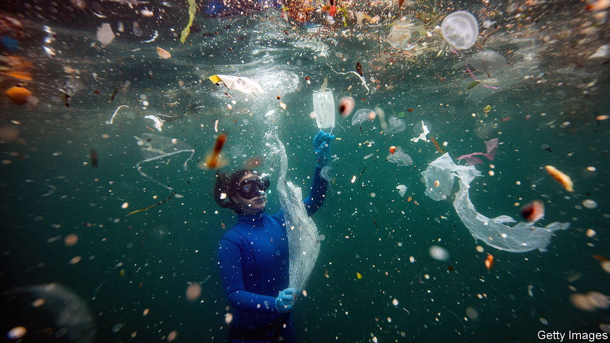

###### Heaps of trouble

# The world’s waste problem is growing fast 

##### Oliver Franklin-Wallis sketches its dimensions in “Wasteland” 

 

> Jun 21st 2023 

By Oliver Franklin-Wallis.

In “Our Mutual Friend”, Charles Dickens’s last complete novel, stray paper “hangs on every bush, flutters in every tree, is caught flying by the electric wires, haunts every enclosure”. Since those words were published in the 1860s, the  has changed in both scale and composition. These days  in one form or another is strewn on verges, clogs rivers and swirls around oceans in vast gyres. Circulated by winds and tides, tiny nanoplastics have penetrated all manner of watery ecosystems, reaching both the Earth’s poles and its highest peaks, with unknown consequences for the planet.

Worried by the pollution caused by a throwaway culture, Oliver Franklin-Wallis—a British journalist who has written for —heads to places that best illustrate this profligacy. In “Wasteland” he visits an Indian landfill that is piled almost as high as the Qutub Minar, a well-known minaret in Delhi; Ghana’s largest second-hand clothes market, through which 15m garments are thought to pass every week; a former mining area in America that is blighted by dumped lead, zinc and cadmium; and a defunct nuclear-power plant in the north-west of England, which contrasts starkly with the natural beauty of the nearby Lake District. He sees  as evidence of human myopia about the Earth’s fragility and the finitude of its resources.

Rubbish, the author notes, is often deposited “on the margins, and on the marginalised”. He explains the concept of “toxic colonialism”, whereby trash is shipped by wealthier countries to poorer ones, and shows its detrimental effects up close. But he also acknowledges that the waste trade can sometimes be beneficial to communities on the receiving end: what one person deems useless, another sees as a potential source of income.

Throughout his tour of disfigured landscapes and industrial , Mr Franklin-Wallis decries the tactic of “planned obsolescence”: ie, the marketing of products that quickly need to be replaced. A notorious early-20th-century example was the “light-bulb cartel”, who conspired to slash the lifespan of their filaments. These days items ranging from “fast fashion” to wireless earbuds are liable to be thrown away or forgotten in a drawer before long.

The book comes alive in its descriptions of people and places. A paper-mill worker in southern England is “bald and aquiline, monkish, with the gentle stoop of an under-watered tulip”. The appearance of a zero-waste zealot in the north of England is “somewhere between affable climate activist and festival drug-dealer”. The colours and buzz of a market day in Accra are sketched in short, lively sentences, as is the dusty decay of an abandoned town in Oklahoma. Happily, Mr Franklin-Wallis writes stylishly about ugly things: cranes at a site for burning garbage “move slowly, Damoclesian, their noise a deep rumble”; the flow of rubbish at a waste plant is “relentless, the choreography balletic”.

“Wasteland” is heavy on facts, many of them interesting and sobering. Twenty thousand plastic bottles are sold around the world every second. The world produced 2bn tonnes of solid waste in 2016, a figure that will rise to 3.3bn tonnes . But the piles of numbers can occasionally be a strain. At such moments, readers may find themselves agreeing that waste is “not the most appealing subject” for a book, as the author himself admits near the beginning of his.

Overall, however, he dispels that impression. “Wasteland” does not offer novel solutions to the problem of waste. Mr Franklin-Wallis wants you to buy less and recycle more, along with a crackdown on “” (whereby companies make exaggerated claims about their environmental credentials). But he succeeds in outlining the size of the challenge. His book should prompt serious discussion in boardrooms and parliaments. ■


