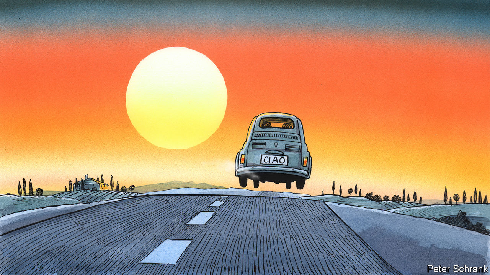

###### Charlemagne

# A farewell to small cars, the industrial icons that put Europe on wheels 

##### Why a continent with ever-smaller families is driving ever-bigger automobiles 

 

> Jun 21st 2023 

Placing a Peugeot 208, Europe’s bestselling car last year, next to a Ford F-150, its American counterpart, is like comparing a Chihuahua to a Great Dane. Both have four wheels and typically serve the same purpose: to ferry a single driver from one place to another. Beyond that they have little in common. The F-150 weighs over two tonnes, twice as much as the lithe Peugeot. The driver in the American pickup truck sits a half-metre higher than the tarmac-scraping Frenchman in his family compact. Forget the flat bed attached to the back of the Ford—its interior alone feels roomier than the entire European car. A Parisian driver ever-confident of his parking skills might well attempt to squeeze his vehicle inside the cab of the American behemoth.

When it comes to motoring, Europeans long felt that size did not matter. The continent was woven together by poky cars powered by engines that would have been shamed by American lawnmowers. Yet what European autos lacked in cylinders they made up for in va va voom. The Fiat 500, Volkswagen Beetle, Austin Mini, Citroën 2CV and even the drab Trabants of East Germany all became pop-culture icons, as core to the idea of what Europe stood for as Nouvelle Vague cinema or riding on a Vespa while smoking a cigarette. Alas these industrial gems are heading to the scrapheap. Since the start of the century cars sold in the EU have gained over 200kg on average—a third of an original Fiat 500. They have grown taller, wider and longer while legally carrying no more passengers. Sport-utility vehicles (SUVs), hunks of automotive manhood tailor-made for the American plains, increasingly rule cityscapes from Helsinki to Athens. 

Europe’s cramped cars were a feature of its history, geography and economics. Whereas America was happy to remodel cities and suburbs to accommodate roomy Chevrolets, Europe stuck with its medieval streets and built its cars to fit (just). Fuel duties were high in Europe (which imports most of its oil), so drivers preferred wimpier engines. Americans drive vast distances for work and leisure; Europeans sometimes settle for buses, bikes and trains instead. Perhaps most important, Europe embraced mass motoring in the lean decades after the second world war. People craved the freedom personal motoring provided, and didn’t mind if their heads stuck out of the sunroof while they were afforded it. Europe even turned its reputation for bijou motors into a marketing asset: in 1959 an ad for the Volkswagen Beetle urged Americans to “Think Small”. (Teenagers there who got their kicks in the back of roomy Cadillacs and station wagons probably had other ideas: not even a couple of eager contortionists could amuse themselves in the back of a European compact.)

For decades the replacements of these pint-sized wheels kept their ethos. No longer. Sales of small cars in the EU have fallen by nearly half since 2011, even as those of SUVs are up threefold. Ford’s little Fiesta, which has charmed Europeans for 47 years, will end production this month. The Volkswagen Golf, a sensible starter car, is also said to be on its last wheels. The popular small-car brands that endure, such as the Fiat 500 or the Mini, now come in bloated versions. The original Mini, launched in 1959, was worthy of the name. The latest iteration of the rebooted model released in 2001 weighs twice as much and is over a quarter longer. Even top-end carmakers have moved away from thinking small: Porsche and Ferrari made their names with zippy two-seaters, but now sell great hulking SUVs as well. 

The trend to distend seems odd at first. European families are getting smaller: Italians had to squeeze an average of 2.3 sprogs in the back of the Fiat 500 when it came out in 1957. Now there are just 1.3 to accommodate. (Fiat, like Peugeot and other brands, is now part of Stellantis, whose largest shareholder owns a stake in ’s parent company.) The streets of Florence or Cologne are getting no wider. Europe has ambitions to cut carbon emissions. Yet bigger cars, by and large, pollute more.

In fact, reducing carbon is one reason why small cars are ailing. New technology to make petrol models comply with green rules is expensive whatever the car size: manufacturers find it easier to pass on the costs to buyers of pricey big models than cheaper small ones. Buying an electric vehicle (Europe recently banned sales of petrol and diesel cars after 2035) often means plumping for a midsize ride, given how few good small European electric cars are on the market. Regulation has also crimped the appeal of poky motors. Children used to be bundled wherever they would fit. These days booster-seats are compulsory, but try latching down a toddler in the back row of a two-door car. Couples that used to have a main motor and a runaround have sometimes replaced the smaller one with an electric bike to zip around cities, as many mayors look to throttle car-driving. The vehicles remaining on the road are thus larger—despite attempts by policymakers to slow the march of size with taxes on heavier models.

Ciao, Cinquecento

Ultimately, fatter cars in Europe are a consequence of fatter wallets. “People buy as much car as they can afford,” says Pedro Pacheco of Gartner, a research firm. “As long as it is within their budget, bigger is always better.” The arc of automotive progress is long, but bends towards duller, bigger wheels. 

Europe should look in the rear-view mirror and realise that it is losing a slice of its heritage, the very thing that made the continent what it is. Some of this is nostalgia, a remembrance of motoring past. Charlemagne grew up squabbling with his brother in the back of the family Mini as it navigated the streets of Paris. Later, a comically underpowered Peugeot 106 struggled to drag him and his new bride up hills in Portugal on their honeymoon. For all their flaws, those cars had a certain . These days such journeys would take place aboard cookie-cutter SUVs: roomy, plush—and destined to be forgotten. ■


