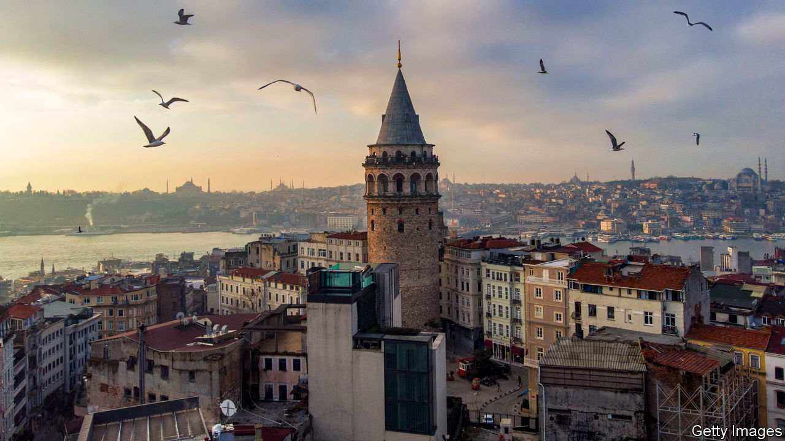

###### Through the roof

# Turkish property prices are soaring 

##### A crazy interest-rate policy is mostly to blame 

 

> Jun 22nd 2023 

RENTS and property prices in Istanbul were never low to begin with. In 2015 a Qatari businessman, thought to be acting as a middleman for the country’s emir, Tamim bin Hamad Al Thani, spent over $100m for a villa on the banks of the Bosphorus, the strait that divides Turkey’s biggest city between Asia and Europe. Earlier this year, another mansion, formerly the home of a sex-cult leader recently sentenced to nearly 900 years in prison for a range of crimes, sold for $26m.

These days, however, even ordinary Istanbul properties are beyond the reach of most Turks. In the two years to May, the price of a square metre of real estate in the city has shot up by over 480%, according to Endeksa, a consultancy. Even after adjusting for inflation, which peaked at 86% year-on-year last autumn before slowing to a mere 40% in May, housing prices in Turkey as a whole increased by 51% last year, more than in any other major economy, according to a study by the Bank for International Settlements. Israel came a distant second, at 11%. Rents have spiked similarly. According to a senior municipal official, average rents in Istanbul, which is home to more than 16m people, have now surpassed average incomes. 

The leading causes are reckless interest-rate cuts, imposed as a result of the misguided policies of Turkey’s president, Recep Tayyip Erdogan, and a resulting surge in inflation. The combination of these developments has encouraged those Turks with access to sufficient credit to protect their wealth by investing in property. Foreign buyers, especially Russians, have also helped drive up prices in Istanbul and along the Mediterranean riviera. 

The earthquakes that destroyed large swathes of Turkey’s south earlier this year, killing over 50,000 people, have had an impact as well. Many of the estimated 3m people who have been displaced by the disaster have moved to other parts of the country, causing an almost overnight spike in demand. Fears of a similarly destructive earthquake in Istanbul, which sits just north of a major faultline, have caused prices of newer and safer buildings in the city to soar. The biggest price increases, according to a recent study by Bahcesehir University’s Centre for Economic and Social Research, have been in neighbourhoods far away from the faultline. 

One might be forgiven for thinking that this has the makings of a bubble waiting to burst. But even a policy U-turn, which kicked off on June 22nd, when Turkey’s central bank increased the benchmark interest rate by 6.5 percentage points, might not be enough to bring the property market down to earth. Analysts expect prices to keep growing, though at a less meteoric pace than before, so long as expectations of inflation remain high.

They do. The new rate hike, considered too low to make much of a difference, failed to relieve pressure on the lira: it plummeted by 3% against the dollar within an hour of the decision. The currency has now lost 18% since Mr Erdogan’s re-election on May 28th. This—as well as a recent 34% increase to the minimum wage, on top of a 55% increase six months ago—is bound to keep inflation bubbling. ■

