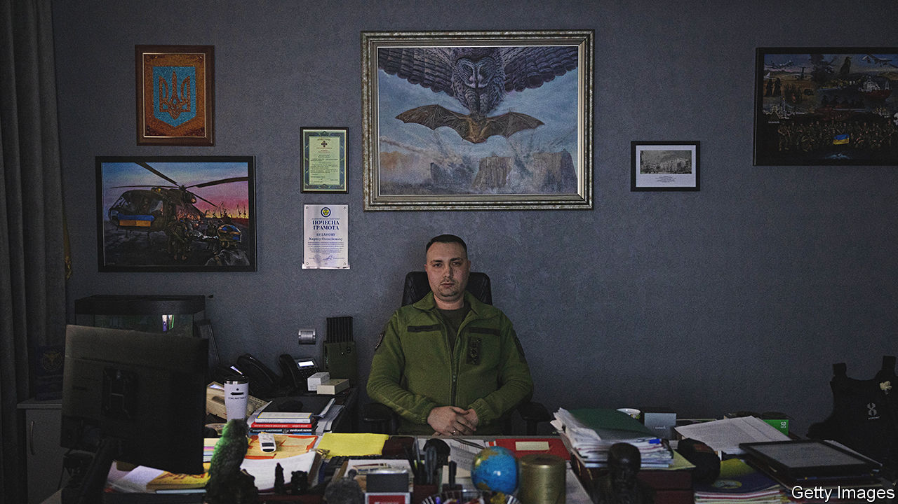

###### An unspooked spook

# Ukraine’s spymaster has got under the Kremlin’s skin 

##### Kyrylo Budanov is much hunted, but is not prone to hiding 

 

> Jun 20th 2023 


IT TAKES A certain amount of fear to paralyse seasoned military-intelligence officers. But a Russian attack on the officers’ Rybalsky island headquarters in Kyiv in March 2022 crossed that threshold. The officers recall “terror” as missiles landed, windows popped and ramshackle buildings crumbled at the edges. The men, waiting in a reception area for a meeting with their boss, fell to the floor. Moments later a door beside them opened, and Major-General Kyrylo Budanov stepped out. “Everything is fine,” one recalls him grunting, before he ordered them to get back to work. “He dusted himself off, put his cap on and went outside to inspect the damage.” 

The 37-year-old General Budanov, a former commando, is Ukraine’s youngest-ever spymaster. As the architect of increasingly brazen operations within Russia, he is also a big irritant for the Kremlin. Aides say there have been “at least ten” attempts on his life. In the latest, on May 29th, missiles and drones targeted his Rybalsky office. They narrowly missed that and an adjacent road bridge, although drones scraped another building. A day later Russia’s president, Vladimir Putin, bragged about a “precision” attack destroying the complex. Pro-Kremlin media reported that General Budanov had been evacuated to Germany and put into a coma.  can confirm that neither claim is true.

The spymaster’s office, his undisguised address for 16 months, exudes chaotic, crepuscular energy. Sandbags block windows. Machine-guns and armour litter the floor. A turntable sits in the corner, though the audible Vivaldi comes from a YouTube playlist. The sense of absurdity is heightened by an elderly frog, swimming about a tank, and a canary. Memorabilia from General Budanov’s war line the wall. In an adjacent corridor hangs a photo of a March cross-border raid into Bryansk in Russia, supposedly the work of independent Russian partisans. A large screen, the room’s only source of light, displays a map of Moscow—the target of a drone strike in May. 

 


Ukraine has not claimed either operation. But General Budanov barely respects the official ambiguity. “We are at war,” he says. “Drones over the Kremlin showed the world that Russian defences are just a Potemkin village.”

Aides huddle close when the general speaks. Under his leadership, Ukraine’s main directorate of intelligence—HUR—has become a plucky, autonomous authority that punches above its weight. It resembles a gang. “Before we had managers, now we have a leader,” says one veteran officer. Oleg, an operative who has known General Budanov for decades, speaks approvingly of his ability to infect others with his fervour, comparing him to a snake “hypnotising you before he comes in for the kill. Restrained, measured, never panicked. You do anything he asks.” 

General Budanov has his adversaries at home as well as abroad. Competing security agencies fret about his power and resources. “It’s logical that military intelligence becomes powerful during war,” says one rival officer. “But you can’t get much done without his sign-off now.” Even friends describe the military-intelligence chief as “difficult”. Some find it hard to get on with him, says Brigadier-General Dmytro Timkov, a partner on “dozens” of operations. “He doesn’t adapt to others’ opinions.” The younger Budanov would answer back to commanders if he thought them wrong. Yet supporters say he has a “generous” side, too. A master of mind games in the outside world, says Oleg, General Budanov never extended that to colleagues. “He understands you can’t trick tricksters.”

 


Volodymyr Zelensky’s decision in 2020 to promote a little-known commander came as a surprise to many. But inside the services Kyrylo Budanov’s name was already legendary. The Kremlin knew something about him, too. “It was the equivalent of holding a red flag to them,” says Andrii Yusov, an HUR officer. “It’s what convinced many of us of [President] Zelensky’s national-security credentials.” 

The new spymaster was revered for leading a daring raid, in 2016, to destroy helicopters at Dzhankoi air base in Russian-occupied Crimea. The geography of the operation—in the backyard of Russia’s security services—was brazen enough. On the way out General Budanov’s team also engaged Russian special forces, killing several, including a high-ranking commander. The Russians later avenged that raid with attacks of their own, missing General Budanov but killing his superior. 

General Timkov, reputed to be the second-in-command on that raid, chortles through an unconvincing denial of the operation. But he offers another story that only adds to the legend. In early 2015, he says, the two were deep inside enemy lines in Donbas, in eastern Ukraine, when the then Lieutenant-Colonel Budanov was hit by an anti-infantry mine. Shrapnel sunk into his neck and shoulder-blade, and just below his heart. “Kyrylo asked us to leave him.” The group refused, and through force of willpower the wounded officer stumbled to safety more than 3km away. “He didn’t say anything the whole way. That’s how much it hurt.”

General Budanov made his real mark after the 2022 invasion. In the early days, as saboteurs operated in Kyiv, the general was seen running about Rybalsky with a machine-gun. He masterminded critical operations at Hostomel airport,  and Moschun, on the edge of Kyiv, which stopped the Russian advance—if only just. He sent supply-and-rescue helicopters into the cauldron of besieged . He took part in many front-line operations himself. The risk-taking worried some colleagues, who felt their leader should be better protected—“but you try stopping him.” The general says he does it only because other people are in danger. “Lives are at stake. There is no room for mistakes.” 

Western partners describe the Ukrainian spymaster as a straightforward and incorruptible player. He is now privy to more American and British intelligence than the Germans or French, says Philip Ingram, a former British military-intelligence colonel. Yet his bravado is not universally welcomed. Leaked documents show that the CIA had to intervene to stop General Budanov from ordering an attack on Moscow on the anniversary of the invasion in February. Sabotage and the raids inside Russia since have heightened worries among Ukraine’s allies about provoking a nuclear power. General Budanov’s statements about engineering a collapse of Russia do the same. 

Yet he says that nine years of studying Russian aggression leave him uniquely positioned to assess the risks of nuclear escalation. “As the head of intelligence, I’m telling you straight out—it’s not going to happen,” he says. “For all my dislike of the Russian Federation, there are not many idiots running the country.” He insists that peace is impossible without the strategic defeat of Russia—and the “reformatting of power” there. “Either everyone will get out of the war at the same time, or one side will lose and the other side will win. There are no other options.” 

As a confidant of the president—those in government call them kindred spirits—General Budanov is understood to be playing an ever-bigger role in behind-the-scenes peace negotiations. Sources say he is a conduit to secret talks with the Chinese, and he has also been in contact with , the leader of Russia’s mercenary Wagner outfit.

In conversation it is clear that General Budanov has been thinking hard about post-war Ukraine. Last winter there was talk of him becoming defence minister. He insists his only ambition is victory. Yet secret polls conducted by Mr Zelensky’s office show they are thinking about using the cult of their hero spymaster to counterbalance a perceived rivalry emanating from , Ukraine’s likeable and independent commander-in-chief. General Budanov’s colleagues say they are convinced he is destined for a big political role once peace comes—if he lives that long. ■

