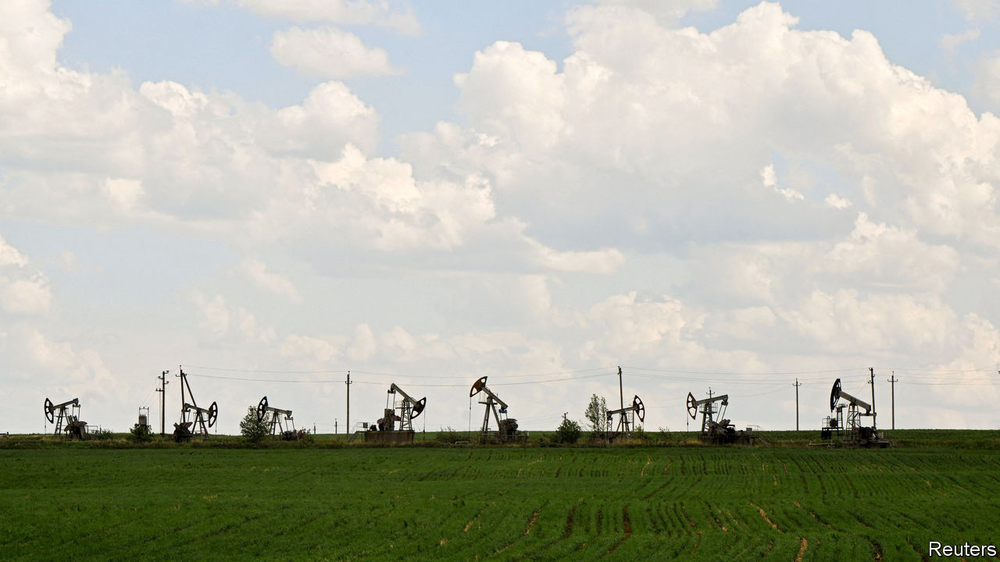
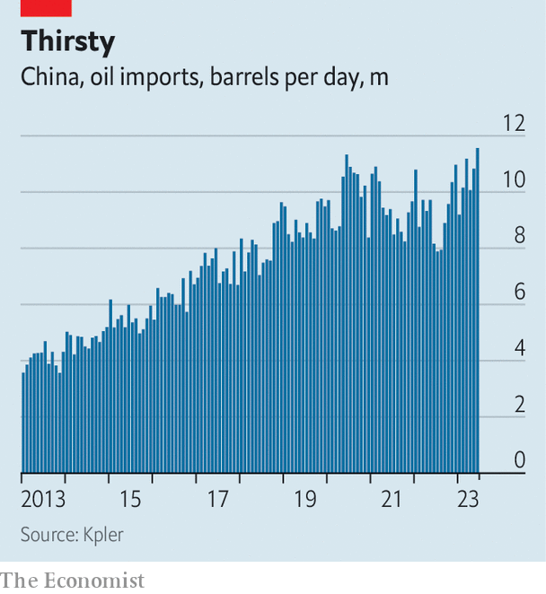

###### Failing to ignite

# Against expectations, oil and gas remain cheap 

##### OPEC has had little luck pushing up crude prices 

 

> Jun 19th 2023 

In the months after Russia’s invasion of Ukraine any hint of bad news sent energy prices into the stratosphere. When a fire forced an American gas plant to close, strikes clogged French oil terminals, Russia demanded Europe pay for fuel in roubles or the weather looked grimmer than usual, markets went wild. Since January, however, things have been different. Brent crude, the global oil benchmark, has hovered around $75 a barrel, compared with $120 a year ago; in Europe, gas prices, at €35 ($38) per megawatt-hour (mwh), are 88% below their peak in August. 

 


It is not that the news has suddenly become more amenable. The Organisation of the Petroleum Exporting Countries (opec) and its allies have announced swingeing cuts to output. In America the number of oil and gas rigs has fallen for seven weeks in a row, as producers respond to the meagre rewards on offer. Several of Norway’s gas facilities—now vital to Europe—are in prolonged maintenance. The Netherlands is closing the largest gas field in Europe. Yet any uptick in price quickly fades away. What is keeping things steady?

Disappointing demand may be part of the answer. In recent months expectations for global economic growth have fallen. The failure of several banks this spring raised fears of recession in America. Inflation is hitting consumers in Europe. In both places, the full impact of interest-rate rises is still to be felt. Meanwhile, in China, the  is proving weaker than expected. Anaemic growth, in turn, is dampening demand for fuel. 

Yet look closer and the demand story is partial at best. Despite its disappointing recovery, China consumed 16m barrels per day (b/d) of crude in April, a record. A rebound in trucking, tourism and travel since the grim zero-covid period means that more diesel, petrol and jet fuel is being used. In America, a 30% drop in petrol prices compared with a year ago augurs well for the summer driving season. In Asia and Europe, high temperatures are expected to last, creating more demand for gas-fired power generation for cooling. 

 


A more convincing explanation can be found on the supply side of the equation. The past two years of high prices have incentivised production outside of opec, which is now coming online. Oil is gushing from the Atlantic basin, through a combination of conventional wells (in Brazil and Guyana) and shale and tar-sands production (in America, Argentina and Canada). Norway is pumping more, too. JPMorgan Chase, a bank, estimates that non-opec output will rise by 2.2m b/d in 2023. 

In theory, this should be balanced by production cuts announced in April by core opec members (of 1.2m b/d) and Russia (of 500,000 b/d), to which Saudi Arabia added another 1m b/d this month. Yet output in these countries has not fallen by as much as promised—and other opec countries are increasing exports. Venezuela’s are up, thanks to investment by Chevron, an American giant. Iran’s are at their highest since 2018, when America imposed fresh sanctions. Indeed, a fifth of the world’s oil now comes from countries under Western embargoes, selling at a discount and thus helping dampen prices.

For gas, the supply situation is trickier: the main Russian pipeline delivering to Europe remains shut. But Freeport lng, a facility which handles a fifth of America’s exports of liquefied natural gas, and was harmed by an explosion last year, is back online. Russia’s other exports to continental Europe continue. Norwegian flows will fully resume in mid-July. Most important, Europe’s existing stocks are vast. The bloc’s storage facilities are 73% full, compared with 53% a year ago, and on track to reach their 90% target before December. Rich Asian countries, such as Japan and South Korea, also have plenty of gas. 

When inflation was soaring and interest rates remained modest, commodities, notably crude oil, were an attractive hedge against rising prices, pushing up prices as investors flooded in. Now that speculators expect inflation to drop, the appeal has dimmed—just as higher rates make safer assets like cash and bonds more alluring. As a result, speculative net positioning (the balance between long and short bets placed by punters on oil futures markets) has slumped. Higher rates also raise the opportunity cost of holding crude stocks, so physical traders are offloading their stock. The volume in floating storage fell from 80m barrels in January to 65m barrels in April, its lowest since early 2020.

Prices could well rise later in the year. The International Energy Agency, an official forecaster, projects that global oil demand will reach a record 102.3m b/d over 2023. Oil supply, too, will hit a record, but the forecaster reckons the market will tip into deficit in the second half of 2023—a view shared by many banks. As winter approaches, competition for lng cargoes between Asia and Europe will intensify. Freight rates for the winter are already rising in anticipation. 

Still, last year’s nightmare is unlikely to be repeated. Many analysts expect Brent crude to stay close to $80 a barrel and not to reach triple digits. Gas futures markets in Asia and Europe point to a 30% rise from today’s levels by the autumn, rather than anything more extreme. Over the past 12 months commodity markets have adapted. It now takes more than a hint of bad news to send prices rocketing. ■


