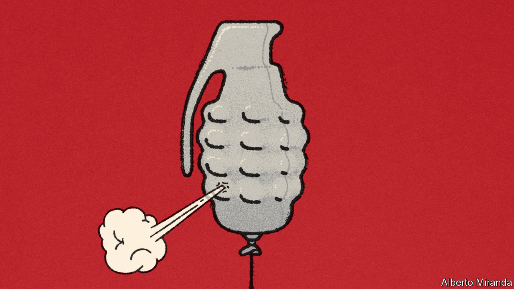

###### Free exchange

# Can the West build up its armed forces on the cheap? 

##### How “Lockheed’s law” keeps defence costs down 

 

> Jun 22nd 2023 

Around the world a boom in defence spending is under way. Roused from their complacency by Russia’s invasion of Ukraine and China’s designs on Taiwan, the 24 of 31 nato members that do not meet the club’s 2%-of-gdp defence-budget target have promised to make good. China’s own military spending grew by 4.2% in real terms last year. Globally, new defence commitments and forecast spending add up to over $200bn, a figure that could rise as high as $700bn under plausible assumptions.

This represents an abrupt reversal of a decades-long decline. During the second world war the Allies devoted half of their gdp to fighting. In the 1960s, at the height of the cold war, governments typically spent 6% of gdp on defence. But after the Soviet Union collapsed, the world reaped a “peace dividend” from shrinking defence spending. Last year global defence spending was $2.2trn, or just above 2% of gdp—close to an all-time low. 

As spending starts to rise, there is a puzzle. Why is the coming bill not bigger still? Even if politicians honour recent pledges, the world will spend less on defence, relative to gdp, than in 1990. 

Part of the answer lies in the fact that defence spending escapes a problem plaguing many governments: that of cost disease. This issue was first outlined by William Baumol, an economist, in the 1960s. The malady applies in labour-intensive industries, such as health care and education, in which productivity grows only slowly because automation is difficult. As innovation boosts output and wages in, say, manufacturing, it becomes necessary to pay nurses and teachers more, to stop them quitting and heading for the nearest factory. As a result, industries suffering from cost disease must, over time, spend more in real terms in order merely to stand still. Baumol presciently worried about health-care spending swallowing up an ever-larger share of gdp.

Armed forces benefit from the reverse phenomenon. Call this “Lockheed’s law”, after the giant American defence contractor. Cost disease bites in places where, in Baumol’s words, “the human touch is crucial”. Yet in America only one-third of total defence spending goes on paying salaries. Indeed, every country that is falling short of nato’s 2% target is closer to America’s spending on armed-forces personnel, as a share of gdp, than it is to Uncle Sam’s other armed-forces spending. This suggests that arming nato will be more about buying additional and superior equipment rather than going on a hiring spree.

Although Russia and Ukraine have deployed enormous conscripted armies, Western countries that are rearming remain mostly committed to the idea that quality beats quantity. Better, the logic goes, to have a smaller army equipped with state-of-the-art artillery, tanks, planes and equipment than a bigger one with rusty kit. To the extent it seeks to compete in manpower with its adversaries, the West tries to do so through big alliances such as nato (ie, by spreading labour costs among countries, rather than turning a greater proportion of workers into soldiers). 

There is also plenty of scope for the automation of defence: machine learning is already replacing human satellite-imagery analysts, for instance. Those companies, like Lockheed, which make military gear have no productivity problem—quite the opposite. America’s statisticians produce price indices for kit, covering everything from missiles to ships. The calculations behind these indices are fiendishly complicated. They can answer the sort of question that a ten-year-old boy might ask. How much does it cost to blow up an enemy’s position? How much does it cost to travel at 1,000 miles an hour in a military jet? The data produced show that armed-forces capabilities have been getting relatively cheaper: quality-adjusted missile prices have fallen by about 30% since the 1970s. In cash terms, America spends about the same on military aircraft as it did in the mid-1980s. Even though the purchasing power of the dollar in the wider economy has fallen over that period, it will buy about the same amount of airpower. 

The result is that shrinking budgets can still buy awesome armies. Economic growth makes the effect even starker. As soldiers posted in the South China Sea are well aware, China has vastly more military might than it did three decades ago. Yet in 2021 it spent 1.7% of its gdp on defence, down from 2.5% in 1990.

Under the gun

Lockheed’s law is not without limitations. Periods of sudden defence spending tend to cause shortages, which send prices soaring. Having armed Ukraine, nato now needs to replenish its stocks of weapons, but defence supply-lines are stretched. More profoundly, health and education spending make peoples’ lives better. Defence spending is usually about forestalling threats and repelling adversaries. To the extent that military outgoings must rise simply because the world has become more dangerous, they are an unwelcome extra cost. The peace dividend was no myth.

Ultimately what matters in war is not the absolute level of a country’s defence capabilities, but its strength relative to that of enemies. If everyone is upgrading capabilities, then the result will be an arms race in which, for every innovation, there must be a countervailing rise in spending. The technological change that has enabled Russia to launch Iranian drones stuffed with explosives at civilians has raised the cost of defending Ukraine, for example. In a zero-sum battle, only technologies that the West alone has access to can really be thought of as helping to contain costs. A hot war between great powers would still send defence spending soaring to agonisingly high levels. 

Nevertheless, it will reassure Western politicians—many of whom are struggling to meet the needs of ageing populations, accelerate decarbonisation and deal with rising interest payments—that not everything on which they must spend gets more expensive through the sheer force of economic logic. Some military muscle can be put on without endlessly rising costs. ■


