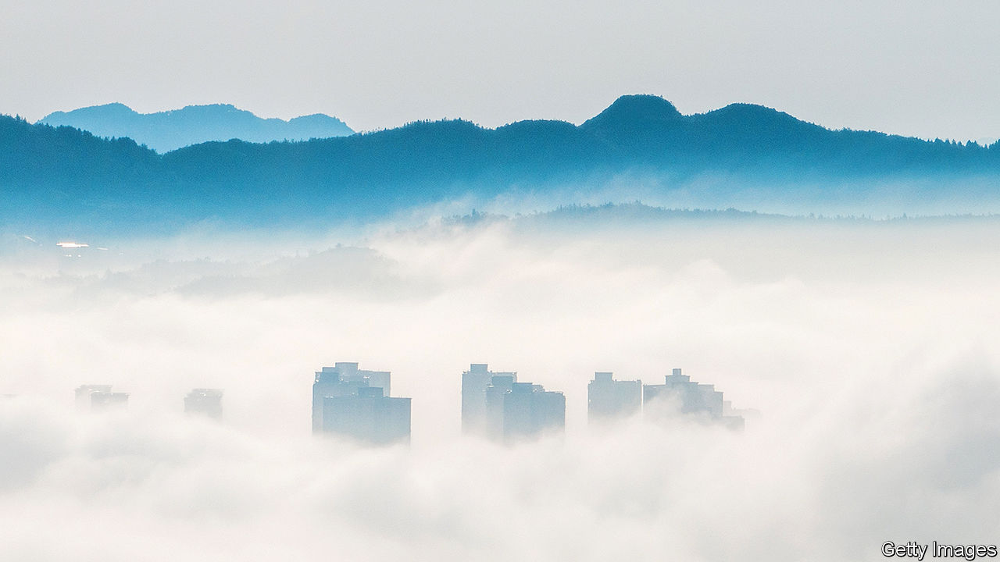
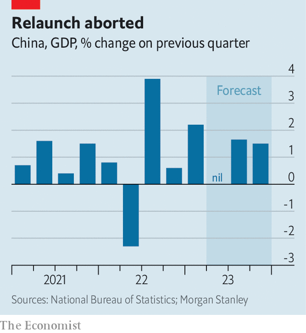
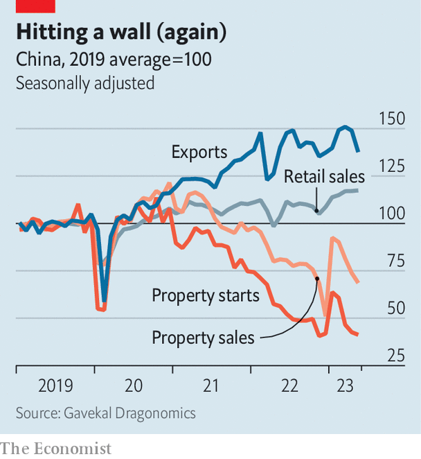

###### Wishful sinking

# China’s economy is on course for a “double dip” 

##### The post-covid economy was meant to roar. But it is faltering again 

 

> Jun 18th 2023 

China prides itself on firm, unswerving leadership and stable economic growth. That should make its fortunes easy to predict. But in recent months, the world’s  has been full of surprises, wrong-footing seasoned China-watchers and savvy investors alike.

Early this year, for example, China’s economy grew faster than expected, thanks to the country’s  from covid-19 controls. Then, in April and May, the opposite happened: the economy recovered more slowly than hoped. Figures for retail sales, investment and property sales all fell short of expectations. The unemployment rate among China’s urban youth passed 20%, the highest since data were first recorded in 2018. Some now think the economy might not grow at all in the second quarter, compared with the first. By China’s standards this would be a “double dip”, says Ting Lu of Nomura, a bank.

 


China has also defied a third prediction. It has failed, thankfully, to become an inflationary force in the world economy. Its increased demand for oil this year has not prevented the cost of Brent crude, the global benchmark, from falling by more than 10% from its January peak. Steel and copper have also got cheaper. China’s producer prices—those charged at the factory gate—declined by more than 4% in May compared with a year earlier. And the yuan has weakened. The price Americans pay for imports from China fell by 2% in May compared with a year earlier, according to America’s Bureau of Labour Statistics.

Much of the slowdown can be traced to China’s property market. Earlier in the year it seemed to be recovering from a disastrous spell of defaults, plummeting sales and mortgage boycotts. The government had made it easier for indebted property developers to raise money so that they could complete delayed construction projects. Households that refrained from buying last year, when China was subject to sudden lockdowns, returned to the market in the first months of 2023 to make the purchases they had postponed. Some analysts even allowed themselves the luxury of worrying about whether the property market might bounce back too strongly, reviving the speculative momentum of the past. 

Yet this pent-up demand seems to have petered out. The price of new homes fell in May compared with the previous month, according to an index from Goldman Sachs, a bank. Although property developers are keen to complete building projects, they are reluctant to start them. Gavekal Dragonomics, a consultancy, calculates that property sales have fallen back to 70% of the level they were at in the same period of 2019, China’s last relatively normal year. Housing starts are only about 40% of their level then (see chart on next page).

 


How should the government respond? For a worrying few weeks, policymakers looked as though they might not do much at all. The official growth target for this year—around 5%—lacks ambition. Beijing seemed keen to keep a lid on the debts of local governments, which are often urged to splurge for the sake of growth. The People’s Bank of China (PBOC), the central bank, seemed unperturbed by falling prices. It may have also worried that a cut in interest rates would put too much of a squeeze on banks’ margins, because the interest rate they pay on deposits might not fall as far as the rate they charge on loans. 

But on June 6th the PBOC asked the country’s biggest lenders to lower their deposit rates, paving the way for the central bank to reduce its policy rate by 0.1 percentage points on June 13th. The interest rate banks charge their “prime” customers then fell in tandem, which will further lower mortgage rates. Although the cut was negligible, it showed the government was not oblivious to the danger. A meeting of the State Council, China’s cabinet, on June 16th, dropped hints of more to come.

 


Robin Xing of Morgan Stanley, a bank, expects further cuts in interest rates. He also thinks restrictions on home purchases in first- and second-tier cities may be relaxed. The country’s “policy banks” may provide more loans for infrastructure. Local governments may be allowed to issue more bonds. China’s budget suggests it expected land sales to stay steady in 2023. Instead, revenues have so far fallen by about 20%. If the shortfall persists for the entire year, it would deprive local governments of more than 1trn yuan ($140bn) in revenue, Mr Xing points out. The central government may feel obliged to fill that gap. 

Will this be enough to meet the government’s growth target? Mr Xing thinks so. The slowdown in the second quarter will be no more than a “hiccup”, he argues. Employment in China’s service sector began this year 30m short of where it would have been without covid, Mr Xing calculates. The rebound in “contact-intensive” services, such as restaurants, should restore 16m of those jobs over the next 12 months. When jobs do return, income and spending will revive. Another 10m of the missing jobs are in industries like e-commerce and education that suffered from a regulatory storm in 2021. China has struck a softer tone towards these firms in recent months, which may embolden some of them to resume hiring as the economy recovers.

Others economists are less optimistic. Xu Gao of Bank of China International argues that further monetary easing will not work. The demand for loans is insensitive to interest rates, now that two of the economy’s biggest borrowers—property developers and local governments—are hamstrung by debt. The authorities cut interest rates more out of resignation than hope. 

He may be right. But it is odd to assume monetary easing will not work before it has really been tried. Loan demand is not the only channel by which it can revive the economy. Zhang Bin of the Chinese Academy of Social Sciences and his co-authors estimate that if the central bank’s policy rate dropped by two percentage points, it would cut interest payments by 7.1trn yuan, increase the value of the stockmarket by 13.6trn yuan and lift house prices, bolstering the confidence of homeowners.

If monetary easing does not work, the government will have to explore fiscal stimulus. Last year local-government financing vehicles (LGFVs), quasi-commercial entities backed by the state, increased their investment spending to prop up growth. That has left many strapped for cash. According to a recent survey of 2,892 of these vehicles by the Rhodium Group, a research firm, only 567 had enough cash on hand to meet their short-term debt obligations. In two cities, Lanzhou, the capital of Gansu province, and Guilin, a southern city famous for its picturesque Karst mountains, interest payments by LGFVs rose to over 100% of the city’s “fiscal capacity” (defined as their fiscal revenues plus net cash flows from their financing vehicles). Their debt mountains are not a pretty picture. 

If the economy needs more of a push, the central government will have to engineer it. In principle, this stimulus could include extra spending on pensions and consumer giveaways. The government has, for example, extended tax breaks on electric vehicles that have helped boost car sales. 

Officials could also experiment with high-tech consumer handouts of the kind pioneered by cities in Zhejiang province during the early days of covid. They distributed millions of coupons through e-wallets, which would, for example, knock 70 yuan off a restaurant meal if the coupon holder spent at least 210 yuan in a week. According to Zhenhua Li of Ant Group Research Institute and co-authors, these coupons packed a punch. They induced more than three yuan of out-of-pocket spending for every one yuan of public money. 

Unfortunately, China’s fiscal authorities still seem to view such handouts as frivolous or profligate. If the government is going to spend or lend, it wants to create a durable asset for its trouble. In practice, any fiscal push is therefore likely to entail more investment in green infrastructure, intercity transport and other public assets favoured in China’s five-year plan. That would be an utterly unsurprising response to China’s year of surprises. ■


